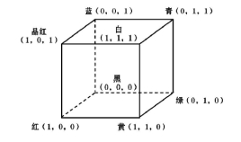
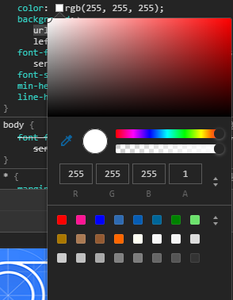
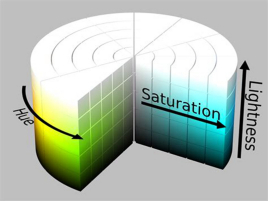
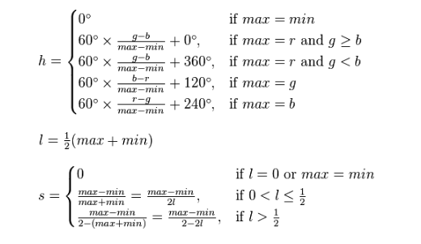
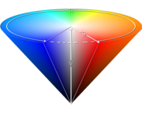
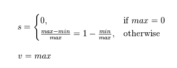
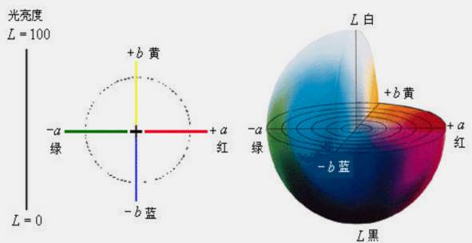

# CSS颜色

在CSS中，一共有4种方法表示颜色，除去RGB这种常用的表示方法外，还有HSL与HSV两种计算机颜色空间模型用于表示颜色。

## RGB颜色空间

RGB颜色空间可以说是最直观，最基础，也是最容易理解的一种颜色表示方法，其他颜色空间均可以通过RGB与转换公式来转换获取。RGB颜色空间以R(Red:红)、G(Green:绿)、B(Blue:蓝)三种基本色为基础，进行不同程度的叠加，产生丰富而广泛的颜色，所以也称三基色模式。

选用红绿蓝作为颜色基本色，也是源于红绿蓝为光学三原色，即不可分解的颜色，其余颜色均可以通过调整三原色的色值来调和完成。在RGB颜色空间中，三原色的色值均有 ``2^8 = 256`` 个等级，这也表明该颜色空间共有 ``2^24 = 256^3 = 16777216`` 种不同颜色可表示。

由于三原色通过叠加来调色，而三原色本身的色值相互独立，所以可以使用笛卡尔系来对RGB颜色空间做一个形象化的表示，坐标值通过将RGB三值分别除以255获得。



在浏览器中，可以看到RGB的表示方法，如下图红色系，就是 ``R = 255, G = B`` 这个空间截面。



平时看到的RGB颜色空间往往会用十六进制的形式来表示，本质上就是将RGB三个值分别转化为十六进制数值后拼接即可，如白色``rgb(255, 0, 0)``等价于``#ffffff``

## HSL颜色空间

HSL(Hue, Saturation, Lightness)即色相、饱和度、亮度。色相(H)是色彩的基本属性，就是平常所说的颜色名称，如红色、黄色等。饱和度(S)是指色彩的纯度，越高色彩越纯，低则逐渐变灰，取0-100%的数值。亮度(L)，同样取0-100%，亮度越高，颜色越白，反之越黑，亮度取50%时，为正常亮度。



HSL颜色空间，可以具象化为一个圆柱坐标系，即一个极坐标系与一个直角坐标系的结合。与RGB颜色空间相对比，将(1, 1, 1)与(0, 0, 0)两个白黑色点展开为一个圆形平面即可得到一个HSL颜色空间。RGB转化为HSL的公式如下。



## HSV颜色空间

HSV(Hue, Saturation, value)即色相、饱和度、亮度、明度，又称HSB。与HSL的区别就在于最后这个V上，明度(V)同样取0-100%的数值。在HSV中，当“光”足够的情况下，颜色会成为颜色其本身，而HSL中，颜色会变成白色。



HSV颜色空间，具象化为一个圆锥坐标系，本质上还是RGB笛卡尔系的一个变形，黑色点与白色点依旧在各自的点位上。RGB转HSV的公式如下，由于色相(H)在HSL与HSV两个颜色空间下表示的含义相同，所以H的算法同上。



## 颜色空间的应用

上述三个颜色空间中，RGB相对来说是我们接触最多的颜色空间，由三个通道表示一幅图像，分别为红色(R)，绿色(G)和蓝色(B)。这三种颜色的不同组合可以形成几乎所有的其他颜色，它也是是图像处理中最基本、最常用、面向硬件的颜色空间，比较容易理解，但也存在一定的局限性。

RGB颜色空间利用三个颜色分量的线性组合来表示颜色，任何颜色都与这三个值有关，而且这三个值是高度相关的，所以连续变换颜色时并不直观，想对图像的颜色进行调整需要同时更改三个值才行。

同时，在自然环境下获取的图像容易受自然光照、遮挡和阴影等情况的影响，即对亮度比较敏感。而RGB颜色空间的三个分量都与亮度密切相关，即只要亮度改变，三个分量都会随之相应地改变，而没有一种更直观的方式来表达。

但是人眼对于这三种颜色分量的敏感程度是不一样的，在单色中，人眼对红色最不敏感，蓝色最敏感，所以RGB颜色空间是一种均匀性较差的颜色空间。这也是HSL与HSV空间的应用场景，由于色值被作为一个单项的数值，所以HSL与HSV颜色空间在颜色变化的处理上非常直观且方便。

所以，RGB颜色空间适合于显示系统，而HSL与HSV空间更适合于图像处理。比如在进行拾色器的开发中，拾色器颜色的变化往往会通过某种均匀的规律呈现，那么此时用HSL进行处理将会更加方便，且颜色效果在两个端点颜色间变化时会更为鲜艳。而RGB在表示单点颜色上，就显得更加可行。

## 透明度(opacity)

对于以上三种颜色空间来说，都有一个共有的表示维度，透明度(opacity)，在颜色空间中，用``a``来表示。当``a=1``时，颜色完全不透明，颜色就为其本身。当``a=0``时，颜色完全透明，该位置将完全展示该颜色下面一层的颜色。

透明度本身似乎表示了颜色的透明程度，而本质上，其实也只是一种颜色的计算方式，是当前颜色与其下层颜色的叠加。以RGB颜色空间为例，现在假设颜色本身为``color``，其下层颜色为``bg-color``，透明度为``a``。那么使用透明度后的实际颜色会通过线性差值的方程计算出``real-color``，公式如下。

```
real-color = bg-color * (1 - a) + color * a
```

比如透明度为50%的红色``rgb(255, 0, 0, 0.5)``置于白色背景``rgb(255, 255, 255, 1)``上等价于``rgb(255, 127, 127, 1)``。

## Alpha通道

透明度可以延伸到Alpha通道的概念，Alpha通道本身是图片的一个内在属性，它没有透明度的意思，通过取值0-1来表达某个像素点位对于图片的贡献度，0代表无贡献，1代表全权贡献，由此来展现一个图片的透明度。换句话说，Alpha通道本身无透明度的含义，但它的外在表现是透明度。

在计算机中，以32位的图片和RGB颜色空间为例，其中8位用于表示Red，8位表示Green，8位表示Blue，8位表示Alpha值，由此构成了RGBA颜色空间。由于有8位用于表示α，所以α可以表示256级的透明度，``α/255``就可以用来表示像素贡献度，这也是css里opacity的真实含义。

当所处的图像本身为透明或是半透明图像时，多个图像进行组合叠加时，表现出来最终颜色的透明度计算方法如下:

```
α = 1 - (1 - α1) * (1 - α2)
```

这可以通过光学原理进行解释，两块玻璃重叠，第一块不透光率为α1，那么其透光``1-α1``，透过的光再由第二玻璃进行筛检，那么整体的透光率为``(1 - α1) * (1 - α2)``，反之，不透光率就为``α = 1 - (1 - α1) * (1 - α2)``。

当然，计算机最终所表现出来的内容必然不会是一个透明的图像，所以背景色会进行贡献度的补完，即 ``1-α`` ，来作为背景色自己的α，这就与上面透明度中的线性差值计算方法相对应起来了。

当两种半透明的颜色与背景色相重叠，那么构成的颜色计算方法就如下

```
real-color = bg-color * (1 - (1 - α1) * (1 - α2)) + multi-color *(1 - α1) * (1 - α2)
```

也可以先由其中一个半透明色与背景色相合并，成为一个新的背景色后再与另一个半透明颜色相结合，那么我们可以得到

```
real-color = (bg-color * (1 - α1) + color1 * α1) * (1 - α2) + color2 * α2
```

通过上述两个式子，由于``real-color``相同，我们可以得到两个半透明颜色合成的multi-color与其透明度。

```
multi-color = (color1 * α1 * (1 - α1) + color2 * α2) / (α1 + α2 - α1 * α2)
```

## 补充： CIE Lab颜色空间

Lab模式是根据Commission International Eclairage(CIE)在1931年所制定的一种测定颜色的国际标准建立的。L与HSL中的L一样表示亮度，a与b表示两个颜色通道，a包括的颜色是从深绿色(低亮度值)到灰色(中亮度值)再到亮粉红色(高亮度值)。b同理，是从亮蓝色到灰色再到黄色。其空间模型如图所示。



Lab模式是一种设备无关的颜色空间，基于人类生理特征而被简历，常用来作为对其他颜色空间的补完。也正因为如此，CSS中其实并没有这个颜色空间对应的函数，所以仅作为颜色空间的补充项放在这里。