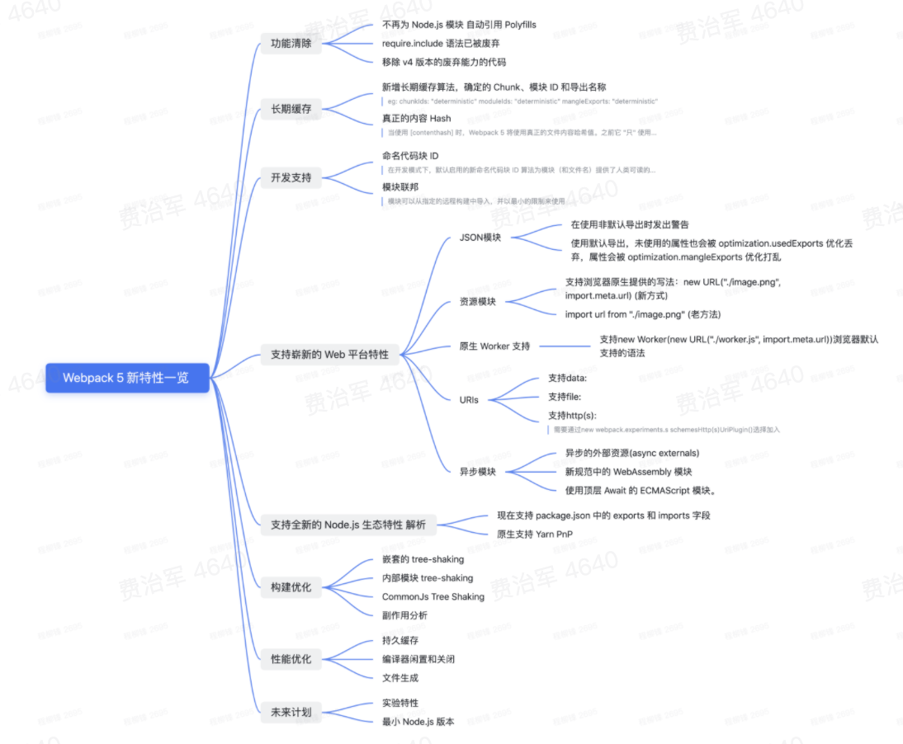

<!--
 * @Author: feizhijun
 * @Date: 2021-03-28 13:19:56
 * @LastEditors: feizhijun
 * @LastEditTime: 2021-03-28 15:53:49
 * @Description: desc
-->

# Bundle & Bundless

## 打包

最初的前端是没有打包这件事的，直接写 HTML，然后在其中引入一些 css 和 js，就可以直接在线上看到效果，稍微复杂点，会对代码做一个压缩。

像 Webpack，和 gulp 都是走的 Bundle 的模式。

随着构建的发展，也出现了 Vite 和 Snowpack 这种 Bundless 的构建方式。

### 为什么要打包

- 浏览器同时加载的资源有限

- 给代码做兼容处理

## Webpack5 新特性

## Bundle 与 Bundless 的差异

### 浏览器交互方式

如果是 Bundle 的形式，浏览器在加载时，是加载了一个总的 bundle.js 文件，里面包含了 a.js, b.js... 等多个模块。

如果是 Bundless 的形式，浏览器是直接加载 a.js, b.js 等各个模块，直接去和模块进行交互。

### 打包速度

- Bundless 的打包冷启动时间大大缩短。

- HMR 的速度不受整个项目的影响。

- Bundless 的单文件粒度缓存更优

### 开发体验

Bundle 形式开发中会依赖很多的 sourcemap，并且 sourcemap 的类型很多。

Bundless 不依赖 sourcemap，调试起来更加简单。

## 构建原理

### Webpack 构建流程

#### 整体流程

整体流程是初始化编译配置，开始编译，读取 entry，递归读取依赖，进行 build 构建。构建过程中会收集依赖列表，一个构建流程结束后再重复构建，知道依赖列表中不再有依赖。

1. entry-option：初始化

2. run：开始编译

3. make：从 entry 开始递归分析，对每个模块进行 build

4. before-resolve：对模块位置进行解析

5. build-module：开始构建某个模块

6. normal-module-loader：从 loader 加载完成的 module 进行编译，生成 ast

7. program：遍历 ast，收集依赖

8. seal：所有依赖 build 完成，进行优化

9. emit：输出到磁盘目录

#### CLI 流程

1. 从命令行获取参数

2. 从 config 文件获取参数

3. 合并两个参数，转换为配置

4. 调用 webpack API 处理配置

5. 校验配置正确性

6. 调用 WebpackOptionApply 处理配置

   将所有配置项转化为对应的插件；调用默认的插件。

7. 创建 Compile 对象

   Compile Hooks：

   - 流程相关
     - before run
     - before-compiler/after-compiler
     - make
     - after-emit
     - done
   - 监听
     - watch-run
     - watch-close
   - 嵌套
     - compilation
     - normal-module-factory
     - context-module-factory

8. 调用 Compile 的 run 或者 watch 方法

#### webpack Module

- NormalModule

- ContextModule

- ExternalModule

- DelegatedModule

- MultiModule

### Vite 构建原理

#### 整体流程

1. 创建 koa server

2. 监听文件变化

3. 模块解析

4. 增加各种中间件

   - 静态文件托管：serverStaticPlugin：serverStaticPlugin
   - 重写模块路径（bare import）：moduleRewritePlugin

5. 启动服务

#### 重写模块路径

1. 对于 bare import，把模块名替换为 entry path，并在前面加上/@modules 标识符

2. 相对路径转换为绝对路径

3. 补齐文件扩展名和 index

4. 给非 js 类型文件添加 ?import 参数

5. 给 hmr 请求加上时间戳，避免缓存

#### CSS 打包

1. 判断是否是 css 文件

2. 判断是否是在 js 中引用的 css

3. 进行 Sass/Less 编译

4. 基于 CSS 代码编译为 js 模块

5. 创建`<style>`，插入 dom 中

6. 如果开启了 CSS Module，则导出对象，否则，导出 CSS 代码
