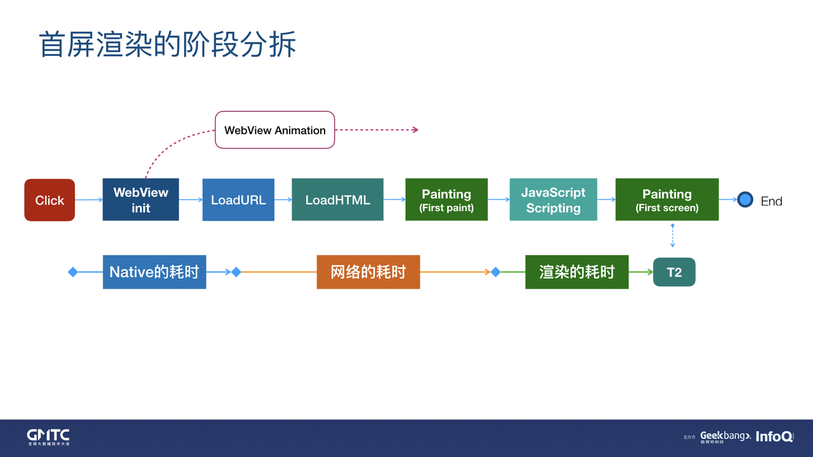
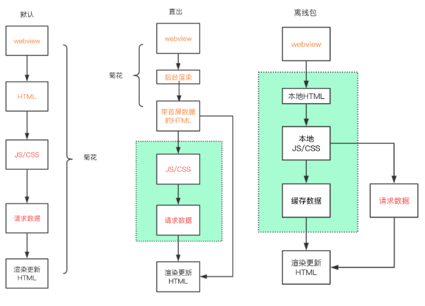
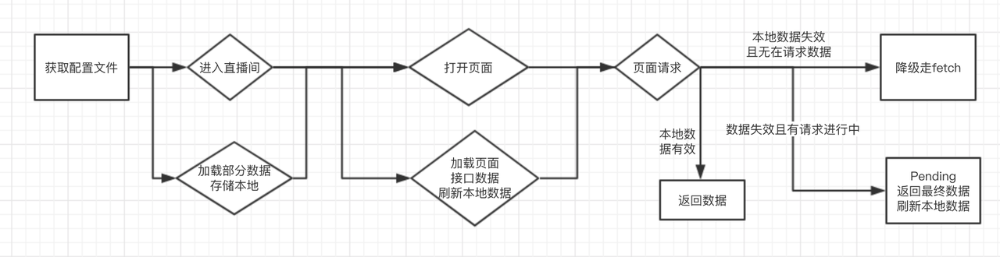
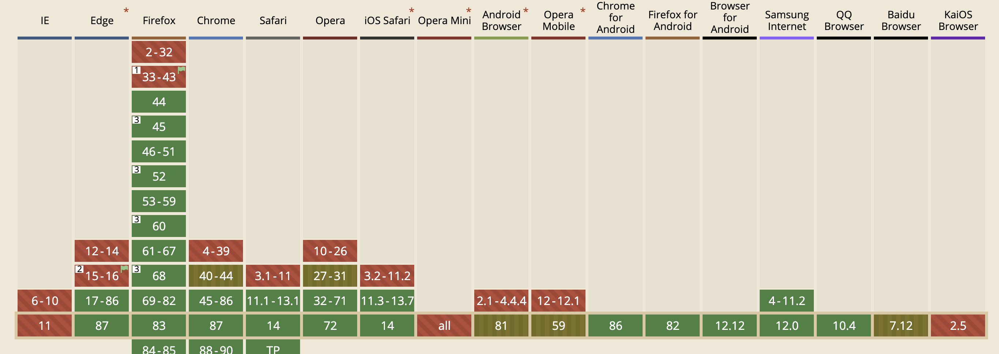
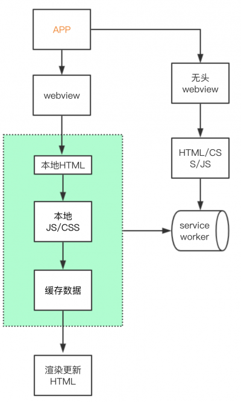

<!--
 * @Author: feizhijun
 * @Date: 2021-05-10 10:26:51
 * @LastEditors: feizhijun
 * @LastEditTime: 2021-05-16 22:10:59
 * @Description: desc
-->

# C 端 H5 性能优化

## C 端首屏链路

Native 的耗时 ≈ WebWindow 创建 + WebView 初始化

网络的耗时 ≈ DNS + TCP(SSL) + 服务端渲染耗时(如果采用 SSR 的话) + html 下载

渲染的耗时 ≈ Ajax(CSR) + JS scripting(CSR 耗时) + 浏览器 Painting(内核)

## 首屏优化点

- WebView 的创建耗时可以优化吗？

理论上可以优化，是 Native 要解决的问题

- 页面资源的加载耗时

资源离线就好了

- 页面渲染的耗时优化

前端可以进行优化，纯前端的手段还不够

## 性能指标

- FP 白屏时间
- FCP 首次渲染时间
- TTI 首次可交互时间

## 优化方向

- 在整个链路中减少中间环节
  - 如：合并/减少请求，缓存/离线资源等。
- 尽可能的预加载、预执行
  - 如：数据预取，页面预渲染等。

## 分析

通常的 web 优化方法，基本围绕在资源加载和渲染两个方面。前者针对首屏，后者针对可交互。
资源加载上，总体方向是围绕更小的资源包上，如：压缩、分包、按需加载、图片优化等。
渲染上，总体方向是更快的展示内容，如： cdn 分发、dns 预解析、缓存、数据预请求等。
除开上述一些常见的优化手段之外，具体分析以下几种方式：

### 离线化+预请求

借助 native 通过 webview 统一拦截 url，将资源映射到本地离线包，打开或者更新应用的时候对版本资源检测，下载和维护本地缓存目录中的资源。

通过离线化能够很好解决 html 文件及各种静态资源本身加载需要时间的问题。

​

### PWA+预请求

通过 web 层面的 service worker 起到一个离线服务器的作用，代替客户端离线化，首次请求需要借助预请求的方式进行优化。

SSR 页面，配合 pwa 将从后台直出的 html 文件，缓存到 cacheStorage，在下一次请求时，优先从本地缓存中获取，同时发起网络请求更新本地 html 文件。

非 SSR 页面，通过 hash 或其他唯一标识确定资源文件，第一次正常请求渲染后，将 html 缓存到 cacheStorage，后续流程与 SSR 页面雷同

PWA 方案属于 web 标准，适用于所有能够支持 service worker 的 H5 页面，且需要手动管理 service worker 的创建和释放。

service worker 兼容性

​

### NSR (Native side rendering)

借助浏览器启动一个 JS-Runtime，提前将下载好的 html 模板及预取的 feed 流数据进行渲染，然后将 html 添加到内存中，从而达到"闪开"的效果。

NSR 将 SSR 渲染的过程分发到 native 中，在减少了后台请求压力的同时，也加进一步快了页面打开速度，加载速度上基本做到了极致。

对比

|                             | 侵入性 | 复杂度 | 可行性 |
| --------------------------- | ------ | ------ | ------ |
| 离线化+预请求               | 小     | 低     | 高     |
| PWA+预请求                  | 小     | 中     | 中     |
| NSR (Native side rendering) | 中     | 高     | 低     |

## 策略

基于以上分析，推荐使用离线化+预请求方案

### 预请求

- 以空间换时间的方式，在用户跳转页面同时请求该页面所需数据，与 html 加载并行执行
- Prefetch 数据预取技术方案

### 利用离线化来进一步提高性能

- SSR 项目可以视情况在 BFF 层进行页面/模块/组件级别的缓存
- 完全离线化

  - 将所有静态资源完全离线化
  - 适用于网络环境/硬件环境较差的情况下，即用户访问时页面由于网络等原因加载过慢甚至加载不出，导致用户流失的情况
  - 由于完全离线化后，用户访问的资源完全依赖于离线下拉，所以会存在一定的版本延后

- SSR+部分离线化
  - 入口 html 文件保持 SSR，其他静态资源借助离线化
  - 用户访问时，正常拉取 SSR 返回的 html 并发起请求，端内拦截并命中离线资源，若没命中则正常请求
  - 静态资源流程图参考完全离线化
