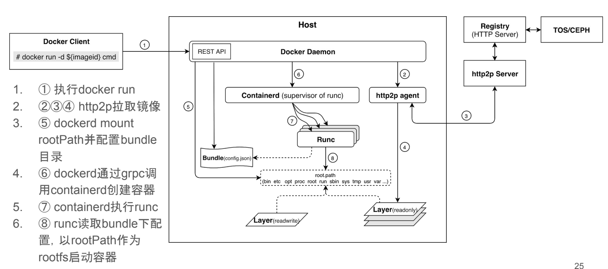

# Docker

## 虚拟化技术

### 虚拟机

虚拟机，就是在你的操作系统里面，装一个软件，然后通过这个软件，再模拟一台甚至多台“子电脑”出来。虚拟机虽然可以隔离出很多“子电脑”，但占用空间更大，启动更慢。虚拟机是建立在 HiperVisor 虚拟机监视器之上，HiperVisor 则是建立在 InfraStructure 之上，HiperVisor 负责分配虚拟机资源，HiperVisor 本质是一个资源调度器而不是一个 OS，所以虚拟机需要自带 OS。

### 容器

容器本身是基于当前操作系统的，所以它不用建立一个 OS，体积会小很多。容器需要定义你能看到什么东西和你能使用什么东西。它创建起来很快，理论上只需要规定它能看到哪些东西，能使用哪些东西就能建立一个容器。

## Docker 基础概念

### 镜像（Image）

类似于虚拟机中的镜像，是一个包含有文件系统的面向 Docker 引擎的只读模板。任何应用程序运行都需要环境，而镜像就是用来提供这种运行环境的。例如一个 Ubuntu 镜像就是一个包含 Ubuntu 操作系统环境的模板，同理在该镜像上装上 Apache 软件，就可以称为 Apache 镜像。

### 容器（Container）

类似于一个轻量级的沙盒，可以将其看作一个极简的 Linux 系统环境（包括 root 权限、进程空间、用户空间和网络空间等），以及运行在其中的应用程序。Docker 引擎利用容器来运行、隔离各个应用。容器是镜像创建的应用实例，可以创建、启动、停止、删除容器，各个容器之间是是相互隔离的，互不影响。注意：镜像本身是只读的，容器从镜像启动时，Docker 在镜像的上层创建一个可写层，镜像本身不变。

### 仓库（Repository）

类似于代码仓库，这里是镜像仓库，是 Docker 用来集中存放镜像文件的地方。注意与注册服务器（Registry）的区别：注册服务器是存放仓库的地方，一般会有多个仓库；而仓库是存放镜像的地方，一般每个仓库存放一类镜像，每个镜像利用 tag 进行区分，比如 Ubuntu 仓库存放有多个版本（12.04、14.04 等）的 Ubuntu 镜像。

## Docker 主要用途

官方就是 Bulid 、ship、run any app/any where，编译、装载、运行、任何 app/在任意地放都能运行。就是实现了应用的封装、部署、运行的生命周期管理只要在 glibc 的环境下，都可以运行。运维生成环境中：docker 化。

* 发布服务不用担心服务器的运行环境，所有的服务器都是自动分配 docker，自动部署，自动安装，自动运行
* 再不用担心其他服务引擎的磁盘问题，cpu 问题，系统问题了
* 资源利用更出色
* 自动迁移，可以制作镜像，迁移使用自定义的镜像即可迁移，不会出现什么问题
* 管理更加方便了

## Docker 使用

### Docker 安装

[官方文档](https://docs.docker.com/engine/install/)

### 搜索下载镜像

```bash
docker search node #查看镜像
docker pull node
```

### 查看已经下载的镜像

```bash
docker images
```

### 查看运行中的容器

```bash
docker container ls
```

​

### 查看所有容器\(包括已终止的\)

```bash
docker container ls -a
```

### 查看某容器内日志

```bash
docker logs -f ${container_id}
```

### 进入某容器，并有 shell 执行环境

```bash
# 进入容器
# -i表示：交互式操作，-t表示：终端
docker exec -it ${container_id} bash
# 可通过输入 exit 退出
```

### 停止容器

```bash
docker container stop ${container_id}
```

### 启动已终止的容器

```bash
docker container start ${container_id}
```

### 删除容器

```bash
docker container rm ${container_name || container_id}
```

### 查看镜像

```bash
docker image ls
```

### 删除镜像

```bash
docker image rm ${image_id}
```

## Docker 原理

由 Linux Namespace，Linux Cgroups 和 rootfs 三种技术构建出来的进程隔离环境。

镜像：容器的一个静态视图

Namespace + Cgroups ：容器运行时，容器的动态视图

### 资源隔离 Cgroups

Control Groups 原理：

主要进行的是 CPU 和内存的隔离，Cgroups 的本质是给进程挂上钩子\(hooks\)，进程在运行时，如果涉及到某个资源时，就会触发钩子附带的 subsystem 进行检测，最终根据资源类别的不同使用对应技术进行资源限制和优先级分配。

内核调度器：告诉 CPU 在下一个时刻选择哪一个进程来运行。

CPU Share: CPU 负载下限

CPU Quota （CFS banwidth control）: CPU 负载上限,周期中的时间片分配

内存调度也是使用 Cgroups 来实现的，主要使用的是 Resource Counter，在内核分配资源时，传入 hooks 函数 charge，用来统计已使用的内存，释放资源时，传入 uncharge

OOM：内存不够，需要选择一个进程杀死，具体选择哪个进程，需要看进程的评分:task's rss（实际使用的内存页） + pagetable + swap space。

系统级别的 OOM：整个物理机没有可用的内存页

Cgroup OOM：系统内存页够，也能申请到，但是 charge 时，发现内存超了，这时进程就被 kill 掉

视图隔离：Linux Namespace，提供了轻量级的虚拟化，一些数据只能局部可见（pid：PID Namespace）。Systemd：NS 中第一个进程，充当 init 进程。

文件系统隔离：Image/Union Mount

Docker 启动流程：



