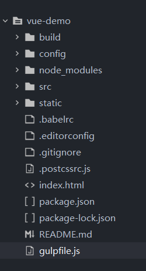

# gulp

## 简介

gulp是一个自动化构建工具，对于前端开发来说，常见的用gulp构建的任务有：

* 搭建web服务器

* 文件保存时重载浏览器

* 使用预处理器如Sass、Less

* 优化资源，如压缩javascript、css、图片等

主要就是用于通过创建任务，设定自动处理项目一些静态资源的工作，简单的说，gulp就是一个资源打包的工具，但又不同于webpack。gulp是一种任务管理工具，而webpack是一种模块化打包工具。

## gulp 与 grunt

当前前端最流行的两个自动化构建工具，无非就是gulp和grunt。相比于grunt，gulp作为后起之秀，吸收了grunt的优点，通过流(Stream)的概念来简化多任务之间的配置和输出，让任务配置更加简洁，编写起来也更加方便，执行效率更高。

## 引入gulp

以vue-cli2.x项目为例引入gulp

安装gulp

  ```shell
  npm install --save gulp
  ```

在项目根目录下创建 gulpfile.js，项目目录如下：



另外，gulpfile也可以通过需要转译的编程语言来编写，如TypeScript或Babel，通过修改gulpfile的扩展名即可完成转译，如

* 对于TypeScript直接其命名为gulpfile.ts

* 对于Babel直接命名为gulpfile.babel.js

## 创建一个gulp任务

在项目中引入gulp后，就可以在gulpfile中创建自己的任务了。比如创建一个简单的任务：

  ```javascript
  var gulp = require('gulp');
  gulp.task('HelloWorld', () => {
    console.log('Hello World!');
  })
  ```

通过task()能够创建一个任务，并在项目根目录下进行调用

  ```shell
  > gulp HelloWorld
  [20:00:00] Starting 'HelloWorld'...
  Hello World!
  ```

------

不过尽管gulp依旧支持task()，但是官网已经不推荐使用了，现在的任务创建可直接通过定义函数并且通过export导出的方法来实现。在导出过程中，可以配合使用series()或parallel()实现组合任务。

  ```javascript
  //gulpfile.js
  import { series, parallel } from 'gulp';

  function private(cb) {
    console.log('private task');
    cb();
  }

  function public(cb) {
    console.log('public task');
    cb();
  }

  exports.public = public;
  exports.combi = series(public, private);
  exports.combiAsync = parallel(public, private);
  ```

gulp任务又被分为公开任务与私有任务：

* 公开任务(Public Tasks)：上述代码中的public()即为公开任务，即直接被导出的方法(任务)，开发人员可以直接在项目根目录下用使用task()时一样的方法进行调用。

  ```shell
  > gulp public
  [20:00:00] Starting 'public'...
  public task
  [20:00:00] Finished 'public' after 2.29 ms
  ```

* 私有任务(Private Tasks)：上述代码中的private()即为私有任务，即用户不可直接调用的任务，一般会通过组合任务配合其他任务一块被执行，如上述代码中，private()与public()通过series方法构建了一个组合任务combi。

  ```shell
  > gulp combi
  [20:00:00] Starting 'combi'...
  [20:00:00] Starting 'public'...
  public task
  [20:00:00] Finished 'public' after 1.71 ms
  [20:00:00] Starting 'private'...
  private task
  [20:00:00] Finished 'private' after 753 μs
  [20:00:00] Finished 'combi' after 9.73 ms
  ```

### 组合任务

那么什么是组合任务呢，通俗的讲就是多个任务一块执行，gulp为组合任务提供了两个API：

* series：series()的入参即是任务本身，它将会按前后顺序，顺序执行入参中的任务；

* parallel：parallel()入参与前者相同，但其中的任务将会被并发执行，我们可以执行一下上面代码中的combiAsync任务，和之前的shell内容相对比，可以很容易的看出两个方法的区别。

  ```shell
  > gulp combiAsync
  [20:35:54] Starting 'combiAsync'...
  [20:35:54] Starting 'public'...
  [20:35:54] Starting 'private'...
  public task
  [20:35:54] Finished 'public' after 2.46 ms
  private task
  [20:35:54] Finished 'private' after 5.01 ms
  [20:35:54] Finished 'combiAsync' after 10 ms
  ```

另外，series与parallel方法也可以相互组合嵌套：

  ```javascript
  exports.task = series(task1, parallel(task2, task3));
  ```

## gulp插件

## sass预处理