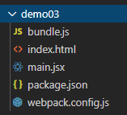

# webpack

# 前言

webpack作为当下前端最火的模块化打包工具，具有强大丰富的功能，它能够分析项目结构，处理模块化依赖，转换成为浏览器可运行的代码等。概括如下：

* 代码转换: TypeScript 编译成 JavaScript、SCSS,LESS 编译成 CSS.

* 文件优化：压缩 JavaScript、CSS、HTML 代码，压缩合并图片。

* 代码分割：提取多个页面的公共代码、提取首屏不需要执行部分的代码让其异步加载。

* 模块合并：在采用模块化的项目里会有很多个模块和文件，需要构建功能把模块分类合并成一个文件。

* 自动刷新：监听本地源代码的变化，自动重新构建、刷新浏览器。

* 构建把一系列前端代码自动化去处理复杂的流程，解放生产力。

### 引入webpack

全局引入webpack

  ```shell
  $ npm install -g webpack
  ```

webpack4.x后需要引入webpack-cli

  ```shell
  $ npm install -g webpack-cli
  ```

### webpack常用命令

* webpack – 开发环境打包

* webpack -p – 生产环境打包

* webpack --watch – 监听变动自动打包

* webpack -d – 生成map映射

* webpack --colors – 打包过程颜色输出

------------

## webpack 入门: webpack-demos 学习笔记

> 通过对[webpack-demos](https://github.com/ruanyf/webpack-demos)内15个demo案例的分析，来对webpack进行入门级的学习。

### demo1 Enrty file

先看文件目录


其中webpack.config.js为webpack配置文件

  ```javascript
  // webpack.config.js
  module.exports = {
    entry: './main.js',
    output: {
      filename: 'bundle.js'
    }
  };
  ```

可以说是最基础的一个例子，entry为webpack入口所在位置

  ```javascript
  // main.js
  document.write('<h1>Hello World</h1>');
  ```

而output对应的bundle.js就是webpack根据main.js模块化打包生成的一个js文件，并会被html引入，从效果上来说与用script标签引入main.js代码相同。

总结：output和entry为webpack的入口与出口文件，output的默认路径为./dist

### demo2 Multiple entry files


从名字也可以看出，demo2就是demo1的一个多文件版本，来看一下配置文件

  ```javascript
  // webpack.config.js
  module.exports = {
    entry: {
      bundle1: './main1.js',
      bundle2: './main2.js'
    },
    output: {
      filename: '[name].js'
    }
  };
  ```
入口文件有main1.js和main2.js两个，而出口文件从文件目录中可知有bundle1.js和bundle2.js两个文件，可见出口文件的[name]即为一个参数，默认情况下name为bundle。

总结： 出入口文件可以有多个，出口文件的命名可以根据参数决定。

### demo3 Babel-loader



相比于demo1，demo3的main.js被替换为了main.jsx文件，众所周知，jsx是React最基本的文件格式，而光有出入口的webpack无法解析javascript以外格式的文件。那么来看一下配置。

  ```javascript
  // webpack.config.js
  module.exports = {
    entry: './main.jsx',
    output: {
      filename: 'bundle.js'
    },
    module: {
      rules: [
        {
          test: /\.jsx?$/,
          exclude: /node_modules/,
          use: {
            loader: 'babel-loader',
            options: {
              presets: ['es2015', 'react']
            }
          }
        }
      ]
    }
  };
  ```

webapck通过babel-loader将jsx编译为js文件，输出至bundle.js。

总结： loader有两个关键点，一个是test，通过正则表达式匹配某一格式的文件。另一个是loader，表明用何种loader来对该文件格式进行处理，可使其成为一个js格式的文件。

### demo4 css-loader

从文件内容与名字上来看，就是通过webpack的css-loader对css文件进行解析。

  ```javascript
  module.exports = {
    entry: './main.js',
    output: {
      filename: 'bundle.js'
    },
    module: {
      rules:[
        {
          test: /\.css$/,
          use: [ 'style-loader', 'css-loader' ]
        },
      ]
    }
  };
  ```

来看配置文件，除了css-loader外，值得注意的还有一个style-loader，它在此处的作用就是为html注入style标签，以此来使css生效。

### demo5 Image loader

webpack对png或jpg格式图片进行处理，形式与前两个相同。

  ```javascript
  // webpack.config.js
  module.exports = {
    entry: './main.js',
    output: {
      filename: 'bundle.js'
    },
    module: {
      rules:[
        {
          test: /\.(png|jpg)$/,
          use: [
            {
              loader: 'url-loader',
              options: {
                limit: 8192
              }
            }
          ]
        }
      ]
    }
  };
  ```

从配置文件的内容来看，通过url-loader为html注入一个img的标签，来使图片正确显示。

### demo6 CSS Module


先来看demo6的目录，根据前几个样例，我们很明显就能知道webpack需要用css-loader和style-loader来打包css文件，用babel-loader来打包jsx文件。

那么webpack配置基本内容确定之后再来看代码内容，

```css
/* app.css */
.h1 {
  color:red;
}

:global(.h2) {
  color: blue;
}
```

```jsx
/* main.jsx */
var React = require('react');
var ReactDOM = require('react-dom');
var style = require('./app.css');

ReactDOM.render(
  <div>
    <h1 className={style.h1}>Hello World</h1>
    <h2 className="h2">Hello Webpack</h2>
  </div>,
  document.getElementById('example')
);
```

比较特殊的点在于css有一个global，而jsx文件内引入了css文件，并将style.h1赋值给了一个元素，再来看一下运行效果。


* html文件中类名为h1的元素并没有生效.h1的样式，jsx的render中类名为style.h1的元素却生效了.h1的样式。且类名不再为h1，webpack将类名编译为一串哈希字符串，该样例中就只在jsx文件内局部被引入并生效。

* .h2的样式由于增加了global申明，就未被webpack转为局部样式，也不会被转哈希值后引入，正常生效于所有对应元素。

可以试着打印一下jsx中引入的style的内容，可以发现只有h1被转译。

```json
{
  h1: "_1yZB3Q5Xe45RPofl-yJAo3"
}
```

最后再来看一下配置文件的特殊点，可以发现css-loader中增加了modules为true的配置，也就是使css模块化生效，将样式模块化打包，可以有效控制项目样式生效的范围，防止一些全局的样式污染。

```javascript
// webpack.config.js
module.exports = {
  //...
  module: {
    rules: [
      //...
      {
        test: /\.css$/,
        use: [
          // ...
          {
             loader: 'css-loader',
             options: {
               modules: true
             }
          }
        ]
      }
    ]
  }
}
```

### demo7 UglifyJs Plugin

直接来看webpack配置文件

```javascript
// webpack.config.js
var webpack = require('webpack');
var UglifyJsPlugin = require('uglifyjs-webpack-plugin');

module.exports = {
  entry: './main.js',
  output: {
    filename: 'bundle.js'
  },
  plugins: [
    new UglifyJsPlugin()
  ]
};
```

相较于上面的样例，增加了一个名为plugins的配置，plugins(插件)可以说是webpack最重要的配置之一，插件的自由度很高，也可以自己编写。本样例中所使用的是官方提供的一个用于压缩js代码的插件。

运行代码后我们可以发现，main.js的代码会被压缩，该例子中为最基本的参数名长度的压缩

```javascript
// main.js 压缩前
var longVariableName = 'Hello';
longVariableName += ' World';
document.write('<h1>' + longVariableName + '</h1>');

// main.js 压缩后
var r = "Hello";
r += " World",
document.write("<h1>" + r + "</h1>")
```

### demo8 HTML Webpack Plugin and Open Browser Webpack Plugin

同样是讲插件配置的样例，直接来看配置文件。

```javascript
var HtmlwebpackPlugin = require('html-webpack-plugin');
var OpenBrowserPlugin = require('open-browser-webpack-plugin');

module.exports = {
  entry: './main.js',
  output: {
    filename: 'bundle.js'
  },
  plugins: [
    new HtmlwebpackPlugin({
      title: 'Webpack-demos',
      filename: 'index.html'
    }),
    new OpenBrowserPlugin({
      url: 'http://localhost:8080'
    })
  ]
};
```

整体来说这个样例难度不大，插件都有自己支持的api，可以在插件的文档中找到各自的含义。

* HtmlwebpackPlugin: 自动生成index.html文件，或者说自动生成入口的html文件。

* OpenBrowserPlugin: 本地运行项目代码时，能够自动打开浏览器，且规定了本地运行的地址与端口。

### demo9 Environment flags

webpack可以用于传递全局变量，如区分开发环境与生产环境，来看webpack的配置文件

```javascript
// webpack.config.js
var webpack = require('webpack');

var devFlagPlugin = new webpack.DefinePlugin({
  __DEV__: JSON.stringify(JSON.parse(process.env.DEBUG || 'false'))
});

module.exports = {
  entry: './main.js',
  output: {
    filename: 'bundle.js'
  },
  plugins: [devFlagPlugin]
};
```

```json
// package.json
// ...
"scripts": {
  "dev": "npx cross-env DEBUG=true webpack-dev-server --open",
  "build": "npx cross-env DEBUG=false webpack"
},
```

使用webpack.DefinePlugin传递全局参数，如规定开发环境的标志，那么使用该插件之后，就可以在开发环境中生效这个参数，如下面代码中，只有在开发环境中才能看到时间。

```javascript
// main.js
document.write('<h1>Hello World</h1>');

if (__DEV__) {
  document.write(new Date());
}
```

### demo10 Code splitting

> 在前端页面进行加载的时候，有时并不需要一次性把所有的代码都加载完成，比如一些非首次课件的元素，像弹窗，或者标签页等。按需加载是webpack提供的一个非常重要的功能，做好代码分割，可以有效提升前端页面的加载效率与优化用户体验。

来看一下demo10的文件目录


```javascript
// webapck.config.js
module.exports = {
  entry: './main.js',
  output: {
    filename: 'bundle.js'
  }
};
```

可以发现有两个js入口文件，但在webpack的配置中，并没有像demo2一样设立了两个入口

```javascript
// main.js
require.ensure(['./a'], function(require) {
  var content = require('./a');
  document.open();
  document.write('<h1>' + content + '</h1>');
  document.close();
});
```

那么在看main.js的代码，使用require.ensure引入了a.js，所以没有两个入口是正常的。但打包生成的代码却有bundle.js和0.bundle.js两份。这就是webpack进行了代码分割处理。通过这种方法引入的代码，在打包后会被分割，并且在需要时进行加载。


当然在这个样例中并不能看到明显的按需加载效果，在界面打开时这两份文件都有打包需求，所以都进行了加载。

在vue中，通过import也可以实现代码分割与按需加载，在router中引入可以实现页面的按需加载，而在vue文件的组件(components)中引入则可以实现组件的按需加载，引入方式如下。

```javascript
const index = () => import(/* webpackChunkName: "index" */ './index.vue');
```

### demo11 code splitting with bundle-loader

所表述的功能与demo10相同，唯一的区别就在于main.js中对a.js的引入方式

```javascript
var load = require('bundle-loader!./a.js');

load(function(file) {
  document.open();
  document.write('<h1>' + file + '</h1>');
  document.close();
});
```

以该种方式引入后，来进行相应chunk的加载，该方法会返回一个function，且入参为一个回调方法

```javascript
// 在require bundle时，浏览器会加载它
var waitForChunk = require("bundle!./file.js");

// 等待加载，在回调中使用
waitForChunk(function(file) {
  // 这里可以使用file，就像是用下面的代码require进来一样
  // var file = require("./file.js");
});
```

但是这样引入其实并非是按需加载，如果需要实现按需加载，需要以以下方式引入

```javascript
var load = require("bundle?lazy!./file.js");

// 只有在调用load的时候才会真正加载
load(function(file) {

});
```

### demo12 Common chunk

先来看文件结构与部分文件内容


```javascript
// main1.jsx
var React = require('react');
var ReactDOM = require('react-dom');
ReactDOM.render(
  <h1>Hello World</h1>,
  document.getElementById('a')
);
```

main2.jsx与1类似，无非就是选中了另一个元素，更改了h1标签的内容。

对于main1与main2这两个模块的代码，都同时引入了react与react-dom两个模块，可以说是两个文件公共模块，但在webpack打包的时候，会将公共模块分别打包进两个bundle里。


由于公共部分的重复存在，所以对于加载来说是一种很大的浪费，这就是这个demo所要介绍的CommonsChunkPlugin插件所解决的问题。

```javascript
// webpack.config.js
var webpack = require('webpack');
module.exports = {
  // ...
  plugins: [
    new webpack.optimize.CommonsChunkPlugin({
      name: "commons",
      // (the commons chunk name)

      filename: "commons.js",
      // (the filename of the commons chunk)
    })
  ]
}
```

在webpack配置中引入该组件，来提出公共模块的代码形成一个新的chunk，来减少重复的代码模块反复加载。引入后，可以看到bundle1和bundle2代码量显著减少，react与react-dom模块都在common.js内被引入。


### demo13 Vendor chunk

延续demo12，如果在暂未有公共代码模块的情况下，想将一些潜在的公共代码提出，则就可以在webpack入口(entry)中加入vendor，一般这些公共代码为第三方库，如demo12的react，以及本例中的jquery。

来看webpack配置

```javascript
var webpack = require('webpack');

module.exports = {
  entry: {
    app: './main.js',
    vendor: ['jquery'],
  },
  output: {
    filename: 'bundle.js'
  },
  plugins: [
    new webpack.optimize.CommonsChunkPlugin({
      name: 'vendor',
      filename: 'vendor.js'
    })
  ]
};
```

在入口处增加了一个vendor，并写明jquery，配合CommonChunkPlugin意为打包后的vendor.js即为jquery的代码模块。

在[webpack-demos](https://github.com/ruanyf/webpack-demos)的readme中，还可以看到对本例的一些在代码中没有的补充。比如对于本例中的jquery，我们需要在单个js内进行引入。

```javascript
// main.js
var $ = require('jquery');
$('h1').text('Hello World');
```

使用ProvidePlugin插件，即可全局挂载这些第三方库，不必再在单个文件内分别进行引入。

```javascript
// webpack.config.js
var webpack = require('webpack');
module.exports = {
  // ...
  plugins: [
    new webpack.ProvidePlugin({
      $: 'jquery',
      jQuery: 'jquery'
    })
  ]
};
```

### demo14 Exposing global variables

说完模块的全局挂载，再来说一说webpack对全局变量的挂载，相比模块的挂载，就简单很多了，webpack提供的external属性可以直接用于全局变量的挂载。

```javascript
module.exports = {
  // ...
  externals: {
    // require('data') is external and available
    //  on the global var data
    'data': 'data'
  }
};
```

```javascript
// data.js
var data = 'Hello World';
```

### demo15 React Router

本例为一个webpack + React-router的简单demo，无过多可介绍的内容，建议直接看代码。

### webpack-demos学习总结

15个demo提供了webpack重要属性的功能，介绍了常用且重要的webpack插件，以及css，image，jsx等格式文件的打包方式。对于初学webpack的人来说可以说是相当友好了。