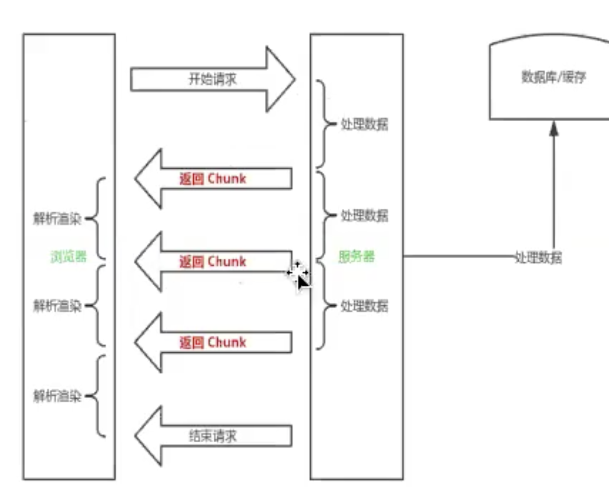
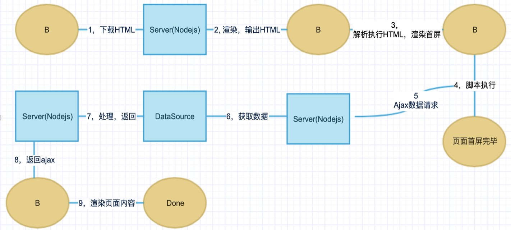
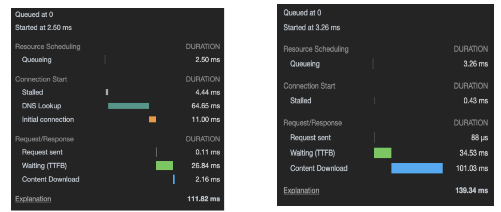
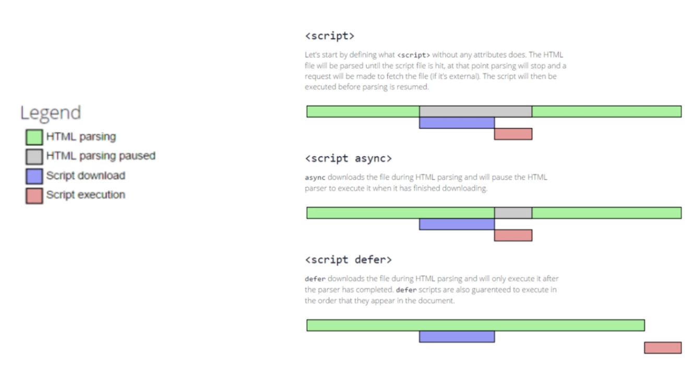

<!--
 * @Author: feizhijun
 * @Date: 2021-03-08 16:18:01
 * @LastEditors: feizhijun
 * @LastEditTime: 2021-03-12 14:55:07
 * @Description: desc
-->

# 前端页面渲染分析

页面的渲染经历了服务端页面直出，ajax 请求

## 页面性能指标

### 定义

1. 白屏时间：用户打开页面到页面出现东西为止
2. 首屏时间：首屏所有内容呈现花费的时间
3. 用户可操作时间： 用户可以正常点击/操作的时间
4. 页面完成时间：所有脚本执行完成，等待用户输入

### 量化

定义 T 值：表示一个过程的耗时，例如一次数据处理，或者一次网络请求。

- 一次网络请求，总耗时为一个 T
- 一次服务端处理，包含拉去数据，数据处理，模版渲染，总耗时为一个 T
- HTML 解析执行，为一个 T
- 脚本执行渲染过程，为一个 T

## 服务端页面直出

通过服务端返回完整 HTML 进行渲染。

### 渲染流程

1. 服务端下载 HTML
2. 数据获取
3. 数据处理以及返回
4. 页面渲染，输出 HTML

### 性能分析

- 白屏时间 2T-4T（两次网络交互，两次数据处理）
- 首屏时间 5T （多一次 HTML 渲染执行）
- 用户可操作时间 5T
- 页面完成时间 5T

### 极端场景优化

如果数据拉取时间过长，会导致白屏时间过长。
优化上可以将 response write 的形式先将 loading 渲染到页面上，用户体验会好很多。

## Ajax 前端渲染页面

### 渲染流程

1. 下载 HTML
2. 服务端渲染，输出基本 HTML
3. 解析渲染执行 HTML
4. 脚本执行
5. Ajax 数据请求
6. 服务端获取数据
7. 服务端处理数据
8. 返回 Ajax
9. 渲染页面内容

### 性能分析

- 白屏时间 2T（一次网络交互，一次数据处理） 1-2
- 首屏时间 3-4T （多一次 HTML 渲染执行，或者再加一次脚本渲染 loading） 1-4
- 用户可操作时间 7T（多两次网络时间+1 次数据处理+脚本渲染）1-9
- 页面完成时间 8T+ 1-9+

### 极端场景优化

如果数据拉取时间过长，会导致白屏时间过长。
优化上可以用 js 渲染内容占位，或者直接在 HTML 内加入。

## Bigpipe

根据模块依赖关系来决定渲染顺序，理论上可以同时渲染所有模块。复杂度会高一些。  
可以实现将重要的模块先渲染，后续模块再渲染。  
这种思想也可用于预加载数据，后端请求数据，然后不断在 HTML 插入脚本保存数据。

### 渲染流程

### 性能分析

- 白屏时间 1-2T
- 首屏时间 2-3T
- 用户可操作时间 2-3T
- 页面完成时间 2-3T

## React SSR

React SSR 在渲染时 2 阶段直接渲染出 HTML，Ajax 方式是 4 阶段才能得到页面

### API

- renderToStaticMarkup
- renderToString
- renderToStaticNodeStream
- renderToNodeStream

### 极端场景优化

1. 服务端 接收到页面请求之后，异步输出一个“框架”，loading 页或者占位。
2. 服务端 与此同时，获取数据。

3. 客户端 渲染完毕首屏之后是 pending 状态，此时没有任务可执行。加载 react 和业务代码开始让客户端执行。（最好什么框架都不用，此时让客户端等待）

4. 服务端 拉取到数据之后有两种方式处理成异步模块，按需 thunk 输出。  
   选择一： 处理数据按照 UI 模块按需输出 json。对应到客户端的 dispatch action 或者渲染方法调用。  
   选择二： 将数据渲染成 html 模块。对应到客户端的 insert 方法。

5. 客户端 接收到 thunk 模块，调用执行。

6. 服务端 send 文档结束标识，结束渲染。

## NSR

native side render

在客户端上做的类似 ssr 的事情，根据离线的 js
bundle 与预加载的 json 数据进行组合，提前渲染出 HTML 页面，在进行类似下一页的操作时可以实现秒开。

## 对比

| 指标           | 直出  | Ajax  | bigpipe | ssr |
| -------------- | ----- | ----- | ------- | --- |
| 白屏时间       | 2T/4T | 2T    | 1-2T    | 2T  |
| 首屏时间       | 5T    | 3T/4T | 2-3T    | 3T  |
| 用户可操作时间 | 5T    | 7T    | 2-3T    | 7T  |
| 页面完成时间   | 5T    | 8T+   | 2-3T    | 8T+ |

### 适用场景

直出：静态/表单页面，不依赖数据  
Ajax：白屏/首屏耗时少，应用广泛，成本适中  
Bigpipe：指标最佳，成本最高  
SSR：性能与 SSR 差异不大，但是灵活性最高。单页首屏优化，复杂度略高

## 网络优化

在浏览器的初次请求与第二次请求差别比较大的地方有 DNS 寻址和初始化 TCP 连接。

### Queue

浏览器进行请求时，会根据一些规则对请求进行排队，排队主要的依据有：

- 等待高优先级请求完毕
- 同域最大 TCP 连接限制（chrome 是 6 个）
- 浏览器正在快速的分配磁盘缓存

#### 优先级

1. head 中的 css 是 highest，script 是 high
2. async script 是 low
3. 异步请求默认优先级是 high，普通文本类型优先级最低

#### 如何影响优先级

1. new Image().src = "请求地址" // low

2. navigator.sendBeacon("请求地址", {}) // lowest

3. preload 预加载
   匹配未来的加载需求，是强制浏览器执行的指令。在适当的情况下，重复利用同一资源。比如字体文件，比较大的 css 文件。图片等。

4. prefetch 预提取

   抢占用户下一步可能进行的操作并为其做好准备。当前页面完成加载后，且带宽可用的情况下，这些资源将在 Chrome 中以  Lowest  优先级被提取。

5. dns-prefetch 预解析 DNS

   preconnect 的子集，仅做 DNS 查询

6. preconnect 预连接

   当前页面大概率会链接到另外一个地址，告知浏览器方便的时候建立链接，以便下次命中缓存以及节省时间。但是浏览器可能因为没有找到合适的时机而忽略。

### DNS

#### DNS Lookup

1. 浏览器缓存
2. 系统缓存
3. HOSTS
4. DNS Server

#### HTTPDNS

HTTPDNS 利用 HTTP 协议与 DNS 服务器交互，代替了传统的基于 UDP 协议的 DNS 交互，绕开了运营商的 Local DNS，有效防止了域名劫持，提高域名解析效率。另外，由于 DNS 服务器端获取的是真实客户端 IP 而非 Local DNS 的 IP，能够精确定位客户端地理位置、运营商信息，从而有效改进调度精确性。

<b>优点</b>

Local DNS 劫持：由于 HttpDns 是通过 IP 直接请求 HTTP 获取服务器 A 记录地址，不存在向本地运营商询问 domain 解析过程，所以从根本避免了劫持问题。

平均访问延迟下降：由于是 IP 直接访问省掉了一次 domain 解析过程，通过智能算法排序后找到最快节点进行访问。

用户连接失败率下降：通过算法降低以往失败率过高的服务器排序，通过时间近期访问过的数据提高服务器排序，通过历史访问成功记录提高服务器排序。
