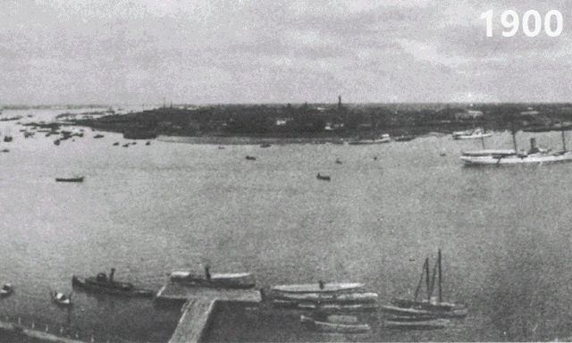

# 动态效果导出 gif

## 背景

开发需求中有动态地图的形式来展现。需要将地图导出成图片，而且需要支持 gif 图，从而可以更好地展现，最终效果类似如下效果：



## 分析

地图一般存在两种展现模式，一种为静态查看，需要下载成图片以便查看；另一种为动态查看，用户可以调整播放速度与以及手动暂停/播放，需要下载成 gif 来查看。

## SVG 导出图片

SVG 导出图片主要可以分为四步：

1. 获取想要下载的 svg 元素
2. 将 svg 转为 data64
3. 使用 canvas drawImage 方法，加载 data64 画在 canvas 上
4. 将 canvas 转为 data64，作为 a 标签 href，模拟 a 标签点击，进行下载

```ts
const img = new Image();
img.onload = drawImage;
img.onerror = errorSolve;
const b64Start = "data:image/svg+xml;base64,";

const svgStr = btoa(
  unescape(encodeURIComponent(new XMLSerializer().serializeToString(svg)))
);

img.src = `${b64Start}${svgStr}`;
```

## SVG 导出 Gif

将动态效果导出为 gif 主要的思路是获取 svg 在不同时刻每一帧的图像，再根据这些图像以不同的间隔来保存为 gif。

但是动态地图的下载要求下载所有的阶段，用户的播放和暂停不应该影响下载的 gif 的结果。也就是实际下载的 gif 与实际展现的 svg 并不同步，无法简单通过获取网页的 svg 来进行转化。因此，需要一个额外的容器来承载渲染的结果，当用户进行下载时，将每一阶段渲染到一个 canvas 容器中。然后使用 gif.js 库，将每一帧加入 gif 中，当全部帧都加入后，对 gif 进行下载。

比较麻烦的一点是 gif.js 必须指定一个 worker，worker 可以放到项目的静态文件中，也可以放在静态资源托管服务上，先获取自己 worker 的源码，再创建一个 base64 地址填写进去。

```ts
const gif = new Gif({
  quality: 10,
  debug: true,
  workers: 2,
  workerScript: URL.createObjectURL(workerBlob),
});
gif.addFrame(canvas, { delay: timeInterval });
gif.on("finished", function (blob) {
  const url = URL.createObjectURL(blob);
  const link = document.createElement("a");
  link.setAttribute("download", "demo.gif");
  link.href = url;
  link.click();
});

gif.render();
```

## 添加文字

添加文字 可以使用 canvas context 的 fillText 方法，使用 measureText 方法可以计算出文字的宽度，然后根据宽度定位到右上角。

```ts
const ctx = canvas.getContext("2d");
const margin = 20;
ctx.fillStyle = "#bbb";
ctx.font = `bold ${fontSize}px Calibri`;
ctx.textBaseline = "top";
const { width } = ctx.measureText(text);
const x = canvas.width - (width + margin);
ctx.fillText(text, x, margin);
```
