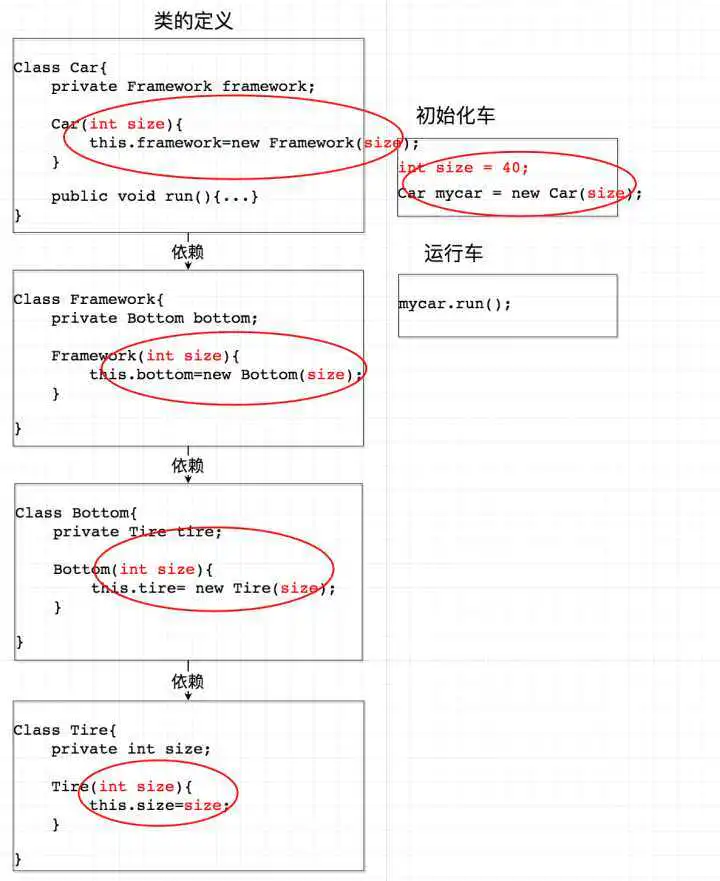

# 控制反转 IoC

控制反转(Inversion of Control, IoC)，是一种面向对象编程的一种设计原则，主要用途是用来降低代码的耦合度。

## 描述

简单来说，Class A 中用到了 Class B 的对象 b，一般情况下，需要在 A 的代码中显式的 new 一个 B 的对象。采用控制反转之后，A 的代码只需要定义一个私有的 B 对象，不需要直接 new 来获得这个对象，而是通过相关的容器控制程序来将操控实例好的 B 对象。
因此，是依赖对象的获得被反转了，因为大多数应用程序都是由两个或是更多的类通过彼此的合作来实现业务逻辑，这使得每个对象都需要获取与其合作的对象（也就是它所依赖的对象）的引用。如果这个获取过程要靠自身实现，那么这将导致代码高度耦合并且难以维护和调试。

## 实现方法

实现控制反转主要有两种方式：依赖注入和依赖查找。两者的区别在于，前者是被动的接收对象，在类 A 的实例创建过程中即创建了依赖的 B 对象，通过类型或名称来判断将不同的对象注入到不同的属性中，而后者是主动索取相应类型的对象，获得依赖对象的时间也可以在代码中自由控制。

### 依赖注入

依赖倒置原则：把原本的高层建筑依赖底层建筑“倒置”过来，变成底层建筑依赖高层建筑。高层建筑决定需要什么，底层去实现这样的需求，但是高层并不用管底层是怎么实现的。这样就不会出现前面的“牵一发动全身”的情况。
依赖注入，就是把底层类作为参数传入上层类，实现上层类对下层类的“控制”。

#### 反转容器

因为采用了依赖注入，在初始化的过程中就不可避免的会写大量的 new。这里 IoC 容器就解决了这个问题。这个容器可以自动对你的代码进行初始化，你只需要维护一个 Configuration（可以是 xml 可以是一段代码），而不用每次初始化一辆车都要亲手去写那一大段初始化的代码。这是引入 IoC Container 的第一个好处。
IoC Container 的第二个好处是：我们在创建实例的时候不需要了解其中的细节。Ioc 容器先从最上层开始往下找依赖关系，到达最底层之后再往上一步一步 new。

#### 具体实现方式

依赖注入有如下实现方式：

- 基于接口。实现特定接口以供外部容器注入所依赖类型的对象。
- 基于 set 方法。实现特定属性的 public set 方法，来让外部容器调用传入所依赖类型的对象。
- 基于构造函数。实现特定参数的构造函数，在新建对象时传入所依赖类型的对象。
- 基于注解。基于 Java 的注解功能，在私有变量前加“@Autowired”等注解，不需要显式的定义以上三种代码，便可以让外部容器传入对应的对象。该方案相当于定义了 public 的 set 方法，但是因为没有真正的 set 方法，从而不会为了实现依赖注入导致暴露了不该暴露的接口（因为 set 方法只想让容器访问来注入而并不希望其他依赖此类的对象访问）。

### 依赖查找

依赖查找更加主动，在需要的时候通过调用框架提供的方法来获取对象，获取时需要提供相关的配置文件路径、key 等信息来确定获取对象的状态

## 参考

[如何基于 TypeScript 实现控制反转](https://zhuanlan.zhihu.com/p/311184005)
[tsyringe](https://github.com/Microsoft/tsyringe)
