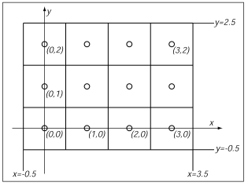

# 从零开始写软渲染器00
## 1. 简介
**计算机图形学**是指使用计算机创建和处理图像的任何方式。计算机图形学主要可以分为三个领域：**建模**、**渲染**和**动画**。

游戏开发的过程涉及到图形学的所有领域，其中最重要的就是渲染。我们常常说一个游戏画面好，那么我们的判断标准是什么？闫令琪大神给了一个简单的判断标准，“看游戏画面是不是足够亮！”，从技术上说，就是看这个游戏的**全局光照**是不是做的足够好，全局光照或者说光照是渲染里非常重要的部分。


在游戏开发的过程中，不论在团队中负责开发什么内容，或多或少都会遇到渲染相关的问题。学习渲染，或者说学习计算机图形学的知识是很有必要的。

在 **从零开始写软渲染器** 这个系列中，作者会以学习者的视角一步步从零开始，实现一个基于CPU的软渲染器。图形学的学习线路是比较漫长的，作者在网上找了很多学习资料，最常见的一句话就是，“最好自己实现一个软渲染器”。这里说的软渲染器，是区别于真正用于影视动画制作、**游戏引擎**等基于GPU的商用渲染器。因此，整个**渲染管线**都是在CPU完成的。

另外，学习计算机图形学或者学习渲染，并不等于学习图形API，因此这里面不会涉及任何 OpenGL DirectX Vulkan 等图形API的内容。相反，我们要做的相当于是自己动手实现一个图形API，自己实现OpenGL库，用这个方式来深入理解这些图形API的原理。

## 2. 代码库
作者会把实现过程和代码开源在GitHub上：https://github.com/travmygit/fffrenderer

项目会以打 tag 的方式记录版本节点，不出意外基本上是每一篇分享对应一个 tag ，具体细节可以到 repos 查看。

## 3. 绘制一个方块
我们第一次就以渲染一个方块来收尾吧！

### 3.1 理论时间
我们日常使用的LED显示器、手机显示屏等都称作 **栅格显示屏(Raster Displays)** ，用来显示栅格图像。栅格图像实际上就是一个很大的数组，里面存储的一个个 **图像元素(picture element, pixel)** 称为像素。像素保存着图像上某一个点的颜色信息。

LED屏由许许多多的LED灯组成，这些灯组成一个个小格子，一个小格子对应一个像素。一个像素里面由三个不同颜色的LED灯组成，红色、绿色和蓝色，分别发出不同强度不同颜色的光。一个像素一般都非常小，当人眼距离屏幕比较远的时候，三种颜色就会混合起来，我们就会看到不同的颜色。


不是所有显示屏的子像素都是这样从左到右整齐排列的，比如iPhone的OLED显示屏就是钻石排列。


但是，不论硬件的排列顺序是怎么样的，在进行软件开发的时候，我们还是会把一个个像素按照横平竖直的方式排列。



> 注意，上图把像素的中点作为坐标点，其实并不是所以的API都是这样的，有的会选择像素的左下角开始。另外，其他一些API则是规定左上角为原点，从左到右，从上到下排列。

在实际开发中，一个像素应该怎么表示呢？一般有以下几种：
* 灰度图 - 只需要灰度，单个子像素
* 带Alpha通道的灰度图 - 灰度 + Alpha组成
* RGB - 三个通道组成，三个子像素
* RGBA - 带Alpha通道的RGB

对于普通的低精度图片，一般RGB的每个通道用8个bit表示，一共占24个bit；而对于高精度的HDR图片，每个通道用32位的float表示，一共占12个字节。可以想象，图片的内存占用是非常大的。

> 灰度图与屏幕显示亮度有关，通常，屏幕会根据输入的像素值来设置LED灯的亮度，但亮度不是随着输入值线性递增的，具体自行查资料，这个并不关键。

最后，简单解释下Alpha通道的工作原理，Alpha通道发生作用是因为一个像素中，前景和背景产生重叠。如果前景是完全透明的，那么只需要渲染背景；如果前景完全不透明，那么只需要渲染前景；如果前景半透明，那么这个像素最终的渲染结果应该受到前背景共同作用。比如可以线性插值`$c=\alpha{c_f}+(1-\alpha)c_b$`。

### 3.2 动手时间
这次会涉及到读写图片的相关内容，但是作为渲染学习，我们应该把注意力放在处理像素、处理图片上。所以我引入了读写图片的开源库，STB，所有的代码只有两个头文件(stb_image.h, stb_image_write.h)，API也非常简洁。STB这个项目还有许多很好的库，感兴趣可以去参考：https://github.com/nothings/stb

了解了上述的理论知识之后，我们知道一个像素可以表示为由RGB三个子像素的组合。另外，屏幕上的一个个像素是像一个个小格子一样，可以从上到下，从左到右排列（我们约定这个顺序，为便于理解，你可以认为像扫描），每个像素有自己的坐标，从 (0, 0) 递增到 (w, h) 。

我们可以认为，图片在内存中就是一段连续的内存，如果我们使用RGB表示一个像素，那么一个像素占用3字节，一个图片一共占用`3*w*h`字节。我们可以这样产生一张100x100的黑色图片。

```cpp
int w = 100, h = 100, n = 3;
unsigned long nbytes = w*h*n;
unsigned char* data;
data = new unsigned char[nbytes];
std::memset(data, 255, nbytes);
stbi_write_bmp("build/output.bmp", w, h, n, data);
```


进一步，还可以画一个方块。

```cpp
int rw = 20, rh = 20;
unsigned char red[3] = {255, 0, 0};
for (int i = 0; i < rw; i++)
{
    for (int j = 0; j < rh; j++)
    {
        std::memcpy(data+(i+j*w)*n, red, n);
    }
}
```


到这里，我们知道了图像是由多个像素组合起来显示在屏幕上的，我们能够轻松地在屏幕上绘制好几个像素。作者希望分享是短小精悍的，所以这次点到为止。

这次的代码：https://github.com/travmygit/fffrenderer/tree/vol00

## 4. 预告
我们知道图像是有一个个像素组成的，像素的排列又是横平竖直，从左到右，从上到下排列的。那么怎么在屏幕上画出一条直线，甚至画出一个三角形呢？我们下次继续！

## 5. 引用
Peter Shirley, Steve Marschner. Fundamentals of Computer Graphics, Third Edition.

iPhone X Diamond Sub-Pixels. https://www.displaymate.com/Diamond_41a.html.