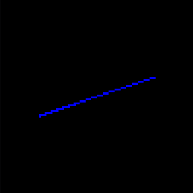

# 从零开始写软渲染器01
## 1. 概览
上次我们已经能够在屏幕上绘制一个方块了，这次我们再往前一步，绘制一条线段。

我们知道，屏幕上的像素排列方式是横平竖直的，在屏幕上用一个个连续的像素画出一条笔直的或者水平的线段是很容易的，但是，如果是一条倾斜着的线段，那么仅仅使用这些像素，怎么可能表示出这样一条倾斜的线段呢？难道不会有锯齿状产生吗？

其实，用像素表示的直线一定会有锯齿状，但是为什么我们确感觉不出来呢？其实还是那个原理，当屏幕上的每个像素都很小很多，人眼距离屏幕越远，越看不出每个像素的区别，看到的图像就越平滑。接下来，我们就通过在屏幕上绘制一条线段的过程来理解这个原理。
## 2. 绘制一条线段
对于由直角坐标系 (x0, y0) 与 (x1, y1) 两点所构成的直线，公式如下：


### 2.1
首先，我们先凭直觉写一个简单的版本：
```cpp
int main()
{
    ...
    fff::Rasterizer r(100, 100, 4);
    r.DrawLine_V1(fff::IntPoint(20, 60), fff::IntPoint(80, 40), fff::Color::Blue);
    ...
}

void fff::Rasterizer::DrawLine_V1(const fff::IntPoint& Start, const fff::IntPoint& End, const fff::Color& Color)
{
	for (float t = 0.f; t < 1.f; t += 0.01f)
	{
		int x = Start.X + (End.X - Start.X) * t;
		int y = Start.Y + (End.Y - Start.Y) * t;
		SetPixel(x, y, Color);
	}
}
```
绘制结果如下：



#### 问题：像素数量
这个算法的问题在于，线段质量的好坏取决于一个常数 0.01f ，除此之外还有性能问题。如果我们把常数设为 0.1f ，那么结果会是：


### 2.2
第一个算法的问题在于受到一个常数的限制，其实想想就会发现，这个常数的作用在于限制了绘制的像素数量，设为 0.1f 那么无论线段多长，最多只会绘制 10 个像素。

为了避免需要考虑像素个数，我们可以想到这样改：
```cpp
int main()
{
    ...
    r.DrawLine_V2(fff::IntPoint(20, 60), fff::IntPoint(80, 40), fff::Color::Blue);
	r.DrawLine_V2(fff::IntPoint(80, 40), fff::IntPoint(20, 60), fff::Color::Red);
	r.DrawLine_V2(fff::IntPoint(20, 40), fff::IntPoint(40, 80), fff::Color::Red);
	...
}

void fff::Rasterizer::DrawLine_V2(const fff::IntPoint& Start, const fff::IntPoint& End, const fff::Color& Color)
{
	for (int x = Start.X; x <= End.X; ++x)
	{
		float t = (x - Start.X) / (float)(End.X - Start.X);
		int y = Start.Y * (1.f - t) + End.Y * t;
		SetPixel(x, y, Color);
	}
}
```
绘制结果：


#### 问题：对称一致性
这个算法虽然解决了像素个数的问题，但是有一个比较明显的问题。上面其实画了两条线段，从 (20, 60) -> (80, 40) 的蓝线 和 (80, 40) -> (20, 60) 的红线，但是只绘制了蓝线。

这里想说的是，绘制的算法需要考虑到**对称一致性**，也就是需要保证由两点确定的线段绘制的效果相同。
#### 问题：线段间隙
我们还发现，其中的红线 (20, 40) -> (40, 80) 有很比较的间隙，这是因为y坐标值的变化率大于x坐标值的变化率，或者说线段斜率大于1。

### 2.3
对称性的问题我们可以交换两个点的，来保证 Start 点的坐标值始终小于 End 点即可。

而线段间隙问题是 x, y 方向变化率大小的问题，我们需要关注算法里的 for 循环，for 循环执行的次数是绘制像素的个数，那么如果 dy 大于 dx ，for 循环应该变成 for (int y ....) ，于是这样改：
```cpp
int main()
{
    ...
    r.DrawLine_V3(fff::IntPoint(20, 60), fff::IntPoint(80, 40), fff::Color::Blue);
	r.DrawLine_V3(fff::IntPoint(80, 40), fff::IntPoint(20, 60), fff::Color::Red);
	r.DrawLine_V3(fff::IntPoint(20, 40), fff::IntPoint(40, 80), fff::Color::Red);
    ...
}

void fff::Rasterizer::DrawLine_V3(const fff::IntPoint& Start, const fff::IntPoint& End, const fff::Color& Color)
{
	int x1 = Start.X;
	int y1 = Start.Y;
	int x2 = End.X;
	int y2 = End.Y;

	int dx = (x1 < x2) ? x2 - x1 : x1 - x2;
	int dy = (y1 < y2) ? y2 - y1 : y1 - y2;

	if (dx >= dy)
	{
		if (x2 < x1)
		{
			std::swap(x1, x2);
			std::swap(y1, y2);
		}
		for (int x = x1; x <= x2; ++x)
		{
			float t = (x - x1) / (float)(x2 - x1);
			int y = y1 * (1.f - t) + y2 * t;
			SetPixel(x, y, Color);
		}
	}
	else
	{
		if (y2 < y1)
		{
			std::swap(x1, x2);
			std::swap(y1, y2);
		}
		for (int y = y1; y <= y2; ++y)
		{
			float t = (y - y1) / (float)(y2 - y1);
			int x = x1 * (1.f - t) + x2 * t;
			SetPixel(x, y, Color);
		}
	}
}
```
绘制结果：


### 2.4
我们的算法到这里效果已经完成了，给任意两点已经能绘制出一条线段，并且保证了**合理的像素数量**、**对称一致性**和**线段无间隙**。但是其中用到了许多浮点数、除法操作，存在性能问题。

在这里我们对算法再做一些优化，注意到算法里的除法部分，我们可以把它提到 for 循环外面：
```cpp
void fff::Rasterizer::DrawLine_V4(const fff::IntPoint& Start, const fff::IntPoint& End, const fff::Color& Color)
{
	int x1 = Start.X;
	int y1 = Start.Y;
	int x2 = End.X;
	int y2 = End.Y;

	int dx = (x1 < x2) ? x2 - x1 : x1 - x2;
	int dy = (y1 < y2) ? y2 - y1 : y1 - y2;

	if (dx >= dy)
	{
		if (x2 < x1)
		{
			std::swap(x1, x2);
			std::swap(y1, y2);
		}

		float error = 0.f;
		float derror = std::abs(dy / (float)dx);

		int y = y1;

		for (int x = x1; x <= x2; ++x)
		{
			SetPixel(x, y, Color);

			error += derror;
			if (error > 1.0f)
			{
				y += (y2 > y1) ? 1 : -1;
				error -= 1.0f;
			}
		}
	}
	else
	{
		if (y2 < y1)
		{
			std::swap(x1, x2);
			std::swap(y1, y2);
		}

		float error = 0.f;
		float derror = std::abs(dx / (float)dy);

		int x = x1;

		for (int y = y1; y <= y2; ++y)
		{
			SetPixel(x, y, Color);

			error += derror;
			if (error > 1.0f)
			{
				x += (x2 > x1) ? 1 : -1;
				error -= 1.0f;
			}
		}
	}
}
```
简单说明一下，对于 dx > dy 的情况，x 递增 1 则 y 递增 (dy/dx) ，y 的递增超过一个像素时，那么 y 就进一步。

但是其中还有浮点数，其实里面并不需要计算 (dy/dx) ，最终改成如下版本：
```cpp
void fff::Rasterizer::DrawLine_V5(const fff::IntPoint& Start, const fff::IntPoint& End, const fff::Color& Color)
{
	int x1 = Start.X;
	int y1 = Start.Y;
	int x2 = End.X;
	int y2 = End.Y;

	int dx = (x1 < x2) ? x2 - x1 : x1 - x2;
	int dy = (y1 < y2) ? y2 - y1 : y1 - y2;

	int derror = 0;

	if (dx >= dy)
	{
		if (x2 < x1)
		{
			std::swap(x1, x2);
			std::swap(y1, y2);
		}

		int y = y1;

		for (int x = x1; x <= x2; ++x)
		{
			SetPixel(x, y, Color);

			derror += dy;
			if (derror >= dx)
			{
				y += (y2 > y1) ? 1 : -1;
				derror -= dx;
			}
		}
	}
	else
	{
		if (y2 < y1)
		{
			std::swap(x1, x2);
			std::swap(y1, y2);
		}

		int x = x1;

		for (int y = y1; y <= y2; ++y)
		{
			SetPixel(x, y, Color);

			derror += dx;
			if (derror >= dy)
			{
				y += (y2 > y1) ? 1 : -1;
				derror -= dy;
			}
		}
	}
}
```
## 3. 小结
上述的最终算法是其实是 Bresenham 算法，这个算法的效率非常高，效果也不错，也是工业界正在使用的算法。我们当然可以直接去网络上找到一个算法直接使用，不过这样比较无趣，深入挖掘算法的过程还是很愉悦的。

这次的代码：https://github.com/travmygit/fffrenderer/tree/vol01
## 4. 预告
这次我们成功绘制了直线，并且了解了直线绘制的算法，这是意义非凡的一步！下次，我们将利用本次学到的知识，绘制图形学的基本图元：三角形！
## 5. 参考
https://en.wikipedia.org/wiki/Bresenham%27s_line_algorithm