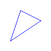
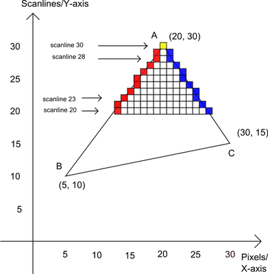
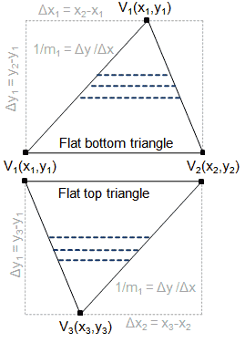
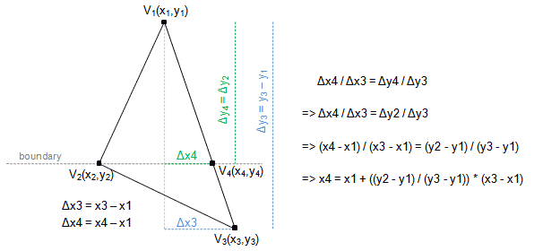
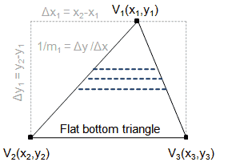
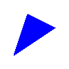
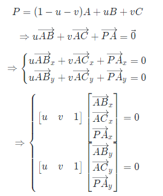
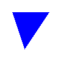

# 从零开始写软渲染器02
## 1. 概览
计算机图形学里的基本的几何图元(Geometry Primitive)通常是指点、线、三角形，前面我们已经知道如何绘制点和线了，所以这次我们来学习绘制三角形，准确来说，应该是绘制一个三角面。
## 2. 绘制一个三角面
绘制三角面的算法有很多，下面逐一讨论 **(Scanline)扫描线法** ，**(Barycentric)重心坐标法**。
### 2.1 (Scanline)扫描线法
首先，我们利用上一篇文章绘制线段的方法已经可以轻松绘制一个三角形线框：
```cpp
void fff::Rasterizer::DrawTriangle(const fff::IntPoint& V0, const fff::IntPoint& V1, const fff::IntPoint& V2, const fff::Color& Color)
{
	DrawLine(V0, V1, Color);
	DrawLine(V0, V2, Color);
	DrawLine(V1, V2, Color);
}
```



线框有了，接下来我们只需要思考怎么往里面填充颜色即可。

第一种填充的方法称为扫描线法，大体意思是按Y轴从下到上有一个水平线，依次计算水平线和三角形三条边的交点，然后填充两个交点之间的像素。



实际上，在具体操作过程中，我们会把三角形分为两部分逐个绘制，比如：



#### 2.1.1
首先我们解决怎么把一个三角形拆分成上下两部分，可以通过相似三角形直接得出：



分割点 V4 为 (x4, y4) ：

x4 = x1 + ((y2 - y1)/(y3 - y1)) * (x3 - x1);

y4 = y2;

#### 2.1.2
接下来我们分别绘制两部分三角形，对于 Flat bottom triangle，我们从 V1 开始向下扫描，对于 V1-V2 边可以计算出斜率 K1 ，那么 Y 每增加 1，X 就会增加 1/K1 。 V1-V3 边同理。



看代码比较清楚：
```cpp
void fff::Rasterizer::FillFlatBottomTriangle(const fff::IntPoint& V1, const fff::IntPoint& V2, const fff::IntPoint& V3, const fff::Color& Color)
{
	float InvSlope1 = (float)(V2.X - V1.X) / (float)(V2.Y - V1.Y);
	float InvSlope2 = (float)(V3.X - V1.X) / (float)(V3.Y - V1.Y);

	float CurX1 = (float)V1.X;
	float CurX2 = (float)V1.X;

	for (int ScanlineY = V1.Y; ScanlineY <= V2.Y; ++ScanlineY)
	{
		DrawLine(fff::IntPoint((int)CurX1, ScanlineY), fff::IntPoint((int)CurX2, ScanlineY), Color);
		CurX1 += InvSlope1;
		CurX2 += InvSlope2;
	}
}
```
对于 Flat top triangle ，则是简单的反过来遍历即可：
```cpp
void fff::Rasterizer::FillFlatTopTriangle(const fff::IntPoint& V1, const fff::IntPoint& V2, const fff::IntPoint& V3, const fff::Color& Color)
{
	float InvSlope1 = (float)(V3.X - V1.X) / (float)(V3.Y - V1.Y);
	float InvSlope2 = (float)(V3.X - V2.X) / (float)(V3.Y - V2.Y);

	float CurX1 = (float)V3.X;
	float CurX2 = (float)V3.X;

	for (int ScanlineY = V3.Y; ScanlineY > V1.Y; --ScanlineY)
	{
		DrawLine(fff::IntPoint((int)CurX1, ScanlineY), fff::IntPoint((int)CurX2, ScanlineY), Color);
		CurX1 -= InvSlope1;
		CurX2 -= InvSlope2;
	}
}
```

#### 2.1.3
整合之后的代码：
```cpp
void fff::Rasterizer::DrawTriangleV1(fff::IntPoint V1, fff::IntPoint V2, fff::IntPoint V3, const fff::Color& Color)
{
	if (V1.Y > V2.Y) std::swap(V1, V2);
	if (V1.Y > V3.Y) std::swap(V1, V3);
	if (V2.Y > V3.Y) std::swap(V2, V3);

	if (V2.Y == V3.Y)
	{
		FillFlatBottomTriangle(V1, V2, V3, Color);
	}
	else if (V1.Y == V2.Y)
	{
		FillFlatTopTriangle(V1, V2, V3, Color);
	}
	else
	{
		fff::IntPoint V4((int)(V1.X + ((float)(V2.Y - V1.Y) / (float)(V3.Y - V1.Y)) * (V3.X - V1.X)), V2.Y);
		FillFlatBottomTriangle(V1, V2, V4, Color);
		FillFlatTopTriangle(V2, V4, V3, Color);
	}
}
```
绘制结果：
```cpp
int main()
{
    ...
	fff::Rasterizer r(100, 100);
	fff::IntPoint V1(20, 80);
	fff::IntPoint V2(40, 20);
	fff::IntPoint V3(80, 40);
	r.DrawTriangleV1(V1, V2, V3, fff::Color::Blue);
	...
}
```


### 2.2 (Barycentric)重心坐标法
扫描线法算是非常好的算法了，但是目前业界使用最多的是重心坐标法。原因在于，扫描线法的设计就是单线程的，而重心坐标法可以很方便使用GPU多线程并行计算，我们来一起看看。

我们首先复习下平面三角形的重心坐标，对于由 a, b, c 三点组成的平面三角形，平面上任一点 p 可以表示为：
```math
p=\alpha a+\beta b+\gamma c

\alpha+\beta+\gamma=1
```
重心坐标上的一点 p 可以表示为：`$p(\alpha,\beta,\gamma)$`

重心坐标可以方便地帮忙我们干两件事：
1. 判断某个点是否在三角形内：`$\alpha,\beta,\gamma \in(0,1)$`
2. 可以线性插值求三角形内某个点的颜色

这个算法的基本思路如下：
```cpp
triangle(vec2 points[3])
{
    vec2 bbox[2] = find_bounding_box(points);
    for (each pixel in the bounding box)
    {
        if (inside(points, pixel))
        {
            draw_pixel(pixel);
        }
    }
}
```
#### 2.2.1
首先解决如何计算重心坐标，下面简单推导一下重心坐标。设重心坐标为P，对于三角形ABC，那么有：
```math
P = (1-u-v)A + uB + vC

\Rightarrow u\overrightarrow{AB} + v\overrightarrow{AC} + \overrightarrow{PA} = \vec{0}

\Rightarrow \begin{cases}
   u\overrightarrow{AB}_x + v\overrightarrow{AC}_x + \overrightarrow{PA}_x = 0 \\
   u\overrightarrow{AB}_y + v\overrightarrow{AC}_y + \overrightarrow{PA}_y = 0
\end{cases}

\Rightarrow \begin{cases}
   \begin{bmatrix}u&v&1\end{bmatrix}\begin{bmatrix}\overrightarrow{AB}_x\\\overrightarrow{AC}_x\\\overrightarrow{PA}_x\end{bmatrix} = 0 \\
   \begin{bmatrix}u&v&1\end{bmatrix}\begin{bmatrix}\overrightarrow{AB}_y\\\overrightarrow{AC}_y\\\overrightarrow{PA}_y\end{bmatrix} = 0
\end{cases}
```


可得向量 (u, v, 1) 与其他两个向量垂直，那么也就是需要求(ABx, ACx, PAx)与(ABy, ACy, PAy)向量的叉乘结果即可。
```cpp
static Vector Cross(const Vector& A, const Vector& B)
{
	return Vector(A.Y*B.Z - A.Z*B.Y, A.Z*B.X - A.X*B.Z, A.X*B.Y - A.Y*B.X);
}

static Vector Barycentric(const Vector& A, const Vector& B, const Vector& C, const Vector& P)
{
	Vector Coord = Cross(Vector(B.X - A.X, C.X - A.X, A.X - P.X), Vector(B.Y - A.Y, C.Y - A.Y, A.Y - P.Y));
	if (std::abs(Coord.Z) < 1)
	{
		return Vector(-1.f, 1.f, 1.f);
	}
	return Vector(1.f - (Coord.X + Coord.Y) / Coord.Z, Coord.X / Coord.Z, Coord.Y / Coord.Z);
}
```
#### 2.2.2
具体的算法实现我们直接看代码吧：
```cpp
void fff::Rasterizer::DrawTriangleV2(fff::IntPoint V1, fff::IntPoint V2, fff::IntPoint V3, const fff::Color& Color)
{
	int MinX = V1.X;
	MinX = std::min(MinX, V2.X);
	MinX = std::min(MinX, V3.X);

	int MinY = V1.Y;
	MinY = std::min(MinY, V2.Y);
	MinY = std::min(MinY, V3.Y);

	int MaxX = V1.X;
	MaxX = std::max(MaxX, V2.X);
	MaxX = std::max(MaxX, V3.X);

	int MaxY = V1.Y;
	MaxY = std::max(MaxY, V2.Y);
	MaxY = std::max(MaxY, V3.Y);

	fff::IntPoint BoundingBoxMin(MinX, MinY);
	fff::IntPoint BoundingBoxMax(MaxX, MaxY);

	fff::IntPoint P;
	for (P.X = BoundingBoxMin.X; P.X <= BoundingBoxMax.X; ++P.X)
	{
		for (P.Y = BoundingBoxMin.Y; P.Y <= BoundingBoxMax.Y; ++P.Y)
		{
			fff::Vector Coord = fff::Vector::Barycentric(V1, V2, V3, P);
			if (Coord.X < 0 || Coord.Y < 0 || Coord.Z < 0)
			{
				continue;
			}
			SetPixel(P.X, P.Y, Color);
		}
	}
}
```
绘制结果：
```cpp
int main()
{
    ...
	fff::Rasterizer r(100, 100);
	fff::IntPoint V1(20, 20);
	fff::IntPoint V2(40, 80);
	fff::IntPoint V3(80, 20);
	r.DrawTriangleV2(V1, V2, V3, fff::Color::Blue);
	...
}
```


## 3. 小结
这次我们知道了栅格化三角面的两个算法，其中重心坐标法是业界普遍使用的算法，因为计算的过程可以多线程并行。而对于单线程的场景下，使用扫描线法是最佳的。

这次的代码：https://github.com/travmygit/fffrenderer/tree/vol02

## 4. 预告
现在我们已经知道如果渲染计算机图形学的基本图元点、线和三角面，然而我们绘制的所有东西都是二维的。下一次，我们将介绍三维空间渲染的知识，让我们的渲染器拥有位移、旋转的变换能力。另外，还有重要的且难度较高的透视投影计算。

## 5. 参考
http://www.sunshine2k.de/coding/java/TriangleRasterization/TriangleRasterization.html

https://en.wikipedia.org/wiki/Barycentric_coordinate_system