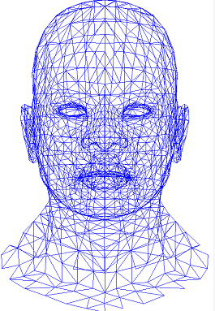
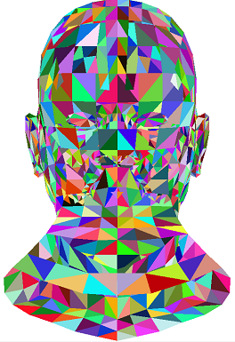

# 从零开始写软渲染器03
## 1. 概览
到目前为止，我们都是在绘制一些基本的图元，这不免会有一些无趣。这次我们来试着用已有的知识来绘制一个模型。

模型里比较通用、有名的文件格式是 OBJ 格式，这次我们来了解一下 OBJ 文件格式的结构并绘制出来。
## 2. OBJ文件
### 2.1 OBJ格式
OBJ 文件使用格式化的数据来表示一个3D模型，包括模型每个顶点的位置、顶点法向、纹理坐标、面等，每个面的顶点默认是按逆时针顺序排列的。OBJ 支持多边形、直线、表面和曲线。
### 2.2 OBJ基本结构
OBJ 文件没有文件头。通常会有一些注释在开头：
```
# this is a comment
```
OBJ 文件由一行行文本组成，一般格式是由几个字母组成的关键字开头，然后后续连上关键词代表的数据。
```
# 顶点(x, y, z[, w])，w 是可选的，默认值是 1.0，表示顶点颜色
v 0.123 0.234 0.345 1.0
v ...
# 纹理坐标(u[, v, w])，范围都是0-1，默认值都是0
vt 0.500 1 [0]
vt ...
# 顶点法向(x, y, z)，法向量有可能不是单位向量
vn 0.707 0.000 0.707
vn ...
# 参数空间顶点(u[, v][, w])，表示曲线的
vp 0.310000 3.210000 2.100000
vp ...
# 多边形面(v1 v2 v3 ...)，1 表示从头数的第一个顶点，-1 倒数的最后一个顶点
f 1 2 3
# 带上纹理信息的面(v1/vt1 v2/vt2 v3/vt3 ...)
f 3/1 4/2 5/3
# 带上纹理信息与顶点法向的面(v1/vt1/vn1 v2/vt2/vn2 v3/vt3/vn3 ...)
f 6/4/1 3/5/3 7/6/5
# 带上顶点法向的面(v1//vn1 v2//vn2 v3//vn3 ...)
f 7//1 8//2 9//3
f ...
# 线段
1 5 8 1 2 4 9
```
OBJ 文件可以引用一个 MTL 材质文件，提供 OBJ 一些材质参数使用。比如，在一个 OBJ 里使用材质 example.mtl ：
```
# 使用 mtl 材质文件
mtllib example.mtl
v ...
v ...
vn ...
vn ...
vt ...
vt ...
...
# 使用 mtl 文件里的 wood 材质
usemtl wood
f ...
...
```
`usemtl xxx`指定了材质，之后的面都是使用这一个材质渲染，直到遇到下一个`usemtl xxx`来指定新的材质。
### 2.3 线框模式
接下来，我们就动手来绘制一个 OBJ 模型。

这里，我们使用开源的 OBJ 文件格式的解析库，是 Github 上的 [Tiny Object Loader](https://github.com/tinyobjloader/tinyobjloader)。

我们使用之前绘制线段的功能来绘制模型的线框（线框模式是在渲染中特别常用的模式）：
```cpp
for (size_t s = 0; s < shapes.size(); s++)
{
	size_t index_offset = 0;
	for (size_t f = 0; f < shapes[s].mesh.num_face_vertices.size(); f++)
	{
		size_t fv = shapes[s].mesh.num_face_vertices[f];
		if (Mode == RenderMode::FRAME)
		{
			for (size_t v = 0; v < fv - 1; v++)
			{
				//
				tinyobj::index_t idx0 = shapes[s].mesh.indices[index_offset + v];
				tinyobj::real_t vx0 = attrib.vertices[3 * idx0.vertex_index + 0];
				tinyobj::real_t vy0 = attrib.vertices[3 * idx0.vertex_index + 1];
				tinyobj::real_t vz0 = attrib.vertices[3 * idx0.vertex_index + 2];
				//
				tinyobj::index_t idx1 = shapes[s].mesh.indices[index_offset + v + 1];
				tinyobj::real_t vx1 = attrib.vertices[3 * idx1.vertex_index + 0];
				tinyobj::real_t vy1 = attrib.vertices[3 * idx1.vertex_index + 1];
				tinyobj::real_t vz1 = attrib.vertices[3 * idx1.vertex_index + 2];
				//
				fff::IntPoint p0((int)((vx0 + 1.f)*Width / 2), (int)((vy0 + 1.f)*Height / 2));
				fff::IntPoint p1((int)((vx1 + 1.f)*Width / 2), (int)((vy1 + 1.f)*Height / 2));
				DrawLine(p0, p1, fff::Color::Blue);
			}
		}

```
绘制结果：
```cpp
int main()
{
	const char* filename = "african_head.obj";
	fff::Rasterizer r(width, height);
	r.LoadAndDrawModel(filename, fff::RenderMode::FRAME);
	r.Serialize("output.png", true);
	...
}
```


### 2.4 Flat Shading
渲染里最简单的着色器就是 Flat Shading ，也就是，直接给三角面绘制特定的颜色，不考虑其他环境光的因素。这里我们就用之前绘制三角面的功能来做一个简单的 Flat Shading：
```cpp
else if (Mode == RenderMode::FILLED)
{
	{
		size_t v = 0;
		//
		tinyobj::index_t idx0 = shapes[s].mesh.indices[index_offset + v];
		tinyobj::real_t vx0 = attrib.vertices[3 * idx0.vertex_index + 0];
		tinyobj::real_t vy0 = attrib.vertices[3 * idx0.vertex_index + 1];
		tinyobj::real_t vz0 = attrib.vertices[3 * idx0.vertex_index + 2];
		//
		tinyobj::index_t idx1 = shapes[s].mesh.indices[index_offset + v + 1];
		tinyobj::real_t vx1 = attrib.vertices[3 * idx1.vertex_index + 0];
		tinyobj::real_t vy1 = attrib.vertices[3 * idx1.vertex_index + 1];
		tinyobj::real_t vz1 = attrib.vertices[3 * idx1.vertex_index + 2];
		//
		tinyobj::index_t idx2 = shapes[s].mesh.indices[index_offset + v + 2];
		tinyobj::real_t vx2 = attrib.vertices[3 * idx2.vertex_index + 0];
		tinyobj::real_t vy2 = attrib.vertices[3 * idx2.vertex_index + 1];
		tinyobj::real_t vz2 = attrib.vertices[3 * idx2.vertex_index + 2];
		//
		fff::IntPoint p0((int)((vx0 + 1.f)*Width / 2), (int)((vy0 + 1.f)*Height / 2));
		fff::IntPoint p1((int)((vx1 + 1.f)*Width / 2), (int)((vy1 + 1.f)*Height / 2));
		fff::IntPoint p2((int)((vx2 + 1.f)*Width / 2), (int)((vy2 + 1.f)*Height / 2));
		DrawTriangle(p0, p1, p2, fff::Color(rand() % 256, rand() % 256, rand() % 256, 255));
	}
}
```
绘制结果：


## 3. 小结
本次我们读取 OBJ 文件，并根据顶点信息、三角面等信息把它绘制了出来。我们首先绘制了模型的线框，不过我们发现线框其实有一些缺口，这个问题需要解决。我们还以 Flat Shading 的方式把他绘制了出现，不过也有一些问题，就是如果模型脑后的三角形比前面的三角形要晚绘制，那么就会把前面绘制的三角形覆盖掉，也就是分不清前后，没有深度，我们需要进行深度测试。

这次的代码：https://github.com/travmygit/fffrenderer/tree/vol03
## 4. 预告
下次我们将慢慢进入3D的世界，了解深度测试的原理。
## 5. 参考
https://en.wikipedia.org/wiki/Wavefront_.obj_file