# 从零开始写软渲染器04
## 1. 概览
这次我们主要来讲一讲变换矩阵！我们先前渲染了那么多的图片，实际上都是在二维空间上完成的，但是我们是生活在三维空间里的，只能够在二维空间绘制几个三角形是不能满足我们的期望的。渲染三维空间里的物体，其实就是把三维空间的物体转换为二维的图像，然后在屏幕上绘制出来。然而事情还没有那么简单，对于人眼来说，我们看到的画面是一张透视图，这种透视图给我们的大脑产生空间感，让我们能够看到三维的世界。

在画师眼里，想要画出一张颇具空间感的画作，需要借助透视画法，而在我们图像程序员眼里，我们就需要借助 Model, View, Projection 等变换矩阵（简称MVP变化）来渲染图像，接下来我们一起看看这些变换矩阵是什么。
## 2. 变换矩阵

### 2.1 仿射变换
#### 缩放矩阵
对于一张二维图片，如下图把他缩小为原来的一半，那么就可以用**缩放**矩阵表示：

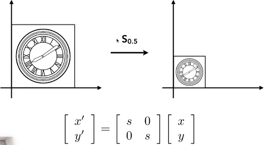
#### 反射矩阵
如下图把他沿Y轴做镜面反射，那么就可以用**反射**矩阵表示：

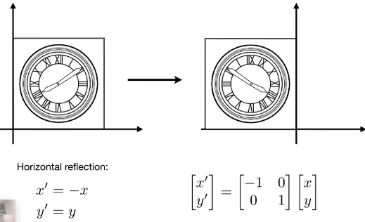
#### 切变矩阵
如下图把他底下的那条边固定住，然后整体向右倾斜，那么就可以用**切变**矩阵表示：

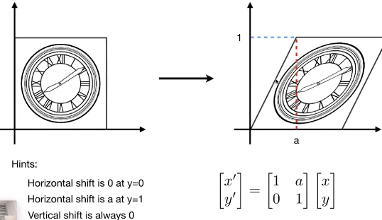

#### 旋转矩阵
如下图把他以原点为中心逆时针旋转，那么就可以用**旋转**矩阵表示：

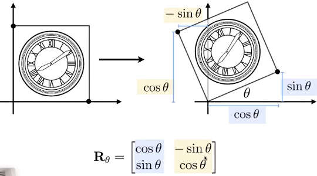

> 注意，我们默认旋转矩阵是以原点为中心，以逆时针为正方形进行的旋转。

#### 线性变换
上面的四种变换都可以表示为如下矩阵形式：

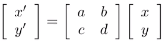

我们把能够表示成这样形式的变换称为线性变换。

#### 平移变换
平移也是一个很普遍的操作，如下图把图像进行平移后，可以分别计算平移后坐标的表达式：

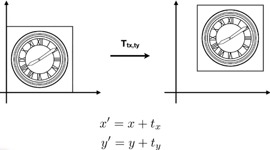

问题出现了，我们还能不能像线性变换一样表示成矩阵乘积的形式呢？显然不能！因此，平移变换不是线性变换。

我们把上述五种变成统称为仿射变换，仿射变换可以用下面的矩阵表达式来表示：

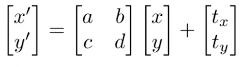

注意，由于平移变换的存在，导致我们的表达式不得不在线性变化的矩阵乘积的后面，再补上一个矩阵加法，这一点非常恶心，也非常令人遗憾。

那么，有没有办法能够通过某种方式干掉后面的矩阵加法呢？答案是有的，这也是为什么我们要引入齐次坐标。

### 2.2 齐次坐标
#### 齐次坐标下的仿射变换
我们引入齐次坐标，把点和向量的表示形式变成如下：

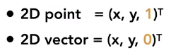

对于二维的点，我们把他变成一个3x1的列矩阵，最后一行设置为1。

对于二维的向量，我们也把他变成一个3x1的列矩阵，最后一行设置为0。

这样的表示法有什么好处呢？我们来看一下在齐次坐标下的平移变换，变成了如下：

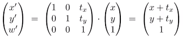

发现了吗？非线性变换的平移变换在这种表示法下，从原来的矩阵加法变成了现在的矩阵乘积！更幸运的是，在齐次坐标下，前面的四种线性变换也都还是以矩阵乘积的形式来表示！

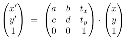

那么对于仿射变换的五种变换，在齐次坐标下就可以非常简单，非常完美的来表示：

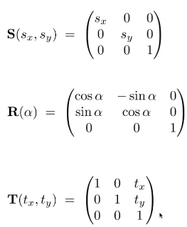

这也就是引入齐次坐标的重要意义！真的是非常精妙啊！

> 向读者提一个问题：上述的仿射变换，是先进行的平移变换，还是先进行的线性变换呢？

#### 齐次坐标下的点和向量
齐次坐标还有一个更精妙的点，考虑下向量的加减法，我们会发现，齐次坐标下有：

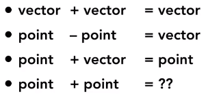

两个向量的齐次坐标相加，还是一个向量！

两个点的齐次坐标相减，得到一个向量！

一个点和一个向量的齐次坐标相加，得到一个点！

这就是齐次坐标表示法的另一个奇妙之处，他与正常的笛卡尔坐标系下的运算完美地一致！

对于正常坐标系下的两个点，他们的加法是没有意义的，然而在齐次坐标下，这个操作被赋予了意义，两个点相加其实是表示**这两个点的中点**。因为，在齐次坐标下的点其实可以表示为：

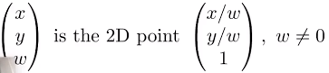

所以，两个点的齐次坐标相加，那么得到的齐次坐标的 w 为 2 ，也就是表示 ( (x1+x2)/2, (y1+y2)/2, 1 ) 的点，也就是中点。

### 2.3 仿射变换的两种表示法
#### 笛卡尔坐标系

#### 齐次坐标表示法

### 2.4 变换的组合
#### 逆变换
与逆矩阵类似，逆变换的意思就是**取消**之前的变换，让图像变回之前的样子，其实也就是乘上矩阵的逆矩阵：

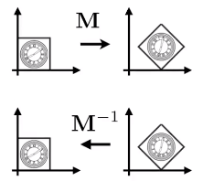
#### 变换的分解
多个不同的变换矩阵其实是可以组合在一起，通过矩阵乘积，最后变成一个合成的变换矩阵的。比如，考虑把下面坐标的图像变换为右边的样子：

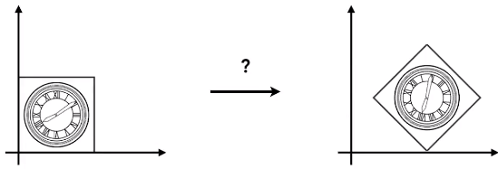

那么其实可以分解为多个步骤来执行：

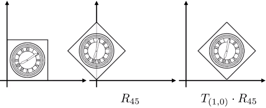

首先使用旋转矩阵把图像以原点为中心逆时针旋转45度，然后再使用平移矩阵把图像向右平移一个单位。

> 向读者提一个问题：上面提到的步骤可不可以反过来呢？

### 2.5 三维的仿射变换
我们上面说的都是二维的变换，其实三维的变换并没有什么新奇的东西，和二维的都差不多。

三维的点和向量的齐次坐标同样是：

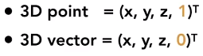

三维的仿射变换同样可以表示为矩阵乘积：

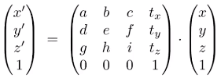

三维的几种仿射变换表示如下：

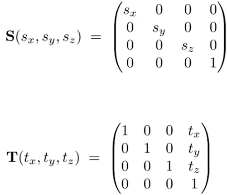

旋转矩阵相对复杂一些，首先可以分解为以 XYZ 三个轴为旋转轴的变换：

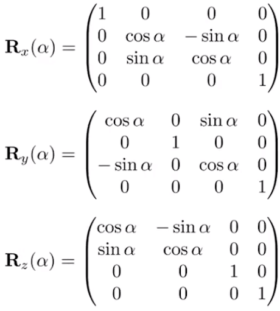

然后，再通过三个矩阵的乘积最终获得绕任意轴的旋转：

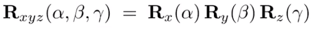

也有人利用上面的方法推导出绕经过原点的任意轴旋转任意角度的公式，叫罗德里格斯(Rodrigues)旋转公式：

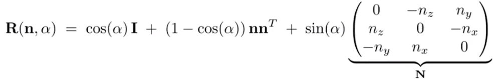

## 3. 小结

上面讲解了 MVP 变换中的 Model 变换，我发现单单这个变换，篇幅好像就已经过长了，因此，我把剩下的 View 和 Projection 变换分到下次分享中讲解。有了 Model 变换，其实我们就已经可以任意地在三维空间中摆弄我们的物体了，但是，要显示到屏幕上还需要一些处理，这也是视图和投影变换的存在。

其实，如果你是一个摄影爱好者，或者你平时有使用手机拍照的经验，那么，你会思考一张照片是怎么拍出来的。可以分为三个步骤，首先，你需要把姿势摆好；其次，你需要把摄像机移动到某一些位置，找好镜头的角度；最后，你按下快门，摄像机就把图像印到底片上，然后你就可以把照片洗出来了。图形学里对图像的处理过程和拍照的过程可以说是一模一样的，这也是所谓 MVP 三个变换进行的三个步骤的操作。

## 4. 参考

Peter Shirley, Steve Marschner. Fundamentals of Computer Graphics, Third Edition.

GAMES101, https://sites.cs.ucsb.edu/~lingqi/teaching/games101.html