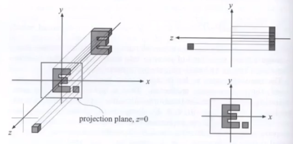

# 从零开始写软渲染器05
## 1. 概览
这次我们来学习剩下的两种变换，视图变换和投影变换。图形学的渲染和现实中的拍照原理相似，在经过上次分享我们学到的模型变换将 POSE 摆好之后，我们再利用视图变换把摄像机的位置和角度调整好，最后再通过投影变换把镜头拍到的图像洗成相片，就完成了一次简单的渲染。
## 2. 视图变换
View Transformation 视图变换，也可以叫做观测变换或者相机变换，这是因为这个变化做的事情与给相机找个“好角度”有关。思考一下，当我们得到一个三维的场景时，我们首先想的应该是从哪个位置哪个角度来看这个场景，也就是我们需要调整好摄像机的位置和角度。

那么从数学上如何确定好相机的位置和角度呢？我们这样定义相机：

* 相机（或眼睛）的位置 E
* 相机（或眼睛）看向的前方 Look At Direction，记作 G
* 相机（或眼睛）的正上方向 Top Diretion，记作 T

> 读者思考下，为什么需要正上方向？

这样一来我们定义好了相机，接下来，我们还需要观察一个现象，就是“相对论”。想象一下，在确定好相机和物体的位置之后，如果我把相机和物体同时平移一段距离，那么相机和物体的相对位置是保持不变的，拍摄出来的景象也是一样的（可以假设背景是全白的幕布）。

既然如此，那么为了方便计算，我把相机移动到原点，让相机的 G 朝向 -Z ，T 朝向 +Y ，这就涉及以下几个仿射变换：

1. 把 E 平移到原点
2. 旋转 G 到 -Z
3. 旋转 T 到 +Y
4. 旋转 (G X T) 到 +X

平移很容易写出变换矩阵：

旋转怎么写出来呢？读者可以暂停思考下。

这里我们利用上次学到的一个性质，那就是逆矩阵的性质。我们不妨来思考，怎么把 +X 旋转到 (G X T)，+Y 旋转到 T，+Z 旋转到 -G：

我们需要求的其实就是上面矩阵的逆矩阵。好消息是，这里的矩阵是旋转矩阵，通过定义可以证明，旋转矩阵的逆矩阵是其转置，也就是说，旋转矩阵是一个正交矩阵，那么问题就很简单了，我们只需要把上面的矩阵转置就能得到答案：

所以，我们相机需要进行得变换就是：

其实，也就是（相对论）物体在做完第一步 Model 变换之后，还需要做上面推出的 View 变换，做完这两个变换之后，相机就在原点，并且看向 -Z ，正上方指向 +Y 。至此就完成了相机的摆放问题。

> 读者发现了没有，视图变换其实也还是仿射变换，跟 Model 变换做的事情其实差不多。这两个变换常常也被人合起来称作 ModelView 变换。

## 3. 投影变换
我们常见的两种投影：正交投影和透视投影，他们的作用就是把三维的视图转化为二维的图像。在这里，我们需要把他们用数学来表示出来。

### 3.1 正交投影
大学学习的工程制图中，基本就是在学怎么画正交投影，那么一个简单的正视图我们怎么画呢？其实就是分以下几步：

1. 摆好相机（回想以下我们约定的相机摆放位置）
2. 把 Z 轴干掉
3. 为了方便计算，把物体平移和缩放到 [-1, 1] 的二维平面上

拓展到三维的数学表示上，其实就是先找到一个长方体的包围盒，长方体分上下左右远近(t,b,l,r,f,n)六个面。

然后，先把长方体中心平移到原点，再把长宽高缩放成一个 [-1, 1] 的正方体。这样的过程，就是正交投影的规范化，或者说标准化（这么做都是为了方便计算）：

到这里，我们就找到了一种三维转二维的方式，只不过正交投影并不是我们常用的，他生成的二维图像也不是我们日常常见的，我们见的最多的是另外一种投影，透视投影。

> 一个物体被正交投影标准化后，其实会被拉伸，但是这并不是三维转二维的最后一步！在做完正交投影之后，我们还需要做一个视口变换(Viewport Transformation)，才把二维图像显示到屏幕上。

### 3.2 透视投影
透视投影是我们平常看到最多的投影，这种投影有近大远小的特点。那么在数学中，我们怎么表示呢？

> 提醒一下，这里的基本逻辑就是，把透视投影转化为我们刚学的正交投影，然后再由正交投影转为二维图像。

首先抽象地想象一下，其实透视投影就是从相机所在的原点向-Z方向形成的一个四棱锥。

离相机比较近的叫做近平面n，离相机比较远的叫做远平面f，这两个平面是我们定死的，然后两个平面之间夹起来的形状，我们叫做视锥(Frustum)，我们要干的就是想办法把这个视锥转为一个长方体，然后转为正交投影就完事了。

透视投影转正交投影的矩阵如下：

下面给出这个矩阵的推导过程（by 闫令琪大神），首先观察，
1. 对于近平面，在变换之后，该平面上的点其实都保持原样
2. 对于远平面，上面的点的Z在变换之后保持不变
3. 对于远平面，平面上的中心点变换之后保持不变

先看Y，由相似三角形可得：

对于X，同理可得：

那么可以推出任一点 (x, y, z) 推出 (x', y', z')：

即：

从而可以求出透视矩阵的三行：

现在求第三行，根据观察2得到：

根据观察3得到：

最后即可解出第三行：

至此，我们已知如何从透视投影转到正交投影，那么要得到最后的透视投影，只需要乘上之前的正交投影矩阵即可：

## 4. 小结
这次加上上次的分享，我们终于把 MVP 变换讲完了，这意味着我们有能力把三维场景转二维图像了，总结下来，其实就是先把物体的位置摆好(Model Transform)，再把相机的位置摆好(View Transform)，最后把三维的物体投影到二维的平面上(Projection Transform)，过程中用到的都是矩阵乘积的知识。

最近工作太忙，都没什么时间写代码，原本想着清明假期可以抽时间写一写，然而父母过来视察，就陪他们逛逛街、吃吃东西。下周我们就抽抽空改一改代码框架，把 MVP 变换写完吧！
## 5. 参考
Peter Shirley, Steve Marschner. Fundamentals of Computer Graphics, Third Edition.

GAMES101, https://sites.cs.ucsb.edu/~lingqi/teaching/games101.html