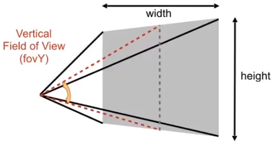
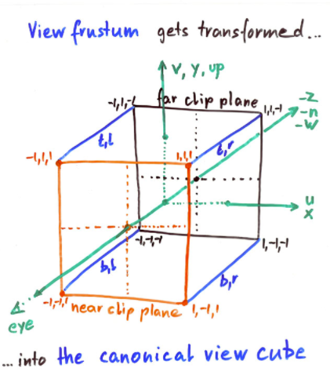
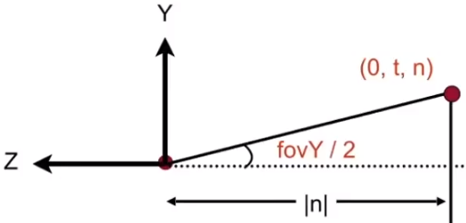
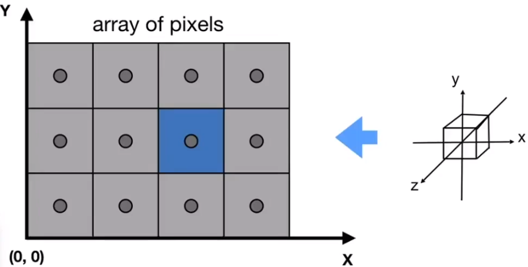
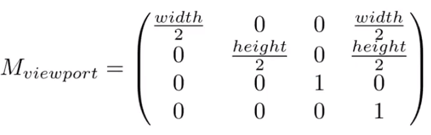

# 从零开始写软渲染器06
## 1. 概览
之前我们学习了 MVP 变换，已经可以把三维空间中的物体限制在了一个标准化的正方体空间中，也就是中心在原点，长宽高缩放到 [-1, 1] 的一个标准化正方体(Canonical Cube)。

我们的目标是把物体显示在屏幕上，屏幕是一个 [0, width] x [0, height] 的一个二维空间，这个时候，我们就需要把标准化的正方体空间转化为屏幕的二维空间，最终把物体显示在屏幕上，这个过程叫做光栅化。
## 2. 光栅化
## 2.1 FOV
我们不管在讨论正交投影，还是透视投影，都要预先定义好相机的位置。我们定义了，相机是处于原点，然后以 +Y 方向为 Up 方向，以 +X 方向为 Right 方向，以 -Z 方向为 LookAt 方向。

除了定义相机摆放的位置之外，我们还需要定义相机的可视范围，或者说 FOV (Field of View)。垂直方向的 FOV 如下：



图中，灰色的部分也就是我们所说的屏幕，屏幕是一个 width x height 的正方形，垂直方向的 FOV-Y 就是图中两条红色虚线的夹角，两条红色虚线是分别指向屏幕最上边的中点和最下边的中点。同理，我们也可以定义水平方向的 FOV 。

我们在 MVP 变换之后得到的标准化正方体，在相加的三个方向上分别为：



* Up: Bottom -> Top
* Right: Left -> Right
* LookAt: Near -> Far

那么，FOV 与这个 [-1, 1] 的正立方体有什么关系呢？



见上图，计算 tan(fovY/2) 可以得到 t/n 值，而 t 也就是屏幕的半高 height/2 。

## 2.2 标准化正立方体空间转为屏幕空间
在 [从零开始写软渲染器02]() 中我们约定了屏幕是由 width x height 个正方形像素组成的空间：



将 [-1, 1] 的立方体空间转为屏幕空间，可以分为以下几步：
1. 把宽度和高度放大到 width 和 height
2. 把中心点移动到 (width/2, height/2)

这里我们暂时不管 Z 值，让 Z 值保持原样，可以写出变换矩阵：



经过这样一个简单的变换矩阵之后，MVP 变换产生的正立方体空间中的数据也就可以投影到屏幕上了。

> 提醒一下，迄今为止，我们用来进行 MVP 变换的数据也就是空间中的一堆三角形！

## 2.3 解决遮挡问题 - Z-Buffer

经过上一个步骤，我们拿到了空间中的一堆三角形投影在在屏幕空间的位置，我们只处理了 x, y 轴坐标，但是让 z 值保持原样。我们知道，不同的物体距离相机的距离是不一样的，距离相机较近的物体会遮挡距离较远的物体，我们怎么实现这种遮挡效果呢？

在 [从零开始写软渲染器02]() 中我们知道，绘制一个三角面，首先需要把其所占的所有像素找出来，然后给这些像素上色即可。假设我们已经找到一个三角形所占的全部像素，那么对于其中每个像素，我们都可以计算这个像素到相机的距离，而这个距离我们称之为深度。

注意，深度永远都是正数，并且深度越小，那么距离相机也越近。在计算机图形学中，目前为之，解决遮挡问题的算法就是使用 Z-Buffer ，也叫深度缓存。

渲染程序每一帧都需要计算屏幕所有像素的值，渲染每一帧会产出两个最重要的缓存：
* Frame Buffer - 渲染结果，即屏幕所有像素的值
* Depth Buffer - 深度缓存，即每个像素的最小深度

渲染程序每一帧做的事情就是，在输出渲染结果的同时，记录每个像素的最小深度值，而所谓的遮挡，即用深度值小的像素覆盖深度值大的像素，这样就实现了距离相机近的物体遮挡距离远的物体，可以看看伪代码：
```
foreach triangle T:
    foreach sample(x,y,z,rgb) in T:
        if sample.z < zbuffer(x,y):         // 取最近的像素
            zbuffer(x,y) = sample.z;        // 更新[x,y]坐标像素的最小深度
            framebuffer(x,y) = sample.rgb;  // 更新[x,y]坐标像素的像素值
```

> 注意一下，伪代码中的 z 并不是位置坐标的 z ，而是深度，我们是通过位置坐标的 z 来算出深度！

## 3. 小结
这样一来，我们已经能够在屏幕上绘制出三维的物体，并且具有透视的效果。但是，光栅化并没有结束，因为渲染一个场景，除了绘制场景中的物体，还需要考虑一个最最最重要的东西：光照！在这个系列文章的开篇，我们就说过一个简单的判断画面质量的标准：看画面是否足够亮？而想让场景亮起来，并且亮得真实、亮得好看，那么就需要好好的进行光照渲染，我们下次就讲一讲光照。

## 4. 参考
Peter Shirley, Steve Marschner. Fundamentals of Computer Graphics, Third Edition.

GAMES101, https://sites.cs.ucsb.edu/~lingqi/teaching/games101.html

https://people.eecs.berkeley.edu/~sequin/CS184/LECT_09/L21.html