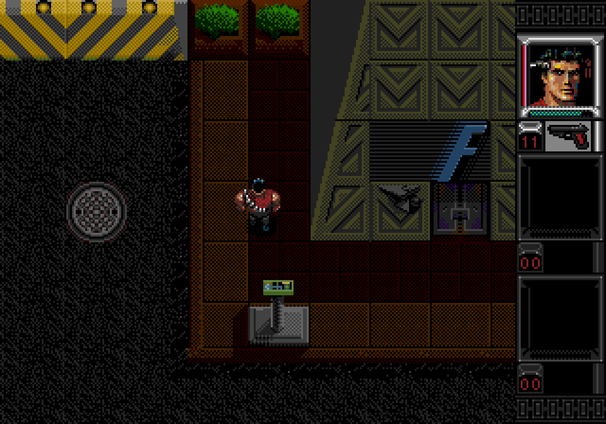

# 游戏中的几种投影视图

> 原文：https://www.significant-bits.com/a-laymans-guide-to-projection-in-videogames/

## 0. 简介
如果一个游戏的相机视角是俯视的，并且整个游戏看起来是倾斜的，那么我们通常称这个游戏有等轴测的(isometric)视图。尽管这个名词不是那么的准确，但是也不是毫无意义的。

投影，是为了把三维物体显示在二维的屏幕上。在现代，世界上已经有非常多种实现投影的技术和方法，这些技术对电子游戏的发展都有深刻的影响。虽然，随着3D游戏的出现，投影技术的作用越来越小，不过，了解各种投影方法的好处和弊端对于3D和2D游戏的开发还是有好处的。

那么，到底有哪些投影方法呢？我们来一起看看吧。

## 1. 正交投影
正交投影是一种轴间关系一致的投影方法，没有透视感，也没有所谓近大远小的视觉效果。如果对任意一个轴进行缩放或者旋转，那么等价于对整个视图进行缩放或者旋转相同的比例。

正交投影的一种是侧视图(side-view)，比如超级玛丽，这种侧视图经常用在一些平台游戏。把相机变成俯视的视角，那么就得到另一种视图，自上而下(top-down)的视图，如果再让相机时刻跟着玩家移动，就会得到鸟瞰视图(bird's eye view)。

这些视图在2D游戏中非常普遍，特别是一些用网格来表示地图的游戏。不过，这些游戏通常会为了表现一些深度、高度的视觉效果，打破正交投影的规则（比如，上图用一种很别扭的方式来表示有金字塔结构的建筑物）。

有人说自上而下的视图是一种3D的视图，但是，这种视图的深度(Z轴)和高度(Y轴)其实是一个东西。正因为如此，这种视图就不能很好地把一个箱子表示出来（有长宽高的箱子）。为了解决这个问题，人们会把相机旋转一个角度，从而创造出另一种投影方式：轴测投影(Axonometric Projection)。

轴测投影是一种工程制图（或机械制图）的方法，这种方法可以把物体的三个维度都表现出来。轴测投影又可以分为三类，斜轴测图(Trimetric)、二轴测图(Dimetric)和等轴测图(Isometric)，区分他们的方法很简单，如上图所示，量出各个轴之间的夹角（上图展示的都是有标准角度的标准视图）。

轴测投影与人眼观察世界的方式不同，这种方法有一些好处，就是可以在一个维度上表示高度和深度，也有一些问题，如下图，蓝球和红球第一眼看起来是在同一层上，而实际上蓝球比红球高两层。

从某种意义上来说，这种投影方式是完全错误的，因为它会创造出现实生活中不可能存在的场景（比如上图），只有少数游戏会使用这种投影方式。

以下是三种视图的概述：

* 等轴测图

在等轴测图中，三个坐标轴(x, y, z)有相同的缩放比例，坐标轴间的夹角都是120度。比如，一个正方体的等轴测投影仍然保持着原有的比例，也就是说，投影的长宽高的大小是相等的，并且，投影的三个表面的面积也是相等的。

不过，计算机很难表示等轴测图。因为，计算机显示屏和计算机的渲染方式都是基于栅格的，而且一般情况下，这些栅格都是横平竖直排列的，这种表示方式在画倾斜角为30度的线段时，竖直方向的像素个数：水平方向的像素个数比例时1：2，然而，这样画出来的线段却并不是30度的（tanx = 0.5）。

虽然，现代有一些技术（高像素、反走样）可以缓解这个问题，不过，对于以前的游戏，他们更倾向于使用二轴测图：

* 二轴测图

二轴测图和等轴测图差不多，区别是二轴测图的限制条件要宽松一些，它只要求其中两个轴比例相等并且有两个轴间的夹角相等即可。二轴测图投影是以前的2D游戏和像素游戏最常用的投影方式。

虽然二轴测图并不要求轴间夹角一定要是几度，但是实际应用中，使用得最多的是与水平方向夹角26.5度（如上图）。这是因为`tan(26.5度)=0.5` ，很好去表示`竖直方向的像素个数：水平方向的像素个数比例时1：2`的线段。这就很方便物体的绘制。

* 斜轴测图

斜轴测图是一种比较偏风格化的视图，但同样也保持了前面两种视图的对称感。它不要求两个轴的比例相等，也不要求轴间夹角相等。模拟城市4就使用了这样一种视图， Paul Pedriana 有一篇[文章](http://simcity.ea.com/about/inside_scoop/3d1.php)介绍他们游戏的视图：

## 2. 斜投影
斜投影和正交投影类似，都利用平行的射线把物体“映射”到屏幕上，不同点在于，正交投影是90度的射线垂直“映射”到屏幕上，而斜投影不是90度。这个不同点导致的结果是物体的拉伸，这种拉伸导致了物体的失真，比如，一个圆形会被表示为一个椭圆形。不仅如此，斜投影还拥有正交投影所有的缺点。因此，鲜有游戏会使用斜投影视图。

## 3. 透视投影
透视投影和前面两种投影都不同，它依赖于焦点的概念，并利用摄像机来模拟人眼效果。在绘画中，有很多种技术来模拟透视投影，见[文章](http://www.scottmcdaniel.net/drawing/perspective/perspective.html)。

有一些早期的2D游戏用透视投影来绘制背景，从而有一种近大远小的视觉效果。在现代，透视投影在3D游戏中就随处可见了。

## 4. 小结
投影于2D游戏的意义与3D游戏不同，2D游戏算是艺术作品，往往需要有艺术的解释，俯瞰视角的游戏往往会伪造透视视图，以增加角色的细节和个性，而类卷轴的游戏则会在背景上使用透视视图，在前景上使用正交视图。

遵循严格的投影规则并不是提升游戏美感的必要条件，但是，它能帮助游戏提升美感，并且还能激发一些玩法创新。