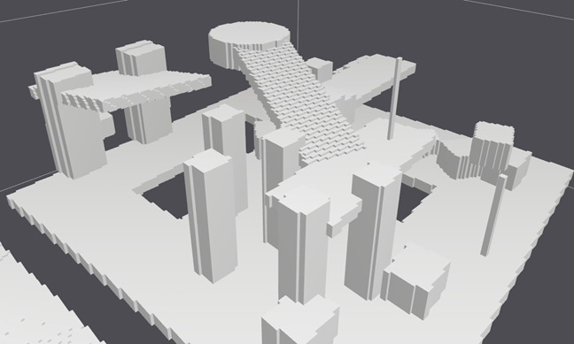

# 现代游戏常用的几种寻路方案（一）
## 1. 概览
寻路，是游戏开发必不可少的重要内容，甚至对于 RPG、MOBA 和 Roguelike 等品类的游戏来说，是最重要的内容。刚好最近作者本人在负责对自己参与的游戏进行寻路开发，借此来向大家分享一些自己对于现在游戏寻路方案的学习心得。

在我看来，一个完整的寻路方案主要应该包含两部分：
1. 构建寻路网格
2. 路径搜索算法

> 当然，要让角色能够跑动起来，还需要完成角色移动和路径跟随等模块。由于不同游戏的物理系统、角色移动等方案可能截然不同，因此这里就不提及移动相关的内容。

## 2. 构建寻路网格
寻路网格，或者叫 Navmesh ，是描述场景的一堆数据，它利用场景提供的地形信息来加工生成一张虚拟的地图，从而给路径搜索算法提供数据源，以使得后续的算法能够运行。
### 2.1 基于 Tilemap 的方格地图
许多比较早期的游戏比如星际1、魔兽3等，他们的地图结构都是由一块块小方块拼接起来的，我们称之为 Tilemap 。这些游戏由于其地形天生的特性，使得他们很自然地使用基于格子的 Navmesh 。

比如，星际1的寻路地图使用8×8的小方格：（即一个 Tile 上有 8x8 个格子的 Navmesh）

Dota2的寻路地图也是小方格：

使用方格来表示 Navmesh 是非常好的，它足够简单、完美表示地形、方便开发与拓展，开发人员甚至可以把它当作地图，存入更多的信息，比如：草地、水面等标记，以此开发出许多有趣的玩法。

不过它也有许多致命的弱点，比如格子数量多、内存占用大，在如今内存速度远远小于CPU速度的情况下，超大的内存占用、频繁的内存使用会给游戏带来致命的性能问题；另外，对于很多3D游戏来说，格子的表示能力不足，比如难以表示有高低差的斜坡、旋转楼梯等。
### 2.2 基于 Tilemap 的三角化地图
为了解决上面提到格子地图的几个缺点，星际2重写了 Navmesh ，比基于格子的地图改为三角化的地图。

首先，基于 Tilemap 的地形提供给上层一个结构规则的地形信息。然后，在生成 Navmesh 之前，先将场景划分为一个个正方形 Tile ，再对这个 Tile 内部进行三角剖分，分成8个三角形。最后，再将相邻的 8 个 Tile 的三角形进行合并，生成最少数量的三角形。

星际2通过三角化的方法，把 Navmesh 数量从之前的 60000 多个降低到了 2000 多个。Navmesh 数量少了，路径搜索的效率也就提升了，内存占用还降低了。除此之外，还解决了斜坡的表示问题（图1展示了这个桥是怎么用8×8的格子做出来的，我用绿框标出了一些格子。如红线所示，在近似于等角投影的视角下，贴图斜着把这些格子切成了不规则的形状，搞得桥的两边都是锯齿型的边缘）。
### 2.3 三维场景 Recast Navmesh
Recast Navigation 是由 Mikko mononen 大神实现的一套通用的三维场景寻路方案。这个方案分为两个部分：Recast Navmesh + Detour Navigation。Recast 负责生成寻路网格，然后由 Detour 负责利用 Recast 提供的网格信息完成路径查询。

寻路网格的生成过程可以分为如下几个步骤：
1. 体素化

体素化的目的是为了提取场景信息，并且把复杂的三维空间转化为简单的2.5维体素空间

2. 生成可行走面

这一步是为了在体素化的空间内找出可以行为的面

3. 分割连通区域

这一步是为了把许多单独的可行走面合成一个大的可行走面

4. 划分区域轮廓

把每个区域的轮廓划分出来，是让我们从2.5D体素空间转向三维空间的重要一步

5. 生成凸多边形

最后，我们根据划分的轮廓进行三角剖分，并对相邻的三角形进行合并，生成数量较少的凸多边形

最终的 Navmesh 生成效果如下：

## 3. 路径搜索算法
Navmesh 提供给上层的是一个邻接图，我们在进行路径搜索的时候，就可以利用这个邻接图来完成路径搜寻。一般来说，一次路径搜索的操作如下：
1. 找到源点所在的结点
2. 找到目标点所在的结点
3. 使用搜索算法获得从源点到目标点经过的所有结点
4. 根据这些结点计算出几段相连的线段，就是最终的路径

其中 1，2 步根据 Navmesh 的数据结构不同，使用的方法也不同，我们主要讲 3，4 步。

### 3.1 A*
完成第三步，可用的算法有很多，可以利用解决图论的一些算法比如 BFS, DFS, Dijkstra 等等，不过游戏开发中比较有名的，也是效率比较可观的是 A* 算法。

不过，当前除了 A* 算法，还有效率很高的跳点算法 JPS 算法。

### 3.2 HPA
对于地图比较大的场景，进行一次长距离的寻路不能直接就在整个地图上跑一次 A* ，因为单次路径搜索的开销可能非常大，因而，就需要改进寻路算法，比如使用 HPA 分层寻路。

这个时候就会把整个地图按区域来进行一次划分，而 A* 算法也分为两步：
1. local A*，即在单个区域内部进行 A* 算法
2. tile A*，即在区域间进行 A* 算法

如果路径搜索的源点和目标点都在同一个区域内部，那么 local A* 即可；而如果分别位于两个不同的区域，那么首先尝试找到两块区域的通路，然后每次得出这一次长路径需要经过的诸多区域。

我们看到上图中，区域间存在一个路点(Way Point)，而区域间的邻接关系靠的就是这些路点的邻接关系，所以每一次长路径，都是先从源点走到相邻区域的路点，再从当前路点出发，走到下一个路店，直到到达目标区域的目标点。

## 4. 小结
本文主要以介绍为主，而具体的实现细节和源码分析将放在之后的分享里。游戏中的寻路算法除了上述不可或缺的两部分，其实后续还有许多重要的操作，比如对路径进行后处理以使得路径平滑、带碰撞体积的单位的寻路、动态障碍物的实现和避障的实现等等，这里面涉及到许多问题有待我们一起探讨。

## 5. 参考

Mikko mononen's blog, http://digestingduck.blogspot.com/

Recast Navmesh, https://sites.google.com/site/recastnavigation/MikkoMononen_RecastSlides.pdf

AI Navigation: It's Not a Solved Problem - Yet, https://www.gdcvault.com/play/1014514/AI-Navigation-It-s-Not

Near Optimal Hierarchical Path-Finding, http://citeseerx.ist.psu.edu/viewdoc/download?doi=10.1.1.72.7041&rep=rep1&type=pdf
