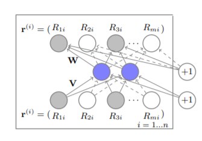
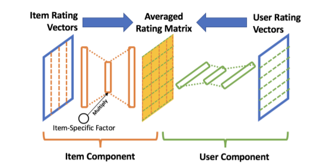

# AutoRec算法及其后续发展

最近在对AutoRec进行复现，并在此基础上尝试做出修改提高性能，因此对原版AutoRec和后续发展起来的几种AutoRec都做了了解，总结如下。

## AutoRec

上期已经介绍过AutoRec是将CV领域的autoencoder成果引入到推荐领域的尝试。参见论文[AutoRec: Autoencoders Meet Collaborative Filtering](http://users.cecs.anu.edu.au/~u5098633/papers/www15.pdf)

这是一个非常早期的成果，因此可以看出其中还保留了很多非深度学习的算法的影子。文章提出了两种AutoRec，区别只在于用物品点击来表示用户还是用用户点击来表示物品。

例如在I-AutoRec中，用户被直接表示为长度为item_nums的向量，每个位置是用户对对应位置物品的评分，如果没有评分则置空。



输入向量经过autoencoder后会重构出一个输出的向量。这个输出向量就表示用户对所有物品的实际评分。用输出和输出向量取差值计算loss就可以对网络进行训练。

注意在计算loss时只会计算该用户在训练集中有评分的那些物品，未评分的物品则需要进行mask处理。

该算法的PyTorch实现如下：

```python
import torch
import torch.nn as nn


class Autorec(nn.Module):
    def __init__(self, args, num_users, num_items):
        super(Autorec, self).__init__()

        self.args = args
        self.num_users = num_users
        self.num_items = num_items
        self.hidden_units = args.hidden_units

        self.encoder = nn.Sequential(
            nn.Linear(self.num_items, self.hidden_units),
            nn.Sigmoid
        )

        self.decoder = nn.Sequential(
            nn.Linear(self.hidden_units, self.num_items),
        )

    def forward(self,torch_input, users):

        encoder = self.encoder(torch_input)
        output = self.decoder(encoder)
        
        return (output > 0).float()
```

论文中对encoder和decoder末尾使用的激活函数也进行了对比实验，最后得出结论是在encoder末尾使用sigmoid函数，在decoder末尾使用符号函数(大于0输出1，小于0输出0)。然而在之后ReLU算法被证明在深度学习中有着比sigmoid更佳的效果，因此被后续的研究者用以替换sigmoid。

值得注意的是该文章原文是用RMSE指标来体现算法的优越性，显然和当下的潮流不符。不过只需要稍加改动就可以根据新的指标对AutoRec进行评估。

- 在autoencoder的输出位置加上sigmoid以保证输出结果是0-1之间
- 可以考虑使用cross_entropy损失函数替代MAE损失函数（存疑，待验证）
- 在测试时只对那些训练集中不存在的用户物品交互进行打分排序

此外，论文中提出的AutoRec分为I-AutoRec(以评分矩阵中每一列的Item对应所有User的评分作为输入)和U-AutoRec(以评分矩阵中每一行User对应所有Item的评分作为输入)，两者在不同的数据集中呈现出不同的performance。

## CDAE

CDAE是在AutoRec上添加一定的去噪和更多的表示能力的算法，参加论文[Collaborative Denoising Auto-Encoders for Top-N Recommender Systems](https://alicezheng.org/papers/wsdm16-cdae.pdf)

改动主要有以下几点：
1. 更改激活函数，encoder的激活函数改为ReLU函数，decoder的激活函数改为sigmoid函数。
2. 在输入multi-hot特征时进行drop out操作，也就是随机去除掉一定比例的特征。这个操作被称作Denoise，由此模型称为DAE。
3. 在模型中添加一个自训练的，由one-hot的user id产生的embedding向量，这个被称作CDAE。

可以看出CDAE试图去除掉CDAE中将全部记录都用于训练的噪音，这主要是为了适应explicit feedback到implicit feedback的场景变换。此外one-hot embedding这一设计和后面的NCF中提出的对user、item的embedding训练处理暗合。

PyTorch实现如下：
```python
import torch
import torch.nn as nn


class CDAE(nn.Module):
    def __init__(self, args, num_users, num_items):
        super(CDAE, self).__init__()

        self.args = args
        self.num_users = num_users
        self.num_items = num_items
        self.hidden_units = args.hidden_units
        self.drop_out = args.drop_out

        self.encoder = nn.Sequential(
            nn.Dropout(self.drop_out),
            nn.Linear(self.num_items, self.hidden_units),
            nn.ReLU()
        )

        self.user_embed = nn.Embedding(num_users, self.hidden_units)

        self.decoder = nn.Sequential(
            nn.Linear(self.hidden_units, self.num_items),
            nn.Sigmoid()
        )

    def forward(self,torch_input, users):

        encoder = self.encoder(torch_input)
        user_embeddings = self.user_embed(users)

        output = self.decoder(encoder + user_embeddings)

        return output

```

## JCA

JCA是2019年WWW会议上提出的比较新的算法，但其实对AutoRec的修改比较少，笔者认为其主要创新在于从训练方法上对AutoRec的优化，参见[Improving Top-K Recommendation via Joint Collaborative Autoencoders](http://people.tamu.edu/~jwang713/pubs/JCA-www2019.pdf)。

其对模型的改变其实只是将I-AutoRec和U-AutoRec的预测结果取一个平均数，以达到两者兼顾。此外，还添加了一个基于item的可学习的正则化层。

模型如下所示：



对训练过程的第一个优化在于pointwise变为pairwise，也就是利用BPR或者metric learning中的一些思路。将目标函数转化为三元组的triplet loss.

即 minimize(max(0, ruj-rui+margin))

第二个优化是基于AutoRec的一个很明显的缺陷。即每个batch中都要将完整的multihot vector传入模型，这意味着模型的参数数量也会取决于user或item数量。一旦面对user和item数量都非常大的数据集，不仅显存或内存消耗过大，噪声也会非常显著。

JCA采取的办法是每个mini batch将整个rating_matrix划分成小的大小相等的方阵，使用滑窗采样的方式使得每个用户每个物品都会被取到。这种方法有些类似于卷积神经网络的卷积操作。


