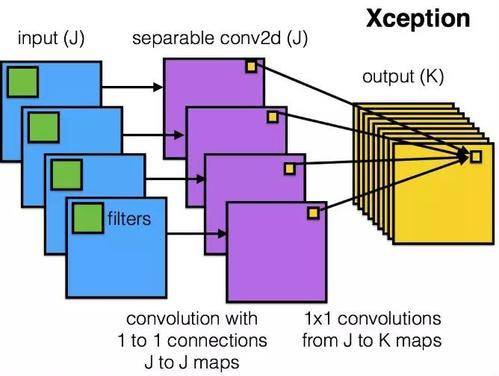
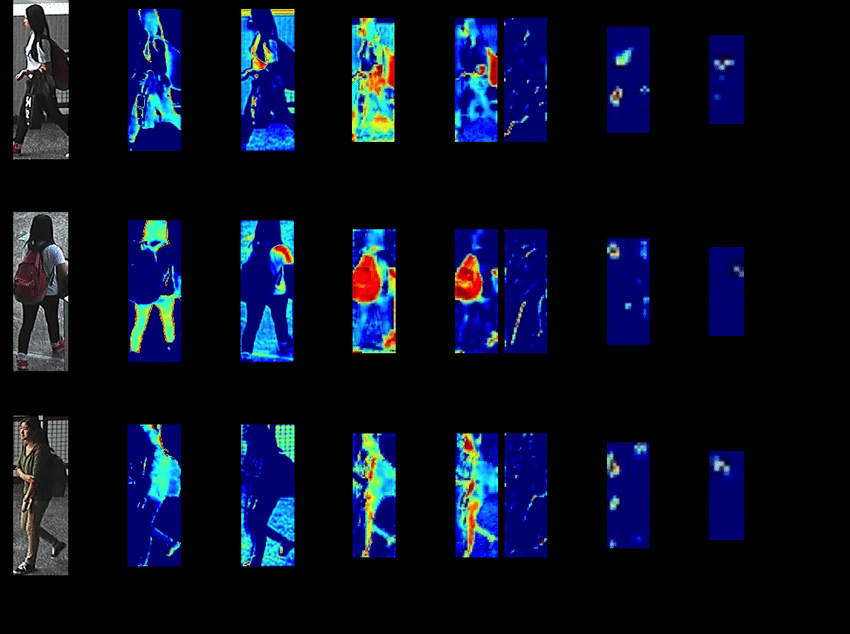
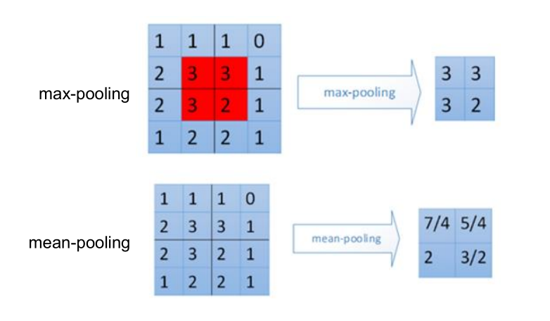

# CNN卷积神经网络

卷积神经网络(Convolutional Neural Network，CNN）是图像处理领域最为常见的一种深度学习方法。在图像处理领域，网络的输入是数万个像素点组成的高维特征，如果仍然使用传统的前馈神经网络主要存在以下几个问题：

1. 计算量巨大，训练效率低
2. 参数过多，需要大量样本进行训练
3. 无法对图像数据中的空间关系等隐藏信息进行建模

为了解决高维图像特征的处理问题，研究者们很早就仿照生物学对人脑结构机制已经提出了卷积神经网络的相关概念。1980年福岛邦彦(Kunihiko Fukishima)在论文中提出了一个包含卷积层(Convolutional Layers)，池化层(Pooling Layers)的神经网络结构。

1998年Yann Lecun在此基础上提出了LeNet-5，将反向传播算法应用在CNN上，形成了现代CNN的雏形。然而当时的这个网络较为简陋，在实际任务中的效果不及SVM、boosting等机器学习算法，也受限于深度学习在当时尚处于学术边缘地带，该算法并没有得到广泛的关注。

2012年，Imagenet图像识别大赛中，Hinton组的论文《ImageNet Classification with Deep Convolutional Neural Networks》中提到的Alexnet引入了全新的深层结构和dropout方法，大幅降低了error rate。自此卷积神经网络开始走向繁荣。

## 卷积层

为了解决前面所述图像特征处理的三个问题，CNN提出的两个最重要的机制是局部连接(Local Connectivity)和权值共享(Weight Sharing)。这两个机制共同作用，形成了卷积神经网络的核心-卷积层。

卷积层对图片特征提取的过程如下图所示：


图中表示的是用3x3的卷积核(Convolutional Kernel)对一张5x5的图片进行卷积操作，可以看到在卷积后，将输入层的5x5数据映射到了3x3的隐藏层中。

### 局部连接

隐藏层(或者称为特征图，feature map)的每个神经元和输入层的3x3个像素点相对应，例如隐藏层左上角的神经元对应于输入图像左上角的9个像素点。这就体现了第一个机制-局部连接。这一机制是基于生理学研究发现动物视觉神经通常是各司其职，一个神经只负责获取视野内一小块的视觉信息。

### padding & stride

在局部连接的过程中，通过控制卷积核扫描的间隔可以调整参数的数量。在图中例子中，如果将stride调整为2，隐藏层大小就会变为2x2。

在stride为1的情况下，在进行局部连接的过程中，会有部分像素点被重复映射。而处于图像边缘的点则只会被计算一次。为了防止图像边缘的像素点无法被充分提取特征，常见的做法是在图像周围补上一圈值为0的空白像素点，即将5x5的图像转化为7x7的图像，这样原本处于图像边缘的点也会被重复卷积。这种方法被称为padding。

在实际运用中，padding和stride都是可以进行调参的超参数。

### 权值共享

权值共享是指对于卷积核在提取图像中每个部分的特征时，使用的参数是相同的，这是基于一个假设，每张图片不同部位的特征分布是类似的。这意味着如果使用3x3的卷积核去提取图像特征，无论图片的大小如何，都只需要保存3x3总共9个参数。这就大幅降低了

同样以之前图中的卷积核为例，输入中所有的3x3矩阵映射到隐藏层都是通过[[1,0,1],[0,1,0],[1,0,1]]的参数。这些参数在训练过程中会进行更新，但始终是共享的。

但是，一个被所有像素区域共享的卷积核并没有足够的表示能力。我们认为一个卷积核的参数表现的只是像素区域某个特定角度的特征。因此只需添加多个卷积核就能得到多个特征图。



由不同卷积核卷积得到的多个特征图就是卷积层的最终输出，如果将这些特征图还原成原始大小和像素的图片，情况就类似于对图片进行RGB三个通道分解的结果。如下图所示：



卷积核的数量又被称为卷积的深度，它决定了模型的复杂程度。

## 池化层

池化层(Pooling Layers)是接在卷积层之后的一个重要网络层。用于对卷积结果进行进一步降维，一定程度上可以降低过拟合的可能。

池化层同样有一个和卷积核类似的“池化核”，如果用3x3的池化核，就是滑动地取每个3x3范围内的9个参数数压缩成1个参数。池化的方法也有多种，如下图所示的最大池化(max pooling)和平均池化(mean pooling)。



## 展平和输出

通过卷积和池化，模型将输入的高维度图像数据转化为了多通道的特征图。经过一次卷积的特征图仍然具有较高的维度，因此需要将特征图作为卷积层的输入进行多层的重复卷积、池化，直到输出结果的复杂度降低到一定程度为止。

在得到了较好的多通道低维度特征图后，下一步就是展平(Flatten)，即将每个像素点直线排开，得到一个一维的向量，然后按照普通前馈神经网络的方法处理这个向量即可。


## CNN的应用

CNN主要应用于图像处理领域。根据笔者的实际经验，随意地设计一个卷积神经网络结构往往会造成结果的不稳定。事实上那些已经经过验证的网络都是经过严格的验证和推理得到的，结构往往也十分复杂。例如resnet的结构如下所示：


在研究中已经很少有人再去试图设计一个优秀的超越以往效果的CNN结构，大部分人都是将CNN作为一个对图像进行预处理的工具，考虑如何从其他角度提高具体应用场景下的性能，或是增加一些部件提高CNN的表示能力和性能。

在大多数深度学习库中都可以很方便地使用经典的图像预训练模型如VGG、resnet等，这些模型在对图像的处理上都具有通用性，以keras为例：

```python
from keras.applications.resnet50 import ResNet50
from keras.preprocessing import image
from keras.applications.resnet50 import preprocess_input, decode_predictions
import numpy as np

model = ResNet50(weights='imagenet')

img_path = 'elephant.jpg'
img = image.load_img(img_path, target_size=(224, 224))
x = image.img_to_array(img)
x = np.expand_dims(x, axis=0)
x = preprocess_input(x)

preds = model.predict(x)
```