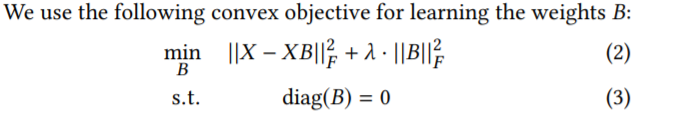
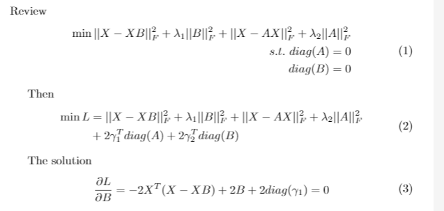
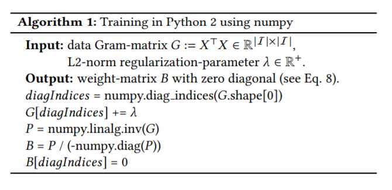

# Embarassingly Autoencoder算法

我们介绍过Autoencoder 以及后续的变分Autoencoder在图像生成上以及序列编码上的应用。而Autoencoder最初的作用是用深度训练的方式寻找特征降维的一种映射。

最近项目遇到一个问题就是AutoRec在面对物品数量较多的情景时显存不足，在这种情况下，需要将上万维的物品点击历史的multi-hot编码降维，而且数据十分稀疏。因此调研了一些用Autoencoder进行稀疏数据降维的方法。Embarrassingly Autoencoder就是其中一种。

该算法来自于2019年WWW的论文：[Embarrassingly Shallow Autoencoders for Sparse Data](https://dl.acm.org/doi/10.1145/3308558.3313710)


## 数据划分和处理

数据处理方面和一般的topk推荐的划分方式不同。由于这里主要是以user作为主体，选取user的点击集合作为特征。因此在划分时考虑的时验证模型对于multi-hot点击特征的处理能力。

具体来说，首先划出80%的点击作为训练集。假设训练集中有N个user, M个item。那么这M个item就会被视为item的全集。在训练过程中会将item的完整历史都输入模型进行训练。

测试过程则是类似于冷启动的过程。首先会划出测试集每个用户80%点击历史作为测试集中的支持集，然后再用这部分支持集输入模型去预测剩余的20%。

作者将这种验证方式称作强泛化（Strong generalization）。并且认为这比对同样的用户进行训练和测试的弱泛化评估方法要更加困难。

## 具体算法

具体算法设计上实际非常简单，以至于我最初也很难把它和autoencoder联系在一起。

作者提出的EASE算法从根本上可以总结为如下的优化目标。其中X是NxM的评分矩阵 B则是item的MxM相似度矩阵。



其中第二项是作为对相似度矩阵的正则化项。而3式提出的限制则是避免每个物品本身的自相似度的影响。

我认为该算法和Autoencoder的主要相似点是在于，它也是将整个点击历史的multi-hot向量组装起来作为模型的输入去进行重建和计算loss。用pytorch可以实现如下：

```python
class EASE(nn.Module):
    def __init__(self, n_items, lambda1, lambda2):
        super(EASE, self).__init__()
        self.B = torch.nn.Parameter(torch.Tensor(n_items, n_items))
        self.lambda1 = lambda1
        self.lambda2 = lambda2

    def forward(self, X):
        recon_matrix = X @ self.B
        loss1 = X.sub(recon_matrix)
        loss1 = loss1 ** 2
        loss1 = loss1.sum()
        loss2 = torch.norm(self.B)
        loss3 = torch.sum((torch.diag(self.B) - 0) ** 2)

        return loss1 + self.lambda1 * loss2 + self.lambda2 * loss3
```

但是这样的方法是非深度的，也很难通过正常的神经网络放在GPU上训练，效率也非常低。作者的主要贡献是基于这个优化目标，证明了其具有close-form的解。如下所示：


总之，这篇论文对Transformer的改进为Transformer和它核心的self-attention机制应用于长程序列中提供了实验依据，在推荐系统等领域也可以对此进行借鉴参考。



从而可以通过下面的算法直接解出B。因此通过简单的cpu上矩阵运算即可，无需进行深度学习。



在测试过程中只需要进行这种运算解出B，然后再通过X*B的矩阵运算得到预测出的评分矩阵即可。

## 总结

本篇论文比较特殊，它通过非深度学习的方法，而且是直接把机器学习转化为了数学计算问题，并且得到了比其他机器学习方法更好的结果。其中数学知识的理解和巧妙应用值得我学习。
