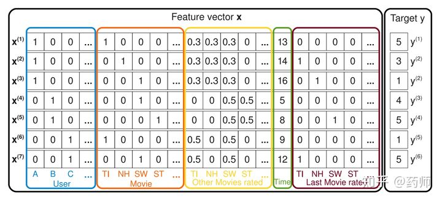
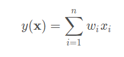
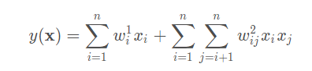
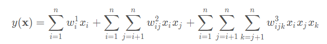
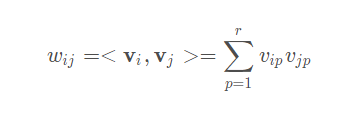

# FM算法

Factorization Machine（FM）算法是一种为了在数据相对稀疏的条件下解决特征组合问题的算法。本质上其实是一种比较高层次的算法思想。FM最早是借由广告和商品推荐中的点击率（CTR）计算问题提出的，因此和推荐系统也有很大的关联。

## 特征组合的基本概念

FM的发明者Steffen Rendle举了一个电影预测的例子来说明FM试图解决的高维稀疏特征组合问题。假设一个电影推荐数据集，每一条数据包括用户名称、电影名称、评分分数、评分时间的数据。

初步看下来这些数据只有4维度（包括其他用户的综合打分特征）。但如果将这些离散数据转化成适合计算机处理的one-hot编码。考虑到电影数量和用户数量均可能有数万个，最终的特征组合维度可能非常巨大，如下图所示：

按照一般的线性模型建模思路，如果用x表示一条特征向量，y表示预测值，实质上是等价于解决如下的线性问题：

为了表示特征组合的信息，常常会将度提升到2，将上述公式转化为如下的公式：

公式中的第二项表示对所有特征进行两两组合并赋予权值。相似的可以得到度为3的线性公式：

为了方便，以d=2的公式为例。在类似于电影推荐的场景中，第二项中的xixj组合是非常稀疏的，因为大多数特征都是onehot特征，这导致x向量中的大部分位置都是0。

因此这样进行特征组合，计算的消耗非常之大，参数总量为O(n^d)。

## 分解

FM的解决方法是将其中的参数w改写成有xi和xj分别对应的两个向量相乘的结果，即

其中v的长度r<<n，因此参数计算量为O(rn),与n成线性相关，与r的变化无关。

实际上熟悉深度学习和推荐系统的人可以看出，这种方法与MF以及深度学习中的嵌入思想非常相近。不同的是它用减小特征组合的计算消耗作为进行这种分解的出发点。

FM和embedding比较容易混淆的一点是，FM中各个特征是共享一个参数矩阵，并且one-hot编码中的每一位都有一个对应的参数向量v。而embedding方法一般是将整个离散变量转化成单个embedding向量。

## 应用

将用户和物品的ID作为输入向量x，分别用向量u和v来表示用户和物品，然后做点积。这是MF算法的基本做法。

MF实际上是FM算法的一种特例，其中特征只有用户和物品的onehot编码，只考虑用户和物品这两组之间的特征组合。将u和v纵向叠在一起就得到了FM算法形式的矩阵V。而FM在推荐领域更常见的用途还是在有上下文的推荐中，用特征组合的方式结合多种上下文特征信息。

此外FM的一大缺憾就是只能表示线性关系。而深度学习的特点就是能表现出十分复杂的非线性关系。而FM算法最大的优势就是能在减小计算量的情况下尽可能提高模型的可解释性。为了实现双方互补不少学者也提出了FM的改进版本，例如DeepFM等。