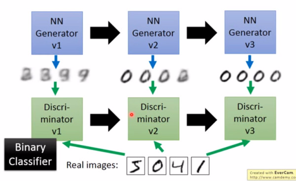

# GAN生成对抗网络

生成对抗网络(Generative Adversarial Network，GAN）由Ian Goodfellow于2014年提出，目前已经成为计算机视觉领域最重要，使用最广泛的概念之一。

顾名思义GAN是以对抗的方式生成数据（通常是图片）的一种深度学习方法，和之前介绍的CNN、RNN等网络不同，GAN并不是一种安排节点构筑神经网络的算法，而是一种用于实现特定学习目标的学习框架。

## 生成

生成（Generate)指的是模型通过学习一些样本数据，根据规律自动产生一些类似的数据，或者根据需要进行了特殊调整的数据。例如根据一幅原画产生不同艺术风格的新画作，根据一张人物照片得到不同动作的照片。


传统上常用的方法有autoencoder，这种方法和之前提到的自然语言处理领域的做法类似。以图像处理为例，将一张图片通过encoder加密成隐藏层的特征，然后用decoder解码出一张图片，试图让产生的图片和输入的图片相同。这样训练出的decoder在一定意义上就能根据随机的隐藏层产生新的图片。

然后autoencoder具有很多弊端。最为人诟病的一点是，autoencoder根据图片像素点之间的差值来判断生成效果，在很多情况下这种判断都是不可靠的，例如下图例子中，和原始图片的差值均为一个像素点，但很明显左图效果要优于右图。


因此人们开始考虑能否以可学习的方式让模型自己来判断生成的效果，GAN自此诞生。

## GAN基本原理

GAN主要由两个部分组成，生成器（Generator）和判别器（Discriminator），两者采用的网络结构不同，使用的参数也相互独立。为了方便本节还是以常见的生成图片应用场景来说明。

生成器输出是和输入维度相同的图片，判别器实际上是一个分类器，目前是区分真实图片和虚假图片。

整个流程可以描述如下：

1. 人为地选择一些真实图片和虚假图片（由未经训练的生成器产生）训练判别器，尽量使判别器能够明确分辨图片的真伪。

2. 随机向生成器输入数据，将生成器的输出结果传给判别器进行判别，根据判别结果优化生成器。

3. 等到生成器优化到能够成功“骗过”判别器时（生成的图片判别器得到的真假概率接近50%），将生成器产生的图片标为负，提供给判别器进行训练。

4. 迭代进行上述操作。



经过许多轮迭代后，理想状态下可以得到两个优秀的模型。一个是鲁棒的区分真假图片的判别器，另一个是可以产生图片的生成器。

GAN的优化目标函数如下：


上式实际上就是从二分类的损失函数扩展而来。判别器D目标是降低该损失也就是分类更加准确，生成器G目标是提高该损失也就是使产生的图片更能够以假乱真。

需要注意的是虽然目标函数表现为一个式子，但是生成器和判别器是分开迭代式交替训练的。

## GAN的优缺点

根据Ian Goodfellow在quora上的回答，GAN的优势主要体现在以下几点：

- 相比其他所有模型, GAN可以产生更加清晰，真实的样本

- GAN采用的是一种无监督的学习方式训练，可以被广泛用在无监督学习和半监督学习领域

- 相比于变分自编码器, GANs没有引入任何决定性偏置( deterministic bias),变分方法引入决定性偏置,因为他们优化对数似然的下界,而不是似然度本身,这看起来导致了VAEs生成的实例比GANs更模糊

- 相比VAE, GANs没有变分下界,如果鉴别器训练良好,那么生成器可以完美的学习到训练样本的分布.换句话说,GANs是渐进一致的,但是VAE是有偏差的

- GAN应用到一些场景上，比如图片风格迁移，超分辨率，图像补全，去噪，避免了损失函数设计的困难，只要将基准用于判别器中，剩下的交给对抗训练即可

GAN也存在一些缺点：

- 训练不稳定，效率低。这一点在笔者实际体验中也有很深的体会。判别器和生成器互为训练的依据。两者要达到平衡常常需要经历漫长的训练时间，模型的优化速度非常慢。

- 训练中会出现模式崩溃(model collapse)现象。这主要是由于GAN训练不充分，导致判别器没有达到最佳效果就用于训练生成器，生成器产生的样本又干扰了判别器的训练。循环下来会出现越训练越差的现象。

以上两个问题在过去数年间也有无数学者进行过研究，已经形成了一整套的GAN运行模式。在训练GAN的时候需要小心地设置超参数和观察指标，并且使用合适的优化器和正则化方法对结果加以约束。

## IRGAN

笔者的主要研究涉及信息检索(IR)范畴内的推荐系统等场景。因此也一直在关注GAN在非图像领域的应用情况。2017年SIGIR论文《IRGAN——A Minimax Game for Unifying Generative and Discriminative Information》提出了将GAN运用在IR问题上的方法，称其为IRGAN。


和一般的GAN不同，在IR问题中要寻找的是未被观察到的正样本。以推荐系统问题为例：

- 判别器：使用一般的协同过滤算法，将点击过的物品作为正样本，在未点击的物品集合中随机采样产生负样本，训练出user和item的embedding。

- 生成器：训练另外一组user和item的embedding，在未点击的物品集合中推荐出若干个物品，尽量使得这些推荐能被判别器认同。

接下来就是重复和GAN一样的迭代训练过程。和图像处理进行对比就可以发现，最大的不同就是将输入换成了成对的query-document以及它们对应的embedding。这就解决了将GAN用于离散输入上的问题。


```