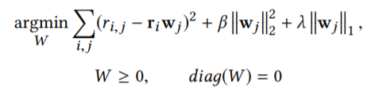
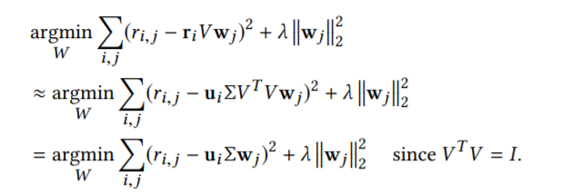
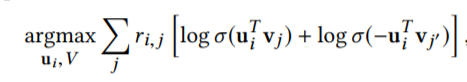
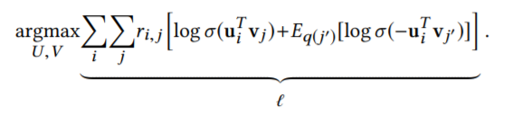
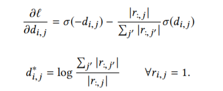
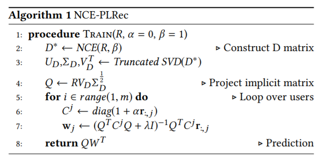

# NCE-PLRec

NCE是自然语言处理中的一种做法，全称是Noise Constractive estimation。这个算法将类别数众多的自然语言多分类问题，转化成一种二分类的训练。

原本的算法是将上下文作为输入，输出该位置单词的编号，这样做需要在数万词的词汇表中通过多分类寻找到解，一般是非常困难的。而NCE采用负采样的方式，人为的选择一些错误的词与正确的词进行比较，使得模型可以分析出对应位置正确的词和错误词的区分规律。

NCE_PLRec就是一个采用了类似的思想解决推荐系统问题的算法，不过个人认为类似的做负采样并进行pairwise采样的办法在推荐领域并不鲜见，该文章的新颖之处在于对训练过程的优化。全文见[Noise Contrastive Estimation for One-Class Collaborative Filtering](https://dl.acm.org/doi/pdf/10.1145/3331184.3331201)

## 背景知识

NCE-PLREC主要是对推荐系统基本的算法和NCE算法的结合。

文章主要利用的是两种算法：

一是MF，即通过矩阵分解的方法将评分矩阵分解成用户和物品的特征向量，再用点乘的方式对矩阵进行重构

二是SLIM，即离散线性推荐方法。这种方法主要通过训练一个item相似度矩阵的方式对输入的评分矩阵进行修正。



其中r是评分矩阵，w是表示需要学习的相似度矩阵，通过这种方式可以通过其他已经有评分的item对无评分的item进行填补。

为了提高SLIM的性能，PLRec被提出。其中运用了基本的MF方法，如pureSVD产生item的特征向量。然后将这个embedding放入SLIM的目标公式中，从而进一步对物品的相似度做出更准确的衡量。



基于PLRec，作者主要提出的点在于其依赖于SVD的矩阵分解，存在较大的偏差，受物品流行度的影响非常严重。因此引入NCE生成更好的item embeddings，之后还是用一般的PLRec进行预测。

## NCE算法

上节已经提到，NCE只用于产生去噪后的评分矩阵。此处NCE实际上是建立一个对于某个rating是否是噪声的分类模型。

对于每个评分点（对应一个用户、一个物品）来说，如果用sigmoid进行二分类，同时用交叉熵函数表示损失，损失函数表示如下。



其中j'是负采样出的用户i在训练集中没有点过的某个item。

将这个公式扩展到评分矩阵的全集上，表示如下：



对其中l的部分求导可以直接解出该损失函数的最优解为：



上式只针对在训练集中观测到的评分，对于未评分的那些点直接设置为0即可，至此就得到了经过NCE去噪的评分矩阵D。

基于D矩阵，其实已经可以通过SVD进行预测。此处作者添加了一些正则化，同时将D分解得到的item embedding重新和原始矩阵相乘后得到user embedding。

最终将这些结果带入到PLRec的close-form解中。整体算法如下所示：



类似的close-form解法其实在之前EASE中就有涉及，在此就不多做推导。

## 代码实现

代码实现的核心在于产生矩阵D，原作者是用numpy配合cupy实现在gpu上运算，笔者这里通过PyTorch进行复现。

```python
def get_pmi_matrix_gpu(matrix, root):
    import torch
    rows, cols = matrix.shape
    item_rated = matrix.sum(dim=0)
    pmi_matrix = []
    nnz = matrix.nnz
    for i in tqdm(range(rows)):
        row_index, col_index = matrix[i].nonzero()
        if len(row_index) > 0:
            values = item_rated[:, col_index].squeeze()
            values = torch.max(torch.log(rows/torch.pow(values, root)), 0)[0]
            pmi_matrix.append(sparse.coo_matrix((values.numpy(), (row_index, col_index)), shape=(1, cols)))
        else:
            pmi_matrix.append(sparse.coo_matrix((1, cols)))
    return sparse.vstack(pmi_matrix)
```
