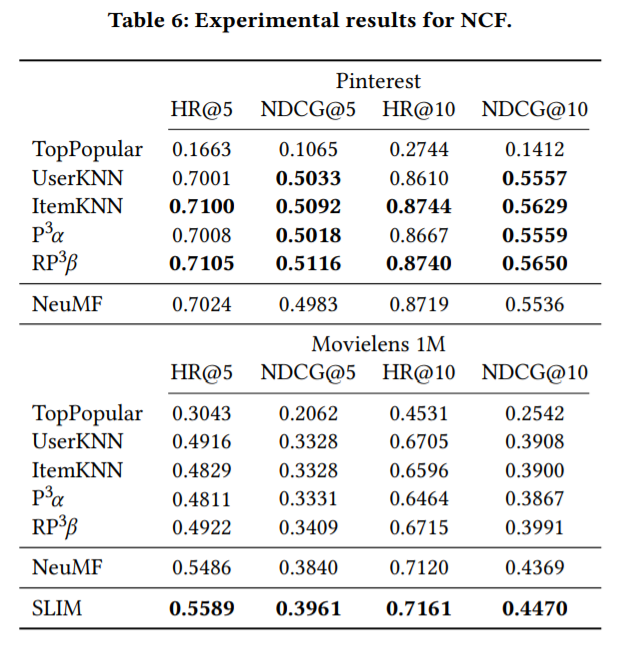
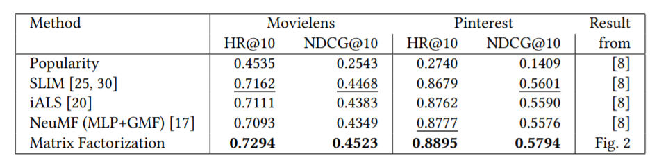

# NCF算法与简单MF的对比

之前我们介绍过深度推荐学习算法。其中非序列推荐的，也就是基于传统不包含时序信息的协同过滤算法的NCF算法是一个里程碑式的成果，同时也一直作为后续的baseline得到使用。

但是在近两年的研究中，逐渐有学者对过去数年间深度学习在推荐系统中取得的进步产生质疑。其中RecSys19上发表的[《Are We Really Making Much Progress? A Worrying Analysis of Recent Neural Recommendation Approaches》](https://dl.acm.org/doi/10.1145/3298689.3347058)获得了当时会议的best paper。

RecSys20上也有一篇[《Neural Collaborative Filtering vs. Matrix Factorization Revisited》](https://dl.acm.org/doi/10.1145/3383313.3412488)，其中着重对比了NCF和简单MF算法，指出MF实际上优于NCF.

## 基于深度学习的推荐系统是否真的优于传统经典方法？

2019年的best paper中收集了18篇顶会论文，并对其结果进行了复现。结果显示只有7篇论文的结果可以得到复现，但其结果却并不优于一些基础的baseline算法。

作者选取的经典算法有：

top popular： 非个性化推荐的算法，仅将最流行的物品不加区分地推荐给用户。流行度由一个物品被评分的次数决定。

itemKNN和userKNN：分别是基于item和user相似度的KNN推荐，即由k个最相近的user或item的评分决定某个用户对某个物品的未知评分。

P^3 α和rP^3 β： 两种实现了用户和用户间的random walk的图算法。

作者成功复现出了NCF的效果，同时NCF的效果也超过了上述算法，但是在测试了另一种SLIM算法之后发现超过了NCF的效果。



相比于其他算法，NCF的表现其实已经不错，因为在第一次比较中没有落于下风（在ml1m数据集中）。使得作者不得不搬出另一种算法SLIM来进行比较。

本文的作者给出了详实的源码，并且其中代码都是可以复现的。这也使得这篇仅仅进行了复现和对比试验，而没有进行任何模型设计的文章获得了当年的best paper。

## NCF与MF的对比

而另一种篇几年的文章则是专门针对NCF以检查NCF是否比MF强。注意，MF算法并没有在2019年文章中的对比实验中作为经典算法之一。

事实上在NCF中有和MF算法的对比，只不过那种MF被记作MF-eALS。是一种通过所有评分历史迭代式的分别更新user和item 隐变量。而本文中使用的则是基于采样的logistic损失函数。

文中实现的算法代码如下：

```python
for i in range(num_examples):
      (user, item, rating) = user_item_label_matrix[i, :]
      user_emb = self.user_embedding[user]
      item_emb = self.item_embedding[item]
      prediction = self._predict_one(user, item)

      if prediction > 0:
        one_plus_exp_minus_pred = 1.0 + np.exp(-prediction)
        sigmoid = 1.0 / one_plus_exp_minus_pred
        this_loss = (np.log(one_plus_exp_minus_pred) +
                     (1.0 - rating) * prediction)
      else:
        exp_pred = np.exp(prediction)
        sigmoid = exp_pred / (1.0 + exp_pred)
        this_loss = -rating * prediction + np.log(1.0 + exp_pred)

      grad = rating - sigmoid

      self.user_embedding[user, :] += lr * (grad * item_emb - reg * user_emb)
      self.item_embedding[item, :] += lr * (grad * user_emb - reg * item_emb)
      self.user_bias[user] += lr * (grad - reg * self.user_bias[user])
      self.item_bias[item] += lr * (grad - reg * self.item_bias[item])
      self.bias += lr * (grad - reg * self.bias)
```

模型维护user和item的embeddings，预测时同样是通过dot product的方式。但是在计算loss时会采取sigmoid函数。和通常认知不同的是，这里计算loss时直接用rating减去sigmoid函数的输出结果，而不是计算cross-entropy损失，让笔者感到有一些疑惑。不过实际运行效果还是很符合文中的描述的。

效果如下图所示：



## NCF作者的回应

这两篇文章同样引起了推荐系统学术圈以及IR圈的一些讨论。有意思的是原作者Xiangnan He老师在知乎中亲自在两个问题中分别回应了这两篇文章对NCF的质疑。(分别见于https://www.zhihu.com/question/336304380/answer/784976195和https://www.zhihu.com/question/396722911）

总结来说He对第一篇文章持否定态度，认为作者并没有对NCF进行合适的调参，同时evaluation也存在过拟合情况。而对itemKNN等经典算法却进行了极为精细的调参。He在回复中总结道：“1. 论文名字取得哗众取宠；2. 作者的质疑精神值得称赞; 3. 但从论文发表的实验结果来看，作者欠缺严谨性的治学精神：对比方法的参数并没有被正确调优（虽然他们号称这么做了，但显然他们并没有仔细阅读原文），就把结果发表了，不仅是学术态度不严谨，而且是对已有工作的不尊重。

对另一篇文章He则一定程度上表示了认可，认为MF_logistic loss并没有进行对比是一定地不足。同时也回忆了当时研究工作的一些不足之处。

以笔者角度来看。第一篇文章的工作确实存在参数调整不充分的问题，在推荐系统领域也确实存在很多争议，不过作者的质疑精神还是十分值得肯定的，至少笔者就很难有勇气去挑战一些经典算法。第二篇文章虽然作者给予了一定的肯定，但是笔者在审阅代码后还是感觉有一定不严谨之处，比如损失函数的选择，而文中也没有对实现的算法予以严格的公式表示。

此外笔者结合实际研究经历更感觉到推荐系统依然缺少一套合理的模型效果评估系统，每一个模型在测试时无论是数据集的选择还是评估方式的选择对结果的影响都很大，希望未来又更加通用化的评估框架出现，能最大程度保证论文设计的模型能保证是真实的提升。