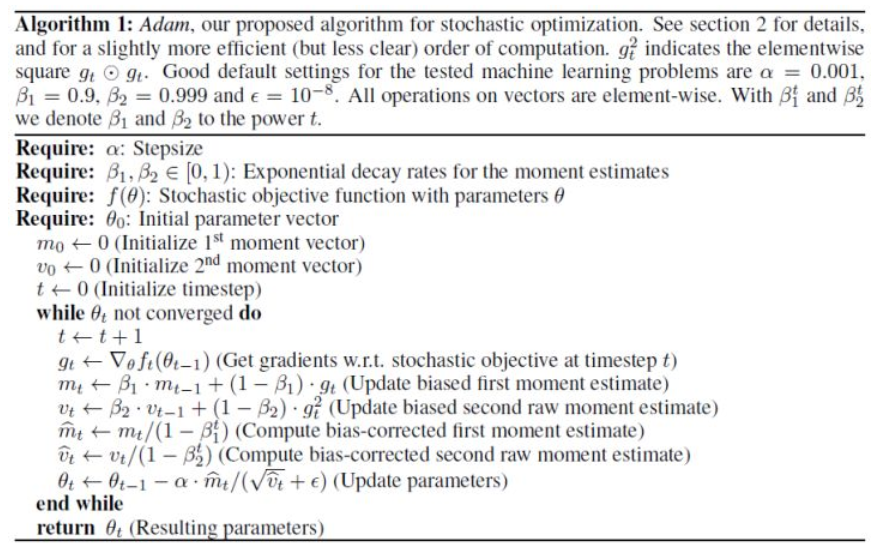

# PyTorch优化器

众所周知，深度学习的模型训练是基于梯度下降的算法以及神经网络反向传播的理论。通常只需要将深度学习问题总结成一个对损失函数求最小化参数的问题，就可以使用梯度下降法来逐步地求得最佳模型参数。同时我们还知道，随机梯度下降(SGD)算法可以取得更佳的结果，避免局部最优。

但在实际使用中，对优化器的选取使用仍然是一个让初学者很容易感到困惑的地方。尤其是对于学习率(learning rate)以及正则化系数的选取，是一个容易让人迷惑的点。本篇PyTorch中常见的几种优化器(optimizer)的使用做阐释，并且简单介绍了设置和调整学习率的方法。

PyTorch和优化器相关的包主要在torch.optim包中

## Optimizer

PyTorch所有优化器的基类是torch.optim.Optimizer(params, defaults)。

所有优化器都提供如下几个函数接口：

- add_param_group(param_group) 用于添加优化器训练的参数组

- load_state_dict(state_dict) 用于从过去储存的文件中加载优化器的状态以便继续训练。

- state_dict()  按照字典的格式返回优化器的状态，将这个状态保存在文件中就可以在需要的时候重新加载。

- step(closure) 执行一个优化步骤，一般在loss.backward()语句下面使用。其中的参数closure官方解释为是一些算法中需要重新评估模型返回损失函数。但就笔者经验来看一般用不上，将其留空即可。

- zero_grad() 清除所有梯度，在每个batch训练之前需要调用这个函数将损失置0，否则会导致loss叠加。

以SGD优化器为例，假设有一个深度学习模型model,再结合我们上篇对DataLoader的使用方法，训练的基本流程是
```python
from torch.utils.data import DataLoader
import torch
import torch.nn as nn

# DataLoader初始化参数

dataloader = DataLoader(dataset, batch_size=1, shuffle=False, sampler=None, 
                        batch_sampler=None, num_workers=0, collate_fn=None, 
                        pin_memory=False, drop_last=False, timeout=0, 
                        worker_init_fn=None)
criterion = nn.BCEWithLogitsLoss(reduction='sum')
for batch_idx, batch in enumerate(dateloader):
    model.train()
    optimizer = optim.SGD(model.parameters(), lr=0.01)
    x = batch['x']
    y = batch['y']
    
    optimizer.zero_grad()
    pred = model(x)
    loss = criterion(pred, y)
    
    loss.backward()
    optimizer.step()

    print(loss)
```

## 优化器的选择

PyTorch中实现了多种优化器，在这里我们只介绍相对来说最常用也是最可靠的几种优化器。必须承认笔者对于优化器的选择很多时候也是根据经验或是前人使用的经历。有些时候很难每次都通过精确的数学证明来决定哪种优化器的选择最好。

### SGD

定义为torch.optim.SGD(params, lr=<required parameter>, momentum=0, dampening=0, weight_decay=0, nesterov=False)

和大部分优化器一样，SGD具有params(训练参数)，lr（学习率），weight_decay(正则化率)等几个公共参数。

我们知道原始的SGD算法就是对参数计算梯度，然后按照学习率优化参数即可。改进版的SGD则加入了momentum(动量)这一概念，使得SGD具备了一定调节梯度的能力。公式为

- vt = γvt-1 + grad

示例如下：
```python
optimizer = torch.optim.SGD(model.parameters(), lr=0.1, momentum=0.9)
optimizer.zero_grad()
loss_fn(model(input), target).backward()
optimizer.step()
```

mini-batch SGD优化在深度学习的很多方面仍然有着不错的成绩，但它的问题依然很明显，那就是对学习率的调整比较死板。

在PyTorch中就可以设置一定的学习率调整策略，核心是利用torch.optim.lr_scheduler包。

例如torch.optim.lr_scheduler.StepLR(optimizer, step_size, gamma=0.1, last_epoch=-1, verbose=False)，就是根据optimizer的优化次数执行学习率衰减，比如在第100轮将学习率减为之前的0.1。

然而根据个人经验这种学习率调整策略的实用价值并不大，通常我们并不能对在何时应该调整学习率有着明确的认知，即使是模型在几个轮次内没有任何提升也不一定表明我们一定要降低学习率。与其采用这种策略，不如降低学习率提高训练轮数。

### RMSProp
定义为torch.optim.RMSprop(params, lr=0.01, alpha=0.99, eps=1e-08, weight_decay=0, momentum=0, centered=False)

RMSProp是Geoffrey Hinton教授在教案中提到的算法，结合梯度平方的指数移动平均数来调节学习率的变化。能够在不稳定（Non-Stationary）的目标函数情况下进行很好地收敛。

其核心还是采用一定的策略进行自适应的学习率修正。其中核心是根据梯度计算指数移动平均数。

- vt = γ（vt-1) + (1-γ)grad^2

然后优化参数

- θt = θt-1 - α * grad/(√vt + ε)

该算法的优势是在不稳定的目标函数下，比基本的SGD表现要好得多。

### Adam

Adam于2014年12月Kingma和Lei Ba两位学者提出，结合了AdaGrad和RMSProp的有点，对梯度的均值和方差进行综合考虑，计算更新的步长。

算法如下所示


在PyTorch中Adam定义为torch.optim.Adam(params, lr=0.001, betas=(0.9, 0.999), eps=1e-08, weight_decay=0, amsgrad=False)

总的来说具有几个优点：
主要包含以下几个显著的优点：

1. 实现简单，计算高效，对内存需求少
2. 参数的更新不受梯度的伸缩变换影响
3. 超参数具有很好的解释性，且通常无需调整或仅需很少的微调
4. 更新的步长能够被限制在大致的范围内（初始学习率）

因此Adam目前一般被认为是深度学习优化器的首选，根据笔者的经验，通常不需要太考虑学习率的精确设置，大致设置一个合理的学习率即可得到足够好的结果。


