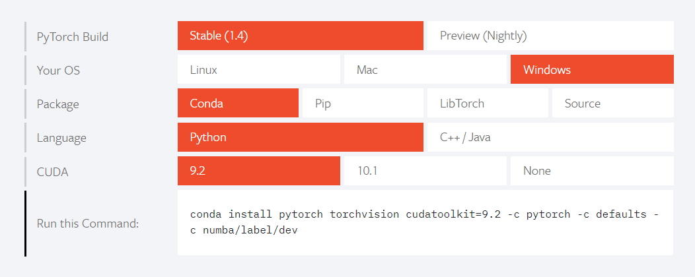

# PyTorch安装和基本操作

## PyTorch介绍

An open source machine learning framework that accelerates the path from research prototyping to production deployment. 

官网: https://pytorch.org/

PyTorch是一个开源的机器学习框架。

从笔者的实际体验来看，相较于其他机器学习框架如TensorFlow、Caffe等，PyTorch主要具有以下特点：
1. 用户友好，API简洁
2. 功能丰富，覆盖了绝大多数机器学习算法和架构
3. 数据处理灵活
4. 动态构建网络
5. 社区生态良好

## PyTorch安装

PyTorch作为一个python库，可以通过pip直接安装

- pip install torch

推荐通过anaconda安装PyTorch，并且根据自身操作系统、cuda版本信息在官网上查询安装命令的最佳实践。

例如笔者的Windows机器 cuda版本位9.2，官网查询的conda命令结果为：



其中torchvision是独立于PyTorch之外的一个库，主要用于处理图像数据的操作。

## PyTorch数据操作

PyTorch的基本数据单位是Tensor。

在PyTorch 0.4.0版本前，Tensor类型的数据必须封装到Variable中才能进行梯度计算、反向传播等操作。
通过.data的方式从Variable中提取数据的值

但在该版本之后，为了方便PyTorch将Variable变量废除。从此无需封装，Tensor就可以完成PyTorch中的
一切数据操作。

Tensor在使用中与numpy的ndarray十分类似，同时也继承了numpy中几乎一切的切片、变换、数学计算的函数
某种程度上我们甚至可以将PyTorch理解为具备机器学习能力的numpy

常用的操作有：

```python
import torch

x = torch.randn((4, 4)) # 根据高斯分布随机构建一个5*5的矩阵 类型DoubleTensor
x.shape # shape变量是一个list表示x的维数[4,4]
x = x.view(2, 2, -1) # 类似于reshape操作 -1表示设置成根据总大小计算出来的值，此处等同于4
# x: ( 2 * 2 * 4 )
# 对于难以确定维数的高维矩阵，可以使用permute函数进行转置
x = x.permute(1, 2, 0)
# x: ( 2 * 4 * 2)
# 选取矩阵中的元素时与numpy类似，可以进行切片索引
a = x[:, :, :2] # 表示在最后一个维上选取只选取前两个值
b = x[0, 0, :] # 表示选取第一行第一列的所有值

# cat表示将两个tensor拼接起来，最后一个参数表示拼接的维度
x = torch.cat((x, x), 0)
# x: ( 4 * 4 * 2 )
# repeat表示按照给出的矩阵进行重复，以下表示将b按照2*2的形状repeat4次
# 注意参数的维度数量不能少于tensor的维度数量
x = x.repeat(2, 2, 2)
# x: ( 8 * 8 * 4 )

# 求和、求平均数、求最大值 dim表示在哪一维上计算 不限定dim时表示在所有元素中计算
torch.max(x, dim=0)
torch.min(x, dim=0)
torch.mean(x, dim=0)
torch.sum(x, dim=0)
```

加减乘除以及乘方等python运算符在torch中均进行了重载，表示矩阵逐个元素进行运算
```python
y = torch.randn((2, 2, 4))
z = x + y
z = x - y
z = x * y
z = x / y

# 矩阵乘法
x = torch.randn(5, 10)
y = torch.randn(10, 5)
z = torch.mm(x, y)

# 矩阵转置
x.t()
```

数据转换和设备转移操作

转换tensor中的数据类型，根据要转化成的类型使用：
- Tensor.float(), Tensor.long(), Tensor.double() ...

numpy.ndarray和torch.Tensor互转：
- Tensor.numpy -> ndarray
- torch.from_numpy() -> Tensor

gpu和cpu之间的转移：
- Tensor.cuda()
- Tensor.cpu()

Tensor根据条件筛选部分元素,例如筛选大于5的元素索引
首先用Tensor > 0转化成一个bool矩阵，再选取其中True的元素
- （x > 5).nonzero()


### 构建模型与模型训练

PyTorch的网络模型中所有神经元部件都基于Module类

- torch.nn.Module

在定义自己的模型时，首先需要继承Module类，然后需要实现foward函数以定义在前向
传播过程中的计算方式

基础的全连接层定义如下，与tensorflow不同的是，需要同时定义输入特征数和输出特征数
此外也没有将激活函数、初始化方法等封装于其中，这意味着在构建网络时会更加灵活也更加需要开发者的精心设计。
- torch.nn.Linear(in_features,out_features,bias = True)

一个包含两个全连接层，最终用ReLU作为激活函数的自定义模型如下所示：
```python
import torch
import torch.nn as nn

class myModel(nn.Module):
    def __init__(self):
        super(myModel, self).__init__()
        self.linear1 = nn.Linear(10, 10)
        self.linear2 = nn.Linear(10, 1)
        self.relu = nn.ReLU()

    def forward(self, x):
        return self.relu(self.linear2(self.linear1(x)))

```

在训练中除了模型本身还需要定义用于优化模型的优化器optimizer， 一般使用torch.optim中的类来定义不同的优化器

在模型训练中需要调用此函数使得模型进入训练状态：

- model.train()

每个iteration结束后需要通过适当的loss函数根据模型的输出和标签值计算出loss值，例如使用
- torch.nn.functional.mse_loss(x, y)

计算完loss后需要优化模型

反向传播
- loss.backward()

梯度下降
- optimizer.step()

模型训练的整个workflow：

```python
x = torch.randn(5, 10)

y = torch.randn(5, 1)

model = myModel()
optimizer = torch.optim.Adam(model.parameters(), lr=args.learning_rate, weight_decay=args.l2)
model.train()

for i in range(10):
    loss = F.mse_loss(model(x), y)
    loss.backward()
    optimizer.step()
```
