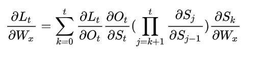
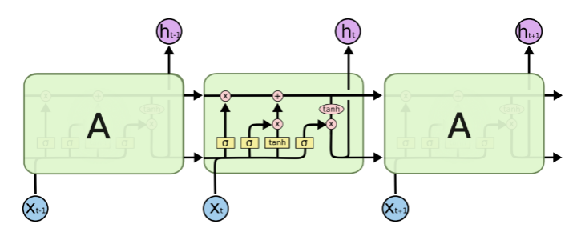

# RNN循环神经网络

众所周知，深度学习的神经网络实际上就是用多层的网络结构来表达函数，并通过激活函数实现非线性的表示能力。

一般将按照输入层->隐藏层->输出层这样顺序结构的神经网络称作前馈神经网络(Feed-forward Neural Network, FNN)。在这种网络中层与层之间是全连接的，单层内的节点之间则是没有任何联系的，因此无法建模两个输入彼此之间的关系。

例如以一个语言翻译任务来说，Machine Learning -> 机器 学习

“学习”这个输出由“Learning”这个输入得到，同时也和“Machine”一词有关。如果没有Machine这个定语，我们可能会将Learning翻译为正在学习。因此要设计满足这个场景的网络就必须考虑同一层内节点间的关系。

本文中介绍的循环神经网络(Recurrent Neural Network, RNN)则是一种可以建模层内的多个节点之间关系的神经网络，他作为一种经典的时序模型被广泛运用在涉及时序关系的机器学习场景中，如自然语言处理、视频识别等。

## RNN的基本原理

RNN的基本原理图如下：

左图是RNN的整体结构简图，可以看出RNN的输入以U为参数，输出以V为参数，这和前馈神经网络的结构类似，相当于两个全连接层。而隐藏层S则是以一种循环的方式进行计算。

通过将简图按时间线展开，可以得到一个更加清晰地结构图，可以看到，S在每个t都有一个状态S{t}, S{t}不仅取决于t时刻的输入X{t}，还取决于t-1时刻的状态S{t-1}。在每个t时刻也都会有一个不同的输出O{t}。

如果用g表示输出O时的激活函数，f表示计算S时的激活函数，可以将O和S的计算以公式表示如下：

- O{t} = g(V · S{t})
- S{t} = f(U · X{t} + W · S{t-1})

S循环层的前后都可以接上各种复杂的网络。例如在输入时可以先接入一个CNN网络，对应的每一个X实际上就是视频中的每一帧图片。

在对RNN输出结果的使用上也比较灵活。如果是在机器翻译的任务中，一个输入对应一个输出，将每一个t时刻的O{t}拼接在一起就会得到翻译得到的完整的句子。

而如果需要根据整个句子的信息对句子的下文做出预测，则可以直接提取RNN的最后一个状态S{n}，通过后续网络得到预测结果。这是由于S{t}是时刻t对前文所有内容的一个总结，对整个序列的信息具有很强的表示能力。

在更复杂的场景中，有时也会同时使用O和Sn来作为输入X的一种隐藏表示，进而使后续网络可以得到更多有关输入的信息。

## RNN的梯度爆炸和梯度消失

上文介绍的RNN只是RNN最原始的版本。实际上这种最简单的RNN存在一些问题使得其往往不能产生很好的训练效果。其中最关键的问题就是梯度消失和梯度爆炸问题。

众所周知神经网络的训练是通过反向传播实现的。RNN的反向传播由于其特殊结构，实际上变成了时序反向传播(Backpropagation Through Time)。由于每个时间t的输出是由0~t-1时刻的计算一步步迭代而来，在反向传播中实际上会产生一个很大的连乘项。

以Wx表示输入层参数，Ws表示S隐藏层的参数，L表示损失函数。在t时刻L对于Wx求偏导的公式如下：

其中的S{t}对于S{t-1}求偏导的结果实际上就是f'·Ws。当f取tanh函数时，f'是一定处于(0,1)范围的，如果Ws也处于(0,1)那么每个连乘项都会处于(0,1)，而如果Ws很大，则每个连乘项也会很大。

这两种情况就会分别造成梯度消失和爆炸两种情况，造成训练结果的不稳定。

## LSTM和GRU

对于RNN的存在的问题，学者们也不断尝试对其做出修改。比较著名的两种就是LSTM和GRU

LSTM的结构如下图所示：

GRU的结构如下图所示：

这两种模型的思想其实类似，都是引入“门”这一结构来解决梯度消失和爆炸问题。门可以理解成一个参数，通过sigmoid结果来判断是否要完成某一动作。

在LSTM中引入了三个门函数：输入门、遗忘门和输出门来控制输入值、记忆值和输出值。而在GRU模型中只有两个门：分别是更新门和重置门。

以LSTM为例，当引入了门之后，上述的f'·Ws变成了f'·sigmoid(W{f}·X{t} + bf)，这使得该函数不在会出现连乘后值过小和过大的问题。

此外门还为模型提供了新的信息，每个状态S{t}可以更加灵活地选择是否要继承上一个状态的结果和当前时刻的输入，实验证明了他们相对于RNN的优越性。
 