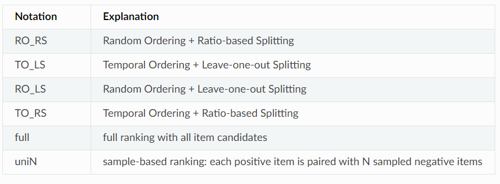

# RecBole开源框架

很多时候推荐系统论文的复现和验证都是一个难题，因为常常涉及不同的数据集来源、数据集划分和训练模式。最近在研究推荐系统问题时，发现一个比较优秀的开源代码库RecBole，对于绝大多数数据集、模型都有着比较完整的实现，同时框架的可扩展性也比较良好。

## 简介

RecBole是主要由国内几所高校（中国人民大学、华东师范大学、北京邮电大学等），共同开发和整理的开源推荐系统代码库。该代码库是基于PyTorch实现的，因此比较符合笔者的使用习惯，同时代码库的各项文档和论文都非常清晰齐全，如下所示：

- 论文地址：https://arxiv.org/abs/2011.01731
- 项目主页地址：https://recbole.io
- 项目Github地址：https://github.com/RUCAIBox/RecBole
- 项目交流邮件组：recbole@outlook.com

在最初的发布版本中，RecBole支持65个通用的推荐系统模型，28个常用于benchmark的数据集。支持的模型涵盖四种常见的推荐系统场景：

- 通用推荐。输入评分矩阵，给出测试集评分。
- 序列推荐。输入包含时间信息的顺序点击数据。
- 上下文推荐。除了评分矩阵外还输入用户或物品的上下文特征信息
- 基于知识的推荐。基于一些额外知识进行推荐

为了解决推荐系统领域的训练和评估问题，RecBole设计了通用的数据结构，设置了标准且得到广泛认同的评价指标。对于28个数据集RecBole都给出了已经转换为特定格式的数据文件，可以直接下载或者自行依照文档进行转化。

RecBole可以通过conda和pip工具按照一般的python代码库安装方式进行安装。

    conda install -c aibox recbole
    
    pip install recbole

或者通过下载开源代码进行手动安装：

    git clone https://github.com/RUCAIBox/RecBole.git && cd RecBole
 
## 基本构成

RecBole主要包含配置设定、数据处理、模型、评价四个部分。

### 配置设定

配置设定是对RecBole的运行环境和运行方式进行一定的设定

基础的参数包括对环境的设置，例如gpu_id、use_gpu(是否使用GPU)、seed（随机种子）等。熟悉论文代码复现和实验的人应该对这些参数十分熟悉。

此外还有对训练和测试中的一些常见的无论任何深度学习模型都需要的参数，比如学习率、训练轮数、batch_size以及评价指标和模式的选择等等。

### 数据处理

数据处理方式基本上参考了PyTorch中已有的Dataset和Dataloader的构成形式。独特之处在于RecBole为了满足推荐系统的特殊形式，采用了一种原子文件（Atomic File）来表示数据流中的基本外部文件


这些文件基本就代表了推荐系统中能够涉及的各类信息。例如一般推荐系统就只涉及.inter，而基于上下文的推荐系统就需要.user和.item。更复杂的涉及知识图谱等结构的推荐系统就需要其他原子文件。

在代码中，则使用interaction类作为基本数据结构。

### 模型与评价

如上文所说，RecBole实现了65种模型，使用者可以简单地调用这些类建立对象来使用这些模型。

而在评价方面，指标包括Recall, Precision, Hit, NDCG, MAP 和MRR等。对应不同的场景，可以采取不同的测试方式。如下所示：




## 执行训练

### 运行

运行有两种方式。

一种是作为学习者，仅仅是快速地验证模型在数据集上的效果。代码非常简单。以BPR算法在ml-100k上的实验为例

```python
from recbole.quick_start import run_recbole

run_recbole(dataset='BPR', model='dataset', config_file_list=config_file_list, config_dict=config_dict)

```

另一种则是构造Trainer对象。通过面向对象的方式进行训练。

```python
from logging import getLogger
from recbole.config import Config
from recbole.data import create_dataset, data_preparation
from recbole.model.general_recommender import BPR
from recbole.trainer import Trainer
from recbole.utils import init_seed, init_logger

if __name__ == '__main__':

    # configurations initialization
    config = Config(model='BPR', dataset='ml-100k')

    # init random seed
    init_seed(config['seed'], config['reproducibility'])

    # logger initialization
    init_logger(config)
    logger = getLogger()

    # write config info into log
    logger.info(config)

    # dataset creating and filtering
    dataset = create_dataset(config)
    logger.info(dataset)

    # dataset splitting
    train_data, valid_data, test_data = data_preparation(config, dataset)

    # model loading and initialization
    model = BPR(config, train_data).to(config['device'])
    logger.info(model)

    # trainer loading and initialization
    trainer = Trainer(config, model)

    # model training
    best_valid_score, best_valid_result = trainer.fit(train_data, valid_data)

    # model evaluation
    test_result = trainer.evaluate(test_data)
    print(test_result)
```

### 订制扩展

RecBole为高级的使用者或者研究人员留出了个性化扩展的接口。这使得RecBole不仅仅是用于进行基线实验，而是可以用于开发新的算法。

主要包括：

订制模型。继承recbole.model.abstract_recommender.GeneralRecom类

订制训练器。继承from recbole.trainer.Trainer。主要是为了设置一些训练的小技巧。例如在某个epoch之后增加损失函数权重等。

订制数据加载器和采样器。主要用于在数据载入前执行一些负采样等操作。