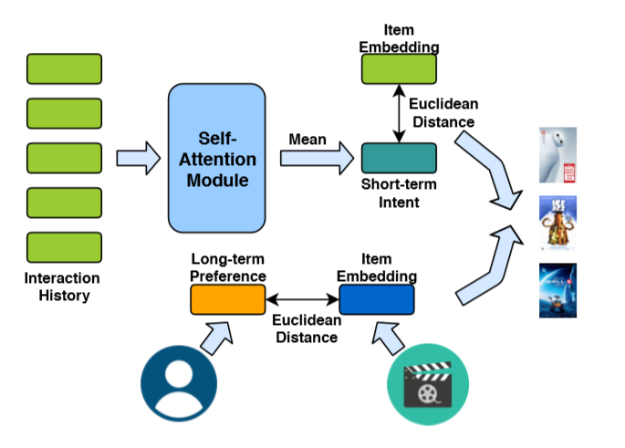
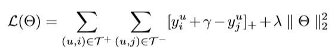

# Self-attention 推荐算法

推荐系统是一种机器学习的主要应用场景。其基本功能是根据用户已有的物品点击记录和属性记录，为用户提供新的物品推荐。因此推荐系统被广泛应用在互联网时代的电商网站、社交平台等服务场景中。

传统的推荐系统采用的主要是基于协同过滤(Collaborative Filting) 的算法，其主要思想是根据用户点击过的记录，计算不同用户之间的相似度。例如将与用户A相似的B、C两用户点击过而A没有点击过的物品推荐给A。具体实现方法多种多样，最常用的是矩阵分解(Matrix Factorization)方法，即从UI评分矩阵中分解出用户和物品的嵌入向量，再用两者进行矩阵乘法得到用于预测的新的UI矩阵。

随着深度学习的兴起，基于深度学习的算法逐渐也在推荐系统领域体现出了优势，较为经典的有TransRec, Caser, LSTM+, GRU4Rec等等，他们的应用场景和协同过滤略有不同，大多是用RNN等方法来建模用户对物品序列的局部偏好，从而使得模型可以对用户下一次的点击做出更好的预测。

本文介绍的Self-attention推荐算法同样是一种深度学习的推荐算法，它的创新之处在于使用前面提到过的self-attention方法建模用户的局部偏好，同时采用度量学习的pairwise损失函数来优化模型对于正样本和负样本的评分。

更多细节可参考《[Next Item Recommendation with Self-Attentive Metric Learning](https://arxiv.org/pdf/1808.06414)》

## 用户的局部偏好

传统协同过滤算法将用户的偏好视作一成不变的。只要用户点击过的物品，都会对用户的整体偏好造成相同的影响。这种假设相当于将数据集当成一个问卷调查结果。

如果数据集中引入了时间信息，传统推荐算法在表现能力上就出现了明显不足。例如：

   - 用户A在3年内有着100个物品浏览记录，他在2017年1月浏览了文具类产品，在2019年12月25日浏览了电子数码产品。
   - 现在我们要在2019年12月26日推荐一些物品给他。

传统算法会赋予文具和电子数码产品相同的权重，甚至有可能在推荐列表中把文具放在数码产品前面。但事实上3年前文具类产品的浏览记录参考价值很低。

正是因为如此，模型需要对用户的局部偏好（local preference）进行建模。在训练中常常会将用户的整个物品交互记录按时间排序然后用窗口滑动方式分段。这些被分成一个个小段的物品实际上就能够体现用户在每个时间节点的局部偏好。

需要注意的是，在建模局部偏好时，并不应该完全放弃传统算法中对于全局偏好（global preference）的估计。因为全局偏好依然可以体现用户某些不随时间变化的特征。

仍然以先前的例子说明，在向用户A做推荐时，我们虽然不能因为他在三年前看过文具广告，就向他推荐文具，但是可以根据他浏览过蓝色文具考虑将蓝色配色的手机推荐给他。因为他对于蓝色的喜好很可能是不随时间变化的。

总结来说一个鲁棒的模型需要建模两种偏好：
- 全局偏好：比较长期的用户特征，比如用户喜欢蓝色的物品
- 局部偏好：比较短期的用户特征，比如用户在前段时间需要买文具，在现在这段时间需要买数码产品
    
## AttRec算法

论文的作者将他的算法称为AttRec，即Attention Recommendation的缩写，后文我们也采用这种缩写。算法的整体架构如下图所示：

在全局特征方面，AttRec使用和一般BPRMF类似的方法，分别用两个可训练的嵌入向量矩阵来表达用户和物品的长期特征，表示为U和V

在局部特征方面，AttRec使用self-attention来建模用户在短期内的偏好。模型将一小段长度为L（实验最佳长度为5）用户的物品点击序列作为输入，经过嵌入层（假设embedding_size为D)之后进行self-attention计算得到大小为L x D的矩阵。

需要注意的是这里的嵌入层X和全局的物品嵌入向量矩阵是相互独立的，并不任何关联。

其中Q K V相等，均为物品序列通过embedding层后经过一个全连接层得到的隐变量，大小为L x D

- Attention(Q, K, V) = softmax( (Q·KT) / (√dk) ) · V

将L x D的结果在列上取均值后，得到了一个1 x D的向量，这便是该用户在这一时刻的Short-term intent，M。

由此我们得到了物品在长期和短期两个角度的representation，V和X，也得到了用户在长期和短期两个角度的representation，U和M。那么剩下的就是将他们进行计算得到某个用户对某个产品的总体评价。作者采用欧式距离计算用户和物品之间的差异性，并将长期和短期两种差异通过一个超参数ω赋予权重后加在一起。

- yij = ω (Ui - Vj) ^ 2 + （1 - ω）x (Mi - Xj) ^ 2

在训练方面，AttRec采用了pairwise的训练方法。针对每个输入的点击序列，取之后的T个点击作为ground truth，从物品全集除去这T个的其他物品中采样T个作为negative targets。模型的训练目标是将ground truth和negative targets的分数差值拉大到γ：

## 实验结果

论文中首先通过比较AttRec和其他已有深度学习或者协同过滤算法在相同数据集上的效果证明了AttRec的优越性。主要指标是HR@50和MRR

为了证明AttRec算法的有效性，论文中还展示了几个对比实验的结果，主要是针对算法中self-attention的使用是否有效以及对self-attention的结果进行mean计算是否合理。结果证明了算法设计的合理性。

