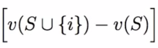
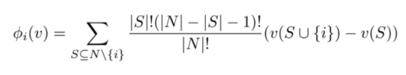
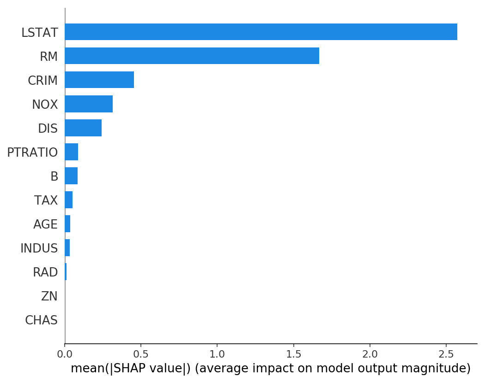

# Shapley Value 算法

目前机器学习模型尤其是深度学习类的算法模型逐渐复杂化，虽然模型在数据集和实际应用中的表现越来越好，但是可解释性也往往越来越差。

但在将机器学习模型投入到实际应用场景中时，往往对可解释性有很高的要求。例如在金融、投资等场景中，需要向客户解释收集信息的原因、以及输入信息对预测结果的具体影响作用。

为了实现可解释性的机器学习，一种方法是设计的算法模型本身具有可解释性，例如基于概率统计的模型朴素贝叶斯、图模型中的贝叶斯网络、以及神经网络中attention机制这种具有一定可解释性的组件；另一种方法则是将已经设计好的模型看作黑盒，然后通过某些算法去评估输入的特征对模型的输出的影响，再借此做出一些解释。

Shapley Value方法就是对模型进行可解释性分析的一种常用方法。通常将这个分析方法称为Shapley Value Estimation(SVE)

## 博弈论中的 Shapley Value 算法

Shapley Value 的计算最早出现于博弈论中，解决的问题是在多个成员合作获得一定收益后如何分配这些收益。

例如 A、B、C三人获得了100收益，如何将这收益分给三人？有以下几种方法：

- 平均分配，将100收益评分为三份。这种分法没有考虑到参与者出力不同，不够公平。

- 根据单个员工的工作能力分配。方法是分别让三名员工单独进行工作。例如A、B、C单独收益分别为20、30、50，则应该将100的收益按照2：3：5的比例分配。

表面上看第二种分配方法是比较科学的，但是这个问题中，多个人合作的收益并不是单个人工作收益的简单累加。A和B两人合作的收益可能超过50。

Shapley value方法提出了边际贡献（marginal contribution）的概念。

例如A和B合作收益是70，A单人收益是20，则在A单人基础上增加一个B参与工作带来的收益增加是50。而如果是在无人的基础上增加一个B参与工作，增加的收益则是30，如果再加入A，则A为团队增加了40的收益。

这里B带来的累加收益分别是50和30，体现了在不同累加顺序情况下，边际贡献是完全不同的，因此要合理分配收益，应当综合考虑各种情况下的边际贡献值。

当前集合为S, 加入的新成员为i, 收益函数为v,则边际收益可以记作：




总集合记为N，需要计算每种排列下的边际收益，然后计算平均值作为单个成员的Shapley value。计算公式为：



为了避免相同集合的收益重复计算，公式中取全集N的任意子集S，然后将成员i添加到S之上。i左侧所有元素的排列数为|S|!，右侧所有元素的排列数为(|N| - |S| - 1)! 在这些排列中i的边际贡献都是一致的。


## 机器学习可解释性与Shapley Value

机器学习中的可解释性分析通常是分析各个输入特征对模型输出的影响力。一般只需要将每个输入特征对应到Shapley Value计算中集合中的每个元素即可。Shapley Value中的收益可以对应到机器学习中模型的准确率、损失值等评价指标。


主要的问题是机器学习中涉及的特征和节点数量较多。而Shapley Value计算的时间复杂度为O(2^N).

降低时间复杂度的方法主要有：

- 设置一个采样数量k。不需要计算所有排列顺序而是采样一定数量的排列组合顺序。时间复杂度为O(2^K)

- 采用一些算法来减少需要分析的特征数量。例如将特征进行层级化划分，只考虑那些排在比较高层级的重要特征。

## SHAP 工具

SHAP是一个开源的python机器学习可解释性分析工具，链接为(https://github.com/slundberg/shap)，SHAP支持当前主流的xgboost等集成学习模型以及主流的tensorflow、Pytorch深度学习框架。

以xgboost为例，可以在完成训练后，直接将模型输入到shap中进行分析，然后可以绘制可解释性分析图等。

```python
import xgboost
import shap

# load JS visualization code to notebook
shap.initjs()

# train XGBoost model
X,y = shap.datasets.boston()
model = xgboost.train({"learning_rate": 0.01}, xgboost.DMatrix(X, label=y), 100)

# explain the model's predictions using SHAP
# (same syntax works for LightGBM, CatBoost, scikit-learn and spark models)
explainer = shap.TreeExplainer(model)
shap_values = explainer.shap_values(X)

# visualize the first prediction's explanation (use matplotlib=True to avoid Javascript)
shap.force_plot(explainer.expected_value, shap_values[0,:], X.iloc[0,:])
```

SHAP进行的可解释性分析大致有两种，一种是体现特征对模型输出的数学影响。例如是哪些特征让输出值变大，哪些特征让输出值变小。


另一种则是体现特征对模型输出的贡献度：


