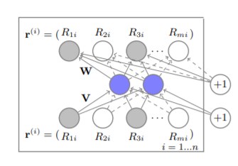
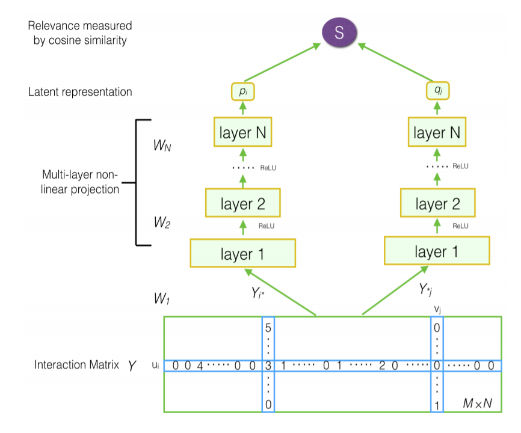
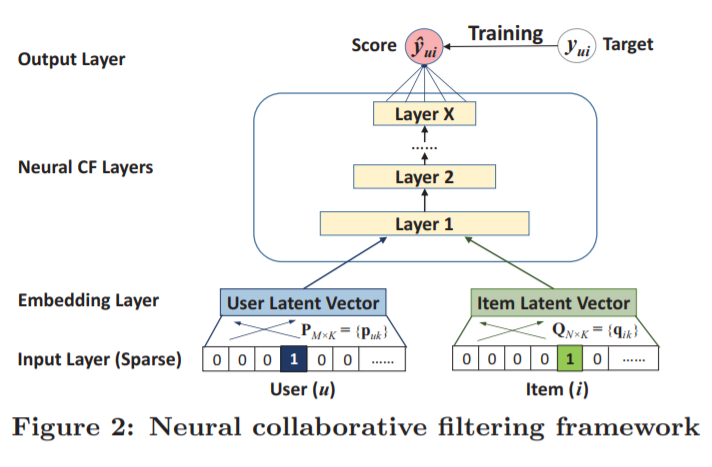
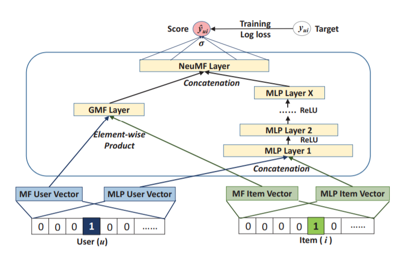

# 深度学习推荐系统算法整理

推荐系统作为一种机器学习的应用场景，经历了几个阶段的变化，最终发展到了深度学习推荐系统的场景里。这个过程中出现的许多算法至今依然被作为推荐算法研究的基线和比较对象。

本篇希望能对几种常见的深度学习推荐系统算法做一个总结，以免在日后实验的复现中出现偏差和误解。注意：本篇只介绍无时序信息的推荐算法，时序推荐留待下次介绍。

## 发展过程

早期推荐系统问题的主要解决思路有两种：

1. 矩阵分解 \(Matrix Factorization, MF\)

   将用户对物品的点击归纳成一个user\_nums\*item\_nums的矩阵，然后通过SVD等矩阵分解方法将评分矩阵分解成对应所有user和所有物品的隐变量向量。

   之后再用这些隐变量向量去重构矩阵，从而填补出之前没有评分的空缺位置的分数，达到预测的目的。

2. 协同过滤 \(Collaborative Filtering, CF\)

   根据每个用户的点击历史以及每个物品的被点击历史，通过某种度量总结出用户之间、物品之间的相似度。依照这种相似度判断某个用户接下来对某个物品的评分。

深度学习的介入同样基本是从这两点出发。早期的算法往往是尝试把用户的点击序列、物品的被点击序列作为一个完整的特征输入到网络中。可以说是综合了MF、CF两者的精华。例如AutoRec、DMF。

随着之后word2vec、embedding等思想的兴起，大部分算法都不再会把整个序列作为特征输入，而是直接将物品和用户的one-hot Id转化为嵌入向量。在对隐变量的处理方法上也不一定继续遵循MF中点乘的方法。例如GMF、MLP、NeuMF等。

在评价指标方面，学术界的热点普遍从显式反馈\(explicit feedback\)转移到了隐式反馈\(implicit feedback\)。在早期的AutoRec的实验中，实验结果是根据具体的1-5评分来计算RMSE、MSE。而目前则是采用对推荐程度进行排序的方式计算recall、NDCG等指标。简单来说两者有点类似于回归问题和分类问题的区别。

在这些发展的基础上，目前研究的主要方向还是在于进一步优化深度学习的网络结构、训练流程或者是引入更多跨域的数据。

## AutoRec

AutoRec是将CV领域的autoencoder成果引入到推荐领域的尝试。参见论文[AutoRec: Autoencoders Meet Collaborative Filtering](http://users.cecs.anu.edu.au/~u5098633/papers/www15.pdf)

这是一个非常早期的成果，因此可以看出其中还保留了很多非深度学习的算法的影子。文章提出了两种AutoRec，区别只在于用物品点击来表示用户还是用用户点击来表示物品。

例如在I-AutoRec中，用户被直接表示为长度为item\_nums的向量，每个位置是用户对对应位置物品的评分，如果没有评分则置空。



输入向量经过autoencoder后会重构出一个输出的向量。这个输出向量就表示用户对所有物品的实际评分。用输出和输出向量取差值计算loss就可以对网络进行训练。

注意在计算loss时只会计算该用户在训练集中有评分的那些物品，未评分的物品则需要进行mask处理。

值得注意的是该文章原文是用RMSE指标来体现算法的优越性，显然和当下的潮流不符。不过只需要稍加改动就可以根据新的指标对AutoRec进行评估。

* 在autoencoder的输出位置加上sigmoid以保证输出结果是0-1之间
* 可以考虑使用cross\_entropy损失函数替代MAE损失函数（存疑，待验证）
* 在测试时只对那些训练集中不存在的用户物品交互进行打分排序

## DMF

DMF，即Deep Matrix Factorization。论文参见[Deep Matrix Factorization Models for Recommender Systems](https://www.ijcai.org/Proceedings/2017/0447.pdf)



图中主要的要点在于：

* 输入：使用用户和物品的点击序列作为特征输入，这个向量是multi-hot的（主要是与后面提到的GMF进行区分）
* 结构：用户和物品向量通过两个不同的多层网络计算，这与AutoRec有明显不同（AutoRec只会用到用户和物品向量两者中的一个）
* 输出和预测：将用户和物品两个神经网络的输出结果作为同一空间中的向量计算余弦相似度

实际上DMF网络输出的p和q就可以认为是MF中矩阵分解得到的用户、物品隐变量，其实是在用一种深度学习的方法来完成以往通过SVD来完成的矩阵分解过程。

## NCF

NCF, 即Neural Collaborative Filtering。论文参见[Neural Collaborative Filtering](https://dl.acm.org/doi/pdf/10.1145/3038912.3052569)

该文章最大的贡献就是对深度学习在推荐系统的应用做了归纳和总结。从谷歌scholar上一千多次的引用记录也可以看出该文章的影响力。

论文将深度学习中的推荐算法总结为以下的框架：



NCF其实并不是一个具体的模型而是一个通用的框架。可以看出该框架完全放弃了用点击序列作为特征输入，而是完全以embedding的方式对one-hot的id进行转化。

此外NCF框架认为在获得了用户和物品的隐变量后不应该直接计算相似度或是预测分数，而是应该增加一些网络的深度，以达到更强的表示能力。

基于这个框架，作者又提出了两种不同的实现思路：

1. GMF\(广义矩阵分解，Generalized Matrix Factorization\) 首先用两个embedding层分别用于转换用户和物品的ID，和MF的另一个区别是在计算相似度是会首先进行逐元素乘法然后通过一个线性层得到输出结果。相当于是在点乘的每个元素前面加上了一个权重。

   ```python
   class GMF(nn.Module):
       def __init__(self,user_num, item_num, factor_num):
           super(GMF,self).__init__()
           self.embed_user_GMF = nn.Embedding(user_num,factor_num)
           self.embed_item_GMF = nn.Embedding(item_num,factor_num)
           self.predict_layer = nn.Linear(factor_num,1)
           self._init_weight_()
       def _init_weight_(self):
           nn.init.normal_(self.embed_item_GMF.weight,std=0.01)
           nn.init.normal_(self.embed_user_GMF.weight,std=0.01)
       def forward(self,user,item):
           embed_user_GMF = self.embed_user_GMF(user)
           embed_item_GMF = self.embed_item_GMF(item)
           output_GMF = embed_user_GMF*embed_item_GMF
           prediction = self.predict_layer(output_GMF)
           return prediction.view(-1)
   ```

2. MLP\(多层感知机，Multi-Layer Perceptron\) 采用深度学习中更常见的concatenate结构来结合用户和物品向量。同时加入多层神经元数量逐渐减小的线性层。层之间用relu激活函数激活。

   \`\`\`python class MLP\(nn.Module\): def **init**\(self, user_num, itemnum, factor\_num, num\_layers, dropout\): super\(MLP, self\).\_\_init_\(\)

   ```text
    self.embed_user_MLP = nn.Embedding(user_num, factor_num * (2 ** (num_layers - 1)))
    self.embed_item_MLP = nn.Embedding(item_num, factor_num * (2 ** (num_layers - 1)))

    MLP_modules = []
    for i in range(num_layers):
        input_size = factor_num * (2 ** (num_layers - i))
        MLP_modules.append(nn.Dropout(p=dropout))
        MLP_modules.append(nn.Linear(input_size, input_size//2))
        MLP_modules.append(nn.ReLU())
    self.MLP_layers = nn.Sequential(*MLP_modules)

    self.predict_layer = nn.Linear(factor_num, 1)

    self._init_weight_()

   def _init_weight_(self):
       nn.init.normal_(self.embed_user_MLP.weight, std=0.01)
       nn.init.normal_(self.embed_item_MLP.weight, std=0.01)

       for m in self.MLP_layers:
           if isinstance(m, nn.Linear):
               nn.init.xavier_uniform_(m.weight)
               nn.init.kaiming_uniform_(self.predict_layer.weight,a=1, nonlinearity='sigmoid')

   def forward(self, user, item):
       embed_user_MLP = self.embed_user_MLP(user)
       embed_item_MLP = self.embed_item_MLP(item)
       interaction = torch.cat((embed_user_MLP, embed_item_MLP), -1)
       output_MLP = self.MLP_layers(interaction)
       prediction = self.predict_layer(output_MLP)
       return prediction.view(-1)
   ```

最终将这两个模型在倒数第二层前concatenate一下再进行转化输出。就得到了作者实验出更加优秀的融合框架，NeuMF。



