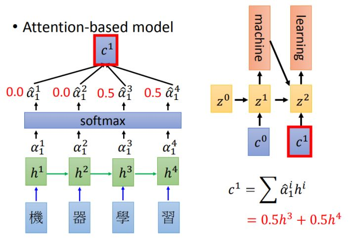
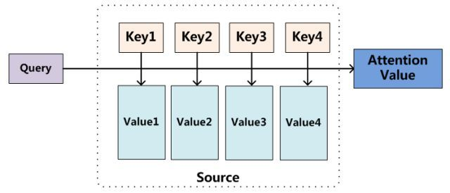
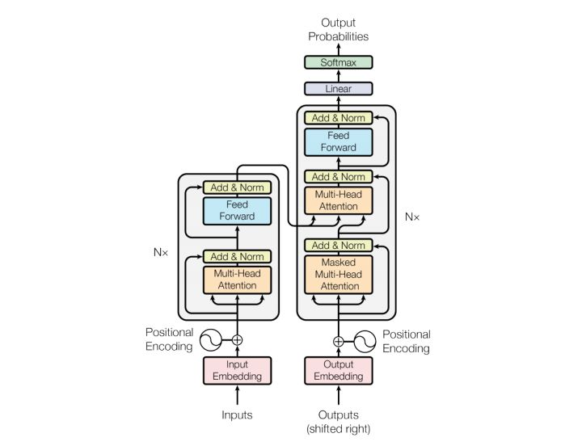

# Transformer算法

在机器学习的自然语言处理（Natural Language Processing）领域中，通常会遇到的问题场景被称作seq2seq。通俗地说，seq2seq指的就是输入为序列，输出也为序列的机器学习模型问题。

首先对于序列的输入，为了建模其中的时序关系，=把一定顺序的输入数据处理成多个输出和状态隐变量，这个阶段被称作encoder。

针对encoder的结果，需要将隐变量通过某种运算得到最终的输出结果，这个阶段被称作decoder。

在transformer提出之前，学者们普遍是采用rnn循环神经网络（包括lstm，gru等rnn的变体）用作encoding，attention机制用作decoding。

Transformer算法由Google团队在《[Attention is all you need](https://arxiv.org/abs/1706.03762)》中提出，提出用attention机制完全取代rnn的self-attention。由此构建的完整的transformer算法开始得到了广泛应用，除了解决seq2seq问题外还被拓展到了计算机视觉等非序列预测的领域。

本文也将主要结合《Attention is all you need》一文的内容进行介绍。

## Attention机制

Attention机制的基本思想很简单，就是在decoding阶段为输入的信息赋予不同的权重。以一个中文到英文的翻译问题为例：



图中h1、h2、h3、h4分别表示从"机器学习"这四个词经过rnn等网络得到的四个隐变量。α表示h1-h4对输出的贡献权重。

从常识出发我们会知道，"machine"一词与"机器"两个字相关，因此从"机器"两个字encode得到的h1、h2这两个隐变量对于"learning"这个词的影响自然比较小，而h3、h4的权重则比较大。

因此如果合理设计网络，模型应该能学习到上述结论，从而主要根据后两个字的输入来翻译后一个输出词语，得到状态c1，进而得到正确的翻译结果。

一般来说会将attention机制分解为下图所示的结构：



Query对应前一张图的输出状态z0、z1，key和value相同都是指h1、h2、h3、h4。模型根据Query和key进行匹配计算权重α，再使用α和value得到输出结果。即：

* Attention\(Q, K, V\) = softmax\( sim\(Q, K\) \) V

实际运用中，在计算α权重的sim函数以及后续输出的网络结构上还有更多复杂的选择，在此不做赘述。

## Transformer模型

开头说过，Transformer和传统rnn\_based attention模型最大的不同在于将rnn从encoder中移除，使用attention同时完成encoding和decoding两个工作。其总体框架图如下所示，左侧为encoder右侧为decoder。



### Multi-Head Attention

可以看到图中主体结构是三个Multi-Head Attention。如果原本的Attention产生的是n\_embd长度的vector,那么Multi-Head其实就是将n\_head个Attention结果concat起来产生n\_head\*n\_embd大小的vector，以提高其鲁棒性。

* MultiHead\(Q, K, V\) = Concat\(head1, head2, ... , headh\)W^O
* headi = Attention\(Q·WQ, K·WK, V·WV\)

其中的每一个Attention模块采用的是scaled dot-product的计算方法，该方法被作者实验证明是最佳实践。

* Attention\(Q, K, V\) = softmax\( \(Q·KT\) / \(√dk\) \) · V

Python简单实现如下\(PyTorch\)：

```python
def attn(self, query, key, value):

        pre_att = torch.matmul(query, key)
        if self.scale:
            pre_att = pre_att / math.sqrt(value.size(-1))
        mask = self.mask_tri[:, :, :pre_att.size(-2), :pre_att.size(-1)]
        pre_att = pre_att * mask + -1e9 * (1 - mask)
        pre_att = nn.Softmax(dim=-1)(pre_att)
        pre_att = self.attn_dropout(pre_att)
        attn = torch.matmul(pre_att, value)

        return attn
```

我们已经在前文说明了在decoding部分的Attention使用encoder结果作为K和V，输出状态作为Q。而在encoding部分的Q、K、V是相同的均为输入值。这种计算被称为self-attention

* Attention\(x, x, x\) 

直观地理解，对"I love my family"这句话中的"love"位置进行self attention计算时，实际上考虑到了句子中其他三个词对其的影响权重。

根据实际情形，有时还需要对输入进行mask处理，比如在decoder部分的输入中我们认为后面的词语对前面的词语不会有影响，因此需要将排在"love"后面的词语权重人为设置为0。这就是图中右下角所写Masked Multi-head Attention的含义。

### Positional Encoding

由于放弃了rnn结构，在decoder层还需要添加额外的操作以表达输入的顺序信息，这样我们的输入才会是"I love my family"而不是"family love I my"这样畸形的句子。此处引入了位置编码\(positional embedding\)的思想。

首先对于长度为length的句子，构造一个从0~length-1的Tensor

```python
position = torch.tensor(torch.arange(length),dtype=torch.long).to(device)
```

然后将其输入到一个embedding层中，这个embedding层会将编号为0到最大窗口大小的序号值映射到n\_embds的空间里。

```python
self.po_embed = nn.Embedding(win_len,n_embd)

po_embedding = self.po_embed(position)
```

这种做法其实有一定局限性，即对句子长度有所限制，当我们的输入非常长的句子时，使用网络来进行embedding就不是很可取。因此作者提出了另一种直接利用不同频率的cos/sim函数来直接计算位置编码的做法，经实验验证效果与embedding一致。

## Transformer算法的优点

1. 计算效率的提升。在encoder部分用大量可并行的矩阵运算取代了必须线性按顺序计算的rnn，大大提高了模型运行的效率。
2. 可解释性的提升。在附录中，论文作者给出的例子显示，对于那些在语义上类似或者有联系的词语，Transformer能够在计算self-attention时训练出较高的权重，可以利用这一点提高模型的解释性。这种特点也在图像等领域得到了验证。
3. 效果优秀。这一点当然也是一个算法得到广泛应用的前提。除了NLP，在推荐、视频等涉及sequence的研究中Transformer都得到了广泛应用。即使是在图像等与序列毫无关联的领域，人们都发现了self-attention机制优越的表示能力能为模型带来提升。

\`\`\`

