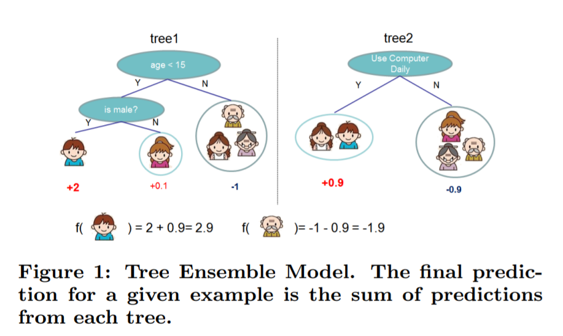
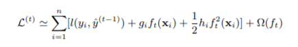
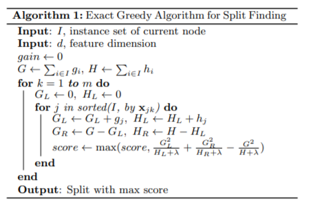
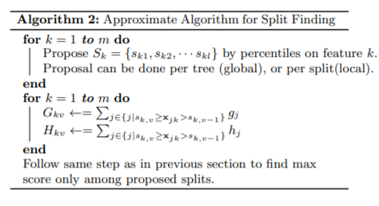
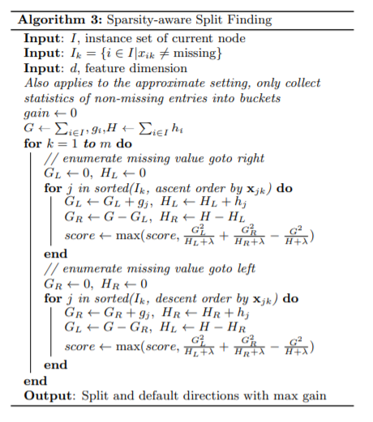

# XGBoost算法

在Boost算法的家族中，XGBoost于2016年sigKDD中提出，普遍认为是一种设计非常优秀，且在工程实践上取得了良好效果的算法。本质上XGBoost是GBDT算法的一种改进，其改进主要体现在以下几个部分

1. 对目标函数进行二阶泰勒展开，在目标函数中引入映射函数的一次和二次导数。
2. 使用近似方法和直方图等方法提高决策树特征选取的速度。 

## CART决策树

决策树是一种简单的机器学习方法。基本思路是利用树这种数据结构来表现根据特征做出预测的整个过程。例如我们仅根据人的头发长度是否大于5cm来决定人的性别是男是女，这就可以利用简单的一层的决策树来表现。即：

* 根节点是所有学生的集合
* 两个子节点分别表示模型预测出的男生和女生
* 根节点到子节点的两条边表示判断条件，头发长度5cm

决策树的关键在于选取更加优秀的分裂点，即先选取哪个特征来进行节点分裂。XGBoost采用的是CART决策树。这种决策树的优越之处在于同时支持离散值和连续值的预测。 分裂点选择一般选择信息熵计算的方法，统计那些可以尽量将数据集平均分开特征。

* 对于离散值，在分裂节点时，根据是否满足离散值条件来划分，预测时根据叶子节点分别给予不同的离散值标签即可。
* 对于连续值，一般都是采用分箱的方法，将连续值划分到不同的连续值区间。在预测时，同一个叶子节点内的样本都将预测值设置为该区间的平均值，用这个平均值分别和每个样本的标签计算损失。

## XGBoost概述和损失函数

XGBoost的原理和GBDT类似，借用论文中的图片，我们可以理解该算法对真实值的拟合过程。

图中展示了一个简单的模型。只训练了两个决策树作为子分类器。其中有两个关键点：

1. 目标函数的逼近。 XGBoost在训练每个树时逼近的目标值是变化的。第一棵树的目标值是样本的真实标签，第二棵树的目标值就变味了样本的真实标签和上一棵树预测结果之间的差值。在完成训练后，我们只需要将所有子树的预测值加在一起就能得到XGBoost的最终预测结果。
2. 特征选择和分裂点选择。每棵树用于进行决策构造的特征并不一定相同，需要根据一定的规则选择对当前的目标值拟合效果最好的特征。然后进行常规的分裂点选择。

对于第t+1个模型，算法的目标函数是：

l是损失函数，例如平方损失函数RMSE等。该目标函数中g和h分别是l函数的一次和二次导函数。事实上上式是下面的目标函数的变形，对l函数进行了二阶泰勒展开。

这种设计有几个原因： 1. 利用了更多的模型信息，比GBDT多了二阶梯度，可以用于下一个模型的分裂点选择和特征选择。 2. 提高模型的优化速度，这点在牛顿法中也有体现。 1. 提高模型的可扩展性，任何二次可导的损失函数都可以适用于这个损失以及后续推导得到的一系列方法。

## 最佳分裂点选择

上文我们已经提到决策树的关键在于选择合适的特征进行节点分裂。这个选择过程被XGBoost认为是最影响GBDT模型训练速度的部分，因此进行了详细的设计。

### 精确贪心算法

这个算法是算法的基线，通过遍历所有的特征计算每棵可能的树的总的收益值。注意此处的收益值是通过计算一阶导数值和二阶导数值的和进行计算的。这个思路是，希望让下一棵树能够尽可能地让模型得到最大的优化，符合GBDT的设计思路。

### 近似算法

精确贪心算法要遍历所有特征的所有排列可能排列成的决策树，因此时间复杂度极高，不具有实际可操作性。

因此将精确贪心算法改进为近似算法。近似算法首先根据特征值分布的百分位数产生一些候选分割点，然后根据候选分割点把连续的特征离散化，然后计算梯度统计gi和hi，根据梯度统计计算obj\*和gain，进而寻找最佳候选分割点。

近似算法中重要的一步就是产生合理的候选分裂点，通常是根据特征值的百分位数点产生候选分割点，这样可以把特征值平均的分成若干个区间。XGBoost采用权重百分位数产生法（（weighted quantile sketch）用二阶导数值作为百分位区间的权重。

### 稀疏数据分裂点算法

在实际应用中，常见类型是稀疏类型的特征，特征里面可能包含大量的缺失值。为了使XGBoost能够适用大量缺失值的场景，在树分裂的时候，给缺失值一个默认的分裂方向（全部分裂到左子节点或者全部分裂到右子节点）。

默认的分裂方向是通过在训练数据上学习得到的。学习默认分裂方向的算法见Algorithm3。

本文受时间限制和作者能力限制，只介绍了XGBoost算法的大概设计情况，和一些关键的组件。实际上XGBoost还有大量对于运行效率的改善以及严格的证明过程，例如对数据结构的设计以及并行计算的引入。有兴趣的读者可参考原文：[https://arxiv.org/pdf/1603.02754v1.pdf](https://arxiv.org/pdf/1603.02754v1.pdf)

