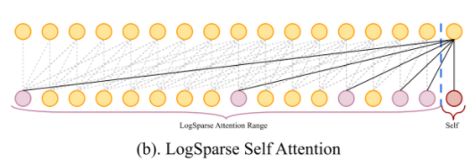

# 序列预测ConvTran算法

我们在很早之前介绍过Transformer算法，该算法使用self-attention机制作为rnn替代进行时序信息的编码。但是Transformer的提出主要是在自然语言处理领域，应对的大部分是长度较短的对话语句。

面对时序预测问题中的较长序列时Transformer往往会遭遇内存瓶颈,同时也难以强化局部性依赖。这次介绍的CovTran算法提出了一种同时解决内存瓶颈并提高影响力的局域性的表示能力的算法框架。

## Transformer算法的问题

众所周知Transformer中self-attention机制的最大优势在于可以便于发现序列数据中每个时刻之间影响力的权重，并且通过矩阵运算就可以得到这个结果，从而可以在GPU上进行高度的并行化运算提高运算效率。

然而这样的处理方式在长序列预测中存在两个主要问题

1. 长序列预测中的长程依赖出现概率较小，反而是近期的数据对预测结果的影响力较大，Transformer无法表示这种局部集中性。
2. Transformer通过以下的Attention函数来执行运算：
   * Attention\(Q, K, V\) = softmax\( sim\(Q, K\) \) V

     空间复杂度为O\(n^2\)。因此序列越长，所需内存空间越大，很容易遇到内存的瓶颈。

ConvTran算法来自于2019年NIPS的论文：[Enhancing the Locality and Breaking the Memory Bottleneck of Transformer on Time Series Forecasting](https://arxiv.org/abs/1907.00235)

该论文主要贡献就是将Transformer应用到了较长序列的预测上，同时解决了上述两个问题。

## 局域性问题的解决

在时序预测领域，为了降低输入数据的维度，除了使用RNN处理数据外，也常常会用到CNN对长序列做一维的卷积以找到其中的局部关联性信息。

由于时序预测场景中只能进行从前到后单向的预测，因此使用的是因果卷积方法，如图所示。

此处使用因果卷积的巧妙之处在于将Attention中计算Query和Key值的矩阵运算过程视作卷积核大小为1的一维卷积操作。如左图所示是一般的Attention操作，右图则表示在卷积核大小大于1的情况下按照窗口提取Query和Key。

在此操作下，空间复杂度随着卷积核大小的增加而显著减小。同时卷积操作为模型提取了局部信息。

## 内存瓶颈的解决

针对这种内存瓶颈问题，文章提出LogSparse self-attention结构，这个结构的有效性基于一种假设：依赖的出现概率随时间跨度的大小呈指数级下降。

相较于完整self-attention机制会考虑所有过去时刻到当前时刻的attention，LogSparseself-attention机制只考虑指数位置到当前时刻的attention。

例如，以2作为底数的LogSparseself-attention机制只考虑距离当前时刻1、2、4、8、16...个时间步的时刻的attention。这样空间复杂度就由O\(n^2\)降低到了O\(nlogn\)。

为了满足时序预测中局域性影响力的强化，Local机制被附加到LogSparse上，即给予靠近当前时刻的一段时刻豁免权，然后从这个一小段时刻之外再开始执行LogSparse。

另一种机制则是将完整的时序划分成较短的子序列，然后在每个子序列的窗口内执行LogSparse，这种做法适用于不很稀疏的数据.这种数据保存了更多时刻的attention信息。

总之，这篇论文对Transformer的改进为Transformer和它核心的self-attention机制应用于长程序列中提供了实验依据，在推荐系统等领域也可以对此进行借鉴参考。

