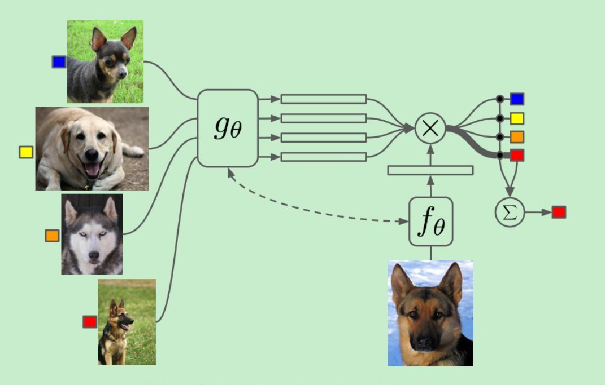
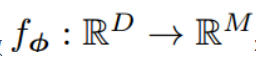
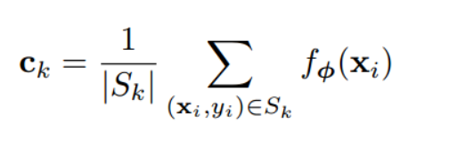
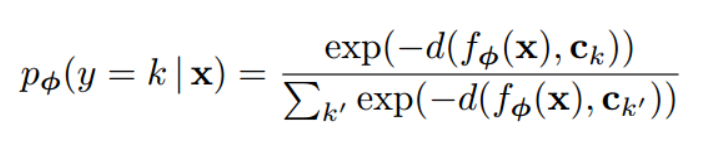
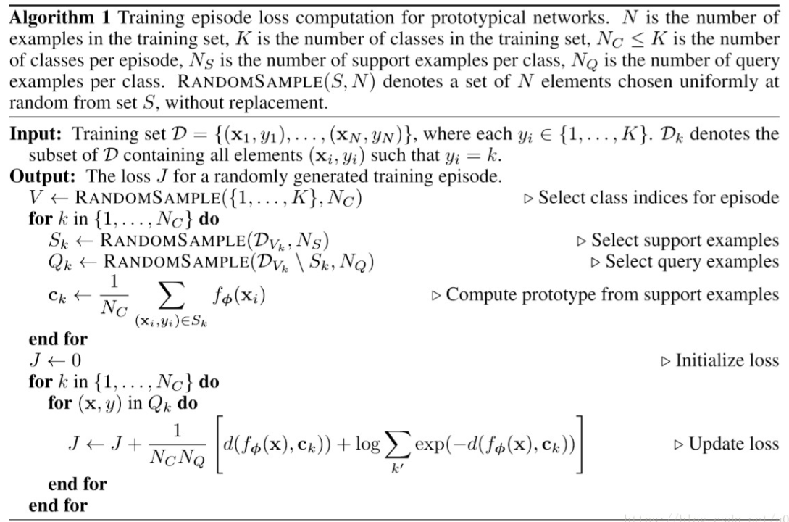
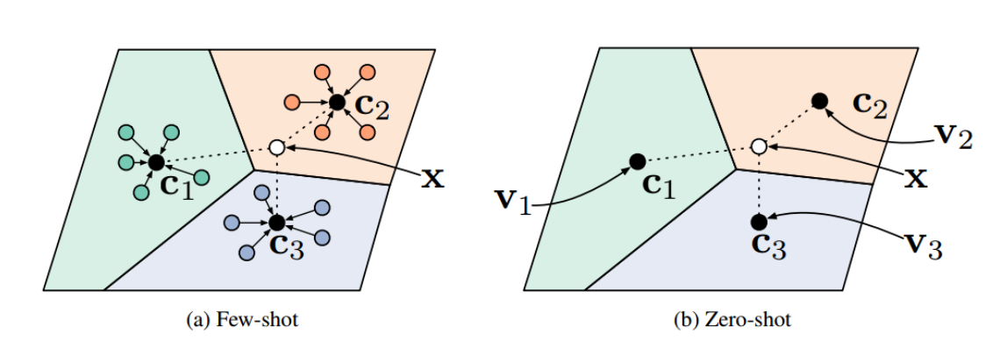

# 原型网络

原型网络（prototypical network）是一种用于解决小样本学习（few shot learning）或者零样本学习（zero shot learning）的方案。

本文主要参考于发表于2017年nips的论文《Prototypical networks for few-shot learning》。

链接：http://papers.nips.cc/paper/6996-prototypical-networks-for-few-shot-learning

## 小样本学习

深度学习场景中，越是复杂的神经网络越需要大量的数据来进行训练才能得到正确的结果。

而现实生活中人却具有从少数几个样本中学习到事物特征的能力。例如，要让从未见过鸭嘴兽的孩子认识鸭嘴兽，完全不需要准备数千张图片用于训练，只需要向孩子展示少数几张图片，人脑就能自然而然地总结规律，认出这种此前从未见过的动物。

在分类问题中，有时候也会出现类似场景。例如训练中数据量不足，推荐系统中的冷启动问题等，都是需要模型在训练数据不足的情况下得出尽可能正确的结果。

在这样的场景中传统的训练方法，无可避免会出现欠拟合、过拟合等问题，人们最初的想法是进一步提高模型的鲁棒性，但效果有限。后来学者们提出了新的思路，一种是元学习（meta learning）即由机器来学习如何学习，在此不做赘述；另一种是用某种方式总结出已有的少量样本的类别特征，在遇到新的样本时比较新的样本和已有特征的区别将新样本归类于某一个类别。

后者的技术关键在于如何提取特征和进行训练，代表性的matching networks方法是通过从训练一个matching网络提取训练集图片特征，在测试时将新图片提取特征后计算其与已有图片特征之间的余弦距离，从而做出类别判断。

原型网络是对于matching networks的一个改进。

## 原型网络的设计思路

原型网络在理论上非常简单，其创新之处在于通过计算原型给出某一个类别的特征。笔者认为这在某种程度上借鉴了无监督学习中聚类方法的思想。

S是一组小规模的有标签的支持数据集（support set）。表示为

- S = {(x1, y1), (x2, y2), ... , (xN, yN)}

其中x是D维的输入数据，y表示数据的标签即x所对应的类别。我们用Sk表示类别为k的数据集合，总类别数记为K

首先以一个网络f作为映射函数将原本D维的特征映射到M维的空间上。

我们选取Sk集合，对于其中所有的M维向量求其平均值，就得到了k类别的原型Ck：

在判断类别时，我们将输入通过同样的网络f得到M维向量。将这个向量与各个类别的原型计算距离，再把这K个向量通过softmax就得到了对于该输入应该属于哪个类别的概率分布。

其中d是一个距离函数，用于比较两个vector之间的差距。一般可使用余弦距离或欧氏距离。

之后便可以通过一般的分类问题损失函数计算损失，对参数进行优化。训练过程中的主要优化目标就是找到一个合适的映射函数f使得原型Ck能够更好地表现出每个类别图片的特征。

## 原型网络的训练流程

原型网络的训练过程与一般的深度学习训练略有不同。一般深度学习的样本仅需要遵循x->y这样的一一对应关系即可，但原型网络中需要有计算原型的过程，也就是说在训练中我们需要尽量模拟出先通过support set计算原型，再对query set中的标签做出判断的流程。

因此作者将网络的训练方法设计为：

在每次迭代中
1. 从所有类别K中选取Nc个类别
2. 对于每个类别，分别取Ns个样本作为support set, 从剩余样本中取Nq个作为query set.
3. 根据support set计算原型。
4. 根据原型对query set中的样本进行分类，计算损失，优化网络。

论文中给出的算法流程伪代码如下所示，注意其中的计算原型处的公式里Nc应该改为Ns,可能是作者的笔误：

## 零样本学习

零样本学习（zero shot learning）是在小样本学习上的进一步提升。其条件更加苛刻，即没有任何样本供学习。提供给模型的只有一些额外的属性信息。

依然以动物图片分类的场景为例，在零样本学习的背景下，模型的输入是动物的一系列属性，如体长、是否有毛。根据这些信息，需要判断一张图片是否是该种动物。

原型网络可以很容易加以改造成零样本学习，方法是将原型替换成由输入的属性计算的到，如下图所示：

## 拓展到回归问题

目前该方法主要还是运用在分类问题上，这是因为其中计算原型的思想需要有类别标签作为支撑。

实际上笔者已经看到过有论文尝试将其运用在回归问题上，其思路是必须对实值的标签做标准化处理，那么可以根据实值标签的上界和下界面分别得到两个原型。

模型可以通过计算与上界和下界的距离，得到预测值，进而计算误差。不过此法引用不多，似乎未得到学界广泛认可。

