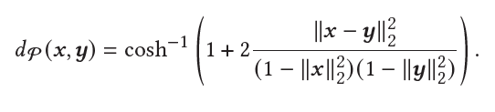
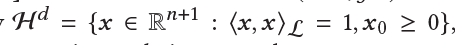
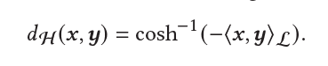
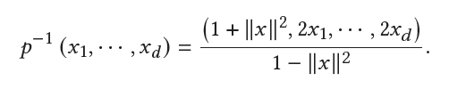

# 双曲空间模型计算与优化

最近在进行将过去的度量学习方法应用到双曲空间上的尝试。之前的工作中也曾经有过将embedding映射到球面空间上的尝试。相较之下双曲空间比较方便对一些额外的附带信息进行聚类、聚合操作，此外也已有学者对于双曲空间的度量学习做过一些成果。

## 双曲空间的两种表示

与球空间类似，双曲空间也是一种特殊的黎曼流形空间。相较于欧式空间，双曲空间满足一些特殊的模长、距离、内积公式。对于每个双曲空间都有一个额外的参数表示曲率。

双曲空间最常见的坐标体系是PoincareBall模型。对于空间中的点，限制其L2模长小于半径，也就是小于曲率的负倒数。

在Poincare空间中距离度量表示为：



另一种表示方式为Lorentz模型。其中将点定义为：



同时距离度量定义为：



实际上这两种模型的点是可以进行相互转化的，也就是说这两种模型对于双曲空间的表示实际上是等价的。转化公式如下所示：



实现上述这些模型的距离计算和点的限制条件并不难。仍然可以使用https://github.com/geoopt提供的python库，调用其中的类构建流形对象进行相关计算。

但关于这两种流形表示的选择还是需要谨慎行事的。一般认为PoincareBall更适用于进行聚类，而Lorentz模型则适合于在深度学习中进行训练优化并具有更好的数值稳定性。

## 基于双曲空间的VAE算法

该算法被称为PVAE，是在欧式VAE基础上的扩充。主要是将VAE中的正态分布转化为黎曼正态分布，再次基础之上利用双曲空间的度量进行重采样等操作。

最终可以通过这种方法得到一些在poincareBall上的降维结果。


## 基于双曲空间的推荐

在初始化时通过以下代码创建Lorentz空间上的embedding:

```python
embedding = nn.Embedding(num_embeddings=self.num_users + self.num_items,
                        embedding_dim=args.embedding_dim).to(default_device())

embedding.state_dict()['weight'].uniform_(-1., 1.)
embedding.weight = nn.Parameter(self.manifold.expmap0(self.embedding.state_dict()['weight']))

embedding.weight = ManifoldParameter(embedding.weight, self.manifold, requires_grad=True)
```

首先创建欧式上的embedding,然后通过expmap函数将embedding限制在设定好的流形上。

然后将embedding的参数转化成ManifoldParameter，以便放在rsgd优化器中训练。
