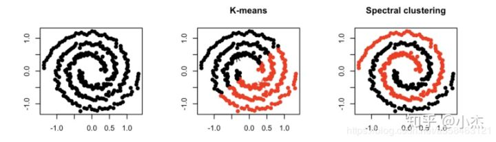

# 图嵌入

图神经网络(Graph Neural Networks)是近年深度学习领域的研究热点。而图神经网络是建立在图嵌入(Graph Embedding)的研究基础上的。本文结合最近学习到的一些知识，对图嵌入的基本思想和方法模型做一个简单的总结。

## 图嵌入基本思想

图嵌入的基本思想就是将图(Graph)转化到较低维的空间上。图是计算机科学中常见的一种数据结构。早期研究者已经针对图这一数据结构进行了大量算法研究，例如深度优先搜索和最短路径算法等。

随着机器学习技术的发展，图这一模型逐渐发挥了更大的作用。很常见的一个应用就是无监督学习中的谱聚类算法。该算法相对于Kmeans等算法，不仅考虑空间中的绝对距离，也会考虑节点之间的边连接关系，从而达到更好的非线性聚类效果。如下所示：

而在深度学习领域，也开始涉及很多图相关的问题，例如社交网络、通信网络等。包括图分类、节点聚类、链路预测等应用。而要应用到深度学习中最大的挑战就是如何用有限的嵌入来表达复杂的图信息，这包括节点的相对位置关系、边的连接关系等传统算法中很难处理的部分。

图嵌入的主要挑战和试图解决的问题有以下三个：

- 属性选择：节点的“良好”向量表示应保留图的结构和单个节点之间的连接。第一个挑战是选择嵌入应该保留的图形属性。考虑到图中所定义的距离度量和属性过多，这种选择可能很困难，性能可能取决于实际的应用场景。

- 可扩展性：大多数真实网络都很大，包含大量节点和边。嵌入方法应具有可扩展性，能够处理大型图。定义一个可扩展的模型具有挑战性，尤其是当该模型旨在保持网络的全局属性时。

- 嵌入的维数：实际嵌入时很难找到表示的最佳维数。例如，较高的维数可能会提高重建精度，但具有较高的时间和空间复杂性。较低的维度虽然时间、空间复杂度低，但无疑会损失很多图中原有的信息。

早期的常见算法是建立一个固定维数的空间嵌入，然后将图里的节点逐个填入空间中，然后根据需要拉近相邻节点的距离，拉远不相邻节点的距离等。

受篇幅所限，本文主要介绍的是深度学习中常用的图嵌入方法。

## 基于DeepWalk的算法

基于DeepWalk的算法其实是对节点建立嵌入。只是在每个节点的嵌入中都包含了相邻节点的信息。这其实是基于Word2Vec的设计理念，保证在空间中相似的单词距离更近。

为了构建类似于Word2Vec的句子，DeepWalk采用随机游走的方式寻找相似节点。

首先选择某一特定点为起始点，做随机游走得到点的序列，然后将这个得到的序列视为句子，用word2vec来学习，得到该点的表示向量。

DeepWalk通过随机游走获得图中节点的局部上下文信息，由此学习到的表示向量反映的是该点在图中的局部结构，两个点在图中共有的邻近点（或者高阶邻近点）越多，则对应的两个向量之间的距离就越短。

与DeepWalk相似，node2vec通过最大化随机游走得到的序列中的节点出现的概率来保持节点之间的高阶邻近性。与DeepWalk的最大区别在于，node2vec采用有偏随机游走，在广度优先（bfs）和深度优先（dfs）图搜索之间进行权衡，从而产生比DeepWalk更高质量和更多信息量的嵌入。

## 结构深度网络嵌入

结构深度网络嵌入(SDNE)不执行随机游走。而是保证两个阶层的节点相似性：

1. 有边相连的节点之间的相似性

2. 节点邻近结构的相似性，保证有类似邻居的节点之间的相似性。

对于相似性2，常用的方法是将邻接向量输入到autoencoder中进行重建，得到邻接向量的嵌入向量后，再计算成对的有边相连节点的嵌入之间的损失。

## 完整图嵌入

完整图嵌入主要是被称为Graph2Vec的算法

Graph2vec方法包括三个步骤:
1. 从图中采样并重新标记所有子图。子图是在所选节点周围出现的一组节点。子图中的节点距离不超过所选边数。
2. 训练跳跃图模型。图类似于文档。由于文档是词的集合，所以图就是子图的集合。在此阶段，对跳跃图模型进行训练。它被训练来最大限度地预测存在于输入图中的子图的概率。输入图是作为一个热向量提供的。
3. 通过在输入处提供一个图ID作为一个独热向量来计算嵌入。嵌入是隐藏层的结果。 由于任务是预测子图，所以具有相似子图和相似结构的图具有相似的嵌入。

