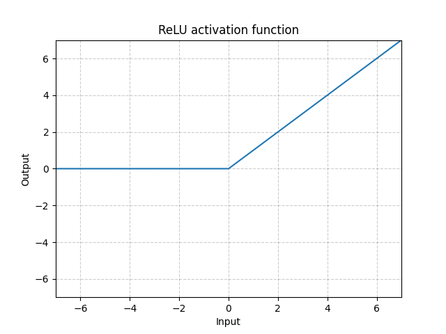
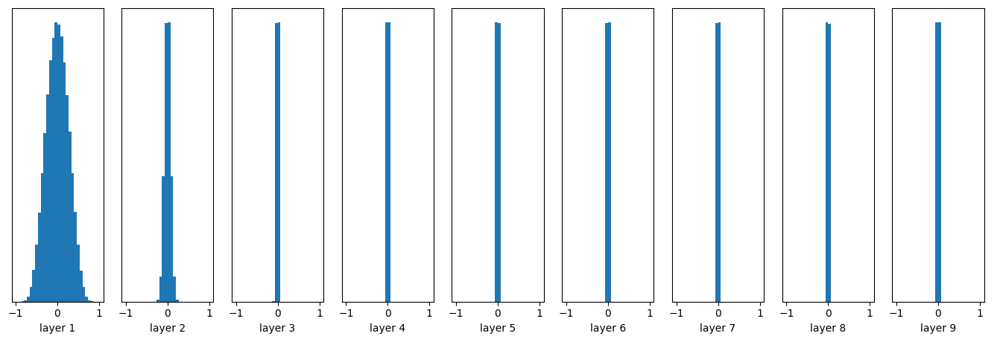
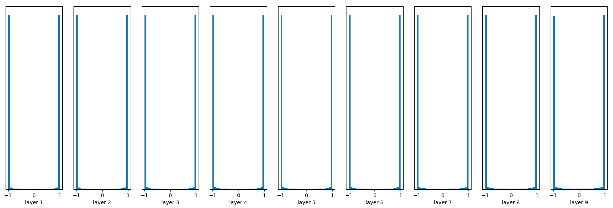
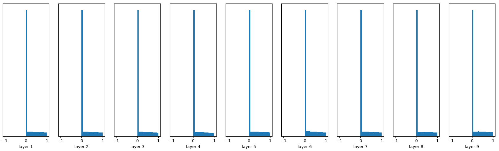

# 深度学习初始化方法

深度学习中的一大挑战就是训练过程中梯度的异常变化，如梯度消失和梯度爆炸等等。激活函数往往被认为是一种应对梯度消失问题的好办法，这是因为它能为深度学习网络模型赋予更多的非线性成分，防止纯线性模型在反向传播过程中减小梯度。

然而不少激活函数本身仍然具有梯度消失风险。例如tanh、sigmoid等函数，这些函数通常都会产生小于1的梯度值，当深度较大的网络逐层累乘这些梯度时，就会出现梯度消失现象。

例如目前最常用的ReLU激活函数，在训练过程中也会出现部分神经元输出小于0，导致这些神经元的输出始终被激活函数置0，这被称为dead neuron.当大部分神经元都出现这种情况时，模型的训练本身就已经陷入停滞。

除了进一步通过网络结构的设计和正则化参数外，参数的合适的初始化，往往能起到很大的作用。

## 基本初始化方法

神经网络参数的基本初始化方法分为无pretrain和pretrain两种。

- 常数初始化和随机初始化
    
    常数初始化即用0或者其他的某个常数作为参数的初始值。由于参数的更新是基于损失函数的反向传播，因此无需担心相同的参数初始值会影响参数的训练。常见的就是将网络中的所有参数初始化为0。
    
    在使用激活函数时，这种初始化方法会存在一些问题，例如relu家族的函数大部分在x=0的位置不可导，因此使用relu的网络如果初始化为0会导致大面积的死区或者其他问题。
    
    
    
    随机初始化则是在某个分布上采样出参数的值，常见的就是设置一定均值和方差的高斯分布，再从中采样。这样可以保证参数限制在一定范围内。在这种方法下梯度消失的问题是存在的。例如一个以tanh激活函数的10层神经网络，当以N(0, 0.01)分布初始化参数时，各层的输出值表现为接近于0：
    
    
    
    这种情况下在反向传播公式中在最前面几层的梯度值很快就被累乘为接近0的数，容易造成梯度消失。
    
    而如果选取较大的方差，又会造成每一层的输出值都向两端趋近，对于tanh、sigmoid等激活函数来说都会造成梯度值本身接近0:
    
    

- pretrain 初始化
    使用autoencoder等方法，对每一层的参数都进行适当的训练。然后再将这些经过预训练的参数组装起来，开始真正的训练。
    
    但随着数据量的增大，和激活函数的发展，这种方法的必要性和代价都不可靠，因此已经很少使用。

## xavier初始化

基于上述可视化结果，直观的解决方法就是尽量保证网络在正向传播过程中，输出值的方差不变（而不是像之前的图中所示一样，方差越来越小），在反向传播的过程中保证梯度的方差不变（而不是在tanh求导之后越来越小）

xavier初始化就是基于这样的目的推导出来的，本身xavier初始化是基于线性网络的，但它也支持任何激活函数关于原点中心对称的非线性网络。

假设当前线性层的节点数量为n_i,下一层节点数量为n_i+1。通过简单推导可以得出，如果要满足正向传播输出值方差不变，则初始化值为1/（n_i)；要满足反向传播输出值方差不变，则初始化值为1/（n_i+1)

两者平均一下，则得到：

- σi = 2 / (n_i + n_i+1)

原论文中是假定为均匀分布。因此表示为：

- U(-(6/(n_i+n_i+1))^0.5, (6/(n_i+n_i+1))^0.5)

由于ReLU函数在整个定义域并非是始终可导的，因此反向传播中的xavier推导对于ReLU来说并不成立，我们必须采用下面的He 初始化方法。

## He初始化

He初始化又称为Kaiming初始化，由何凯明提出。基本方法就是假定ReLU激活函数下有一半神经元被关闭。并且是采用高斯分布进行初始化。设定的高斯分布为：

- N（0， （2/ni)^0.5)

图为使用He初始化得到的各层输出值变化。可见方差基本保持一致。

