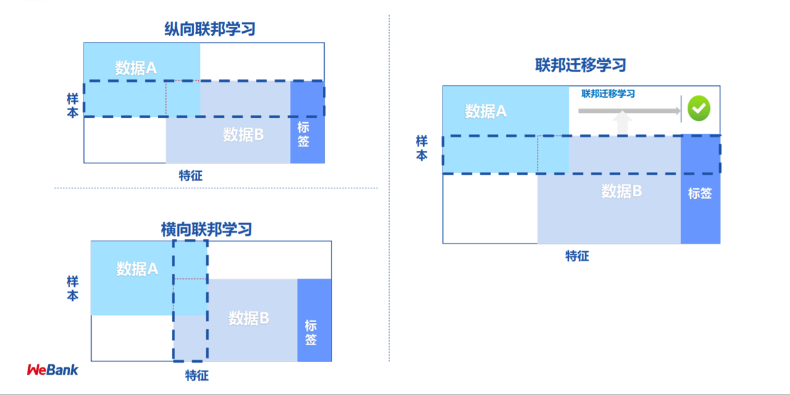

# 联邦学习

最近实验室在进行一个有关联邦学习的项目开发，涉及到一些预备知识的学习储备。在笔者平时上课的过程中也确实听到许多老师都对这一概念有相当的兴趣。因此将部分知识做一个分享。

事实上联邦学习并不只是一个有关机器学习算法的问题，它还涉及到大量有关密码学、计算机安全领域的知识。

## 联邦学习简介

联邦学习最早于2016年由谷歌公司提出，最初是为了解决在多个安卓设备上收集数据训练一个模型（这个模型在谷歌的后续论文中证实是键盘输入词预测问题）同时避免侵犯用户隐私的问题，据此还发表了论文《Federated Learning of Deep Networks using Model Averaging》。

联邦学习的动机理解起来其实非常简单。举个例子来说，A公司和B公司都各自拥有不重合的1000条用户数据，现在他们希望训练一个模型来预测用户违约的可能性，出于对用户负责的考虑，它们都不能向对方泄露自己的数据，但又想要将各自数据合成一个大的数据集达到更好的训练效果，他们应该怎么做？

一种想当然的方法是找到一个两家公司共同信任的第三方对A、B数据集进行管理和训练，但这样的第三方往往是不存在的。

联邦学习的关键就在于保证原始数据不被任何外人所见，传输的数据只有模型训练的梯度。谷歌提出的解决办法是，以每台设备上的数据作为子数据集本地地计算梯度优化参数，然后对所有设备上的参数值进行平均回传给每台设备作为训练结果。这就是被称作FederatedAverage的算法。

上述算法其实只是联邦学习较为简单的一种类型，根据数据分布的不同联邦学习可分为以下三种：

1. 横向联邦学习（水平联邦学习）：每个参与方都拥有id不同的数据集，并且都同时拥有标签和特征。相当于每一方都有一个小数据集。

2. 纵向联邦学习（垂直联邦学习）：每个参与方拥有id相同的数据，但掌握的特征不同，且只有一方拥有标签（或者只以一方的标签为准）。

3. 迁移联邦学习：前两种类型的综合， 在前两者的基础上，还需要利用好那些缺少部分特征的数据。

以更形象的例子来解释就是：

- 横向联邦学习：抖音和快手拥有不同的用户群，两者合作进行一个模型的训练预测用户点击行为。

- 纵向联邦学习：保险公司、银行、电商企业合作设计模型根据某个用户的保险、借贷、存款、购物情况评价其信用

很明显看出本节一开始提到的例子适用于横向联邦学习。这类之所以简单就在于它在不进行联邦的情况下也可以训练，因为标签一直都是存在的，各方之间的交互比较有限。而纵向联邦学习中，A公司并没有标签，必须和B公司发生一定的数据交互。

## 秘密分享

秘密分享是一种在多方数据间进行安全计算的方法，在蚂蚁金服的《Industrial Scale Privacy Preserving Deep Neural Network》论文中它被用于解决神经网络参数和输入的联邦学习问题。具体算法如下：

在神经网络的纵向联邦学习中实际上是要解决特征和参数之间的矩阵乘法问题，即（XA + XB) x (ΘA + ΘB)。（注意这里的加号指的不是加法而是矩阵的连接concatenate）。

将该式做了分解之后我们可以发现实际上需要进行数据传输计算的就只有XA x ΘB 和XB x ΘA。

因此A、B先将各自拥有的特征和参数做一个加法的分解，将X分解为X1+X2（此处的加法表示算术意义上的加法）。这时在传输X1或者X2时就不会泄露原始数据的任何信息。

之后通过双方各自持有的一对三元组，进行秘密分享的矩阵乘法。具体方法见于另一篇论文《ABY – A Framework for Efficient Mixed-Protocol Secure Two-Party Computation》

