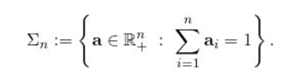
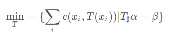
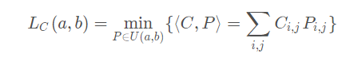
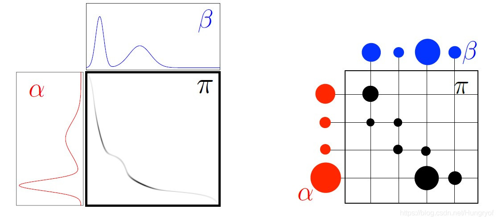
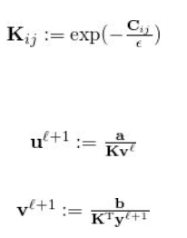

# 计算最佳传输

最佳传输（Optimal Transport—）是一种广泛应用在多个交叉领域的问题。尤其是在计算机图形学、计算机视觉、医学图像处理以及深度学习等方面取得了显著效果。以法国数学家蒙日（Monge）在二百多年前给出的问题为例：当给定两个沙盘时（每盘沙子可以代表一个概率分布），可以通过很多方式将一个沙盘传输（Transport or Reshape）到另一个沙盘。基于传输单个沙粒的局部花费，每一种传输方法均对应一个全局花费。

在实际应用中，最佳传输最常见的应用是计算机视觉领域的图形匹配、图形检索、图形分类等算法研究中。

## 基本概念

以蒙日提出的问题，可以得到最佳传输问题的基本表示。假设a和b分别表示两个不同的离散分布。可以用概率值或者直方图的形式将这两个分布表示为数值向量，即：

传输就是从一个直方图a转移到另一个直方图b的方法。显然在这种情况下，无法定义何种方法最佳，因此引入一个形状为X*Y的矩阵c来表示每个位置x到位置y的运输代价。

而将ai传输给bj的代价是不同的。因此最佳传输问题就是要计算代价最小的转移映射。

可以将问题表示为如下公式：

其中x表示初始分布的位置，T是一个映射，将源位置映射到目标位置。alpha和beta表示源分布和目标分布的直方图。

蒙日问题的主要缺点是要找到这样的解，必须保证源分布和目标分布能够找到合适的分割方式。因为在这种设定下无法对初始的直方图中每个位置的权重进行分割。

用通俗的方法解释就是，只能将城市A的煤炭整个运到城市B，而不能一半分到城市B、一半分到城市C。

此外蒙日问题还被证明是非凸的，解决起来具有很大困难。

## 康托洛维奇松弛

康托洛维奇（Kantorovich）在上世纪40年代提出的一种松弛形式的最佳传输问题形式，在之后得到了很大发展。它将T映射转化成一个传输矩阵P。

传输矩阵P的每一个点Pij表示从位置i向位置j传输的份额。

同时P矩阵还必须满足，行求和等于alpha分布，列求和等于beta分布。用图的形式表示则是：

解决上述问题已经提出了不少算法。其中主要的一种是sinkhorn算法，表示为：

其中，先通过Cij的变幻计算K，然后再通过两个迭代公式，不断迭代u和v向量，直到收敛。最后通过

- diag(u*)K diag(v*) 

计算出最佳传输矩阵P。

## 应用

最佳传输问题的应用非常广泛。主要是因为其中的两个矩阵C和P可以根据需要赋予不同的意义。例如相似度、差异程度、距离矩阵等等。笔者目前有所涉及的是在图像和推荐中的应用。

### 图形处理中的应用

图形处理中主要用最佳传输来学习两张图像之间的匹配或者迁移关系。

CV中可以很轻易的通过常见的卷积神经网络将二维的像素点数据转化成一维的特征向量。然后很自然地就会使用两个图片的特征向量之间的相似程度构造出cost矩阵，从而得到一个最佳传输问题。

然后可以通过计算出的P进行一些分析。例如寻找一张图片中和另一张图片最为相关的部分，这可以用在人脸试别，OCR技术等。

### 推荐系统中的应用

推荐系统中的应用尚在探索中。但很容易就可以将cost矩阵和推荐领域常见的相似度矩阵、评分矩阵等结合起来。同时也可以利用物品的流行度等信息构造直方图。

最佳传输P矩阵则可以解释为用户对各个物品的喜好程度，从而作为推荐排序的依据。不过此方面的算法目前尚没有较好的成果出现，还需要研究人员的进一步优化和探索。

## 代码实现

代码实现方面主要谈些笔者在实验中遇到的问题。Python中目前已有最佳传输算法库POT存在。然而该库的代码水平只能作为参考，还不能成为scipy、sklearn那样具有较高权威性的算法实现。主要问题有：

1. 虽然这个库可以让使用者通过ot.sinkhorn()这样简单的语句计算最佳传输，但是算法的效率较低，尤其是在矩阵尺寸较大情况下，时间消耗大，内存负载也很大。

2. 与深度学习耦合度低。库中只有很少一些接口借助cupy实现了gpu运算，主要算法只能在cpu上计算，更不用说和传统深度学习框架结合进行反向传播等操作。

3. 框架的整体鲁棒性较低。笔者在使用时常常出现由于输入的矩阵存在问题，或者正则化系数过小过大造成代码报错。但是POT库只会像报告warning那样报告一个“除以0错误”却不会详细给出解决方法。同时在github社区中也几乎搜索不到该框架的报错和解决方案。

综上还是建议参考该库自己实现OT算法，这样也方便对算法细节进行修改，或者将其并入已有模型中整体求导优化。
