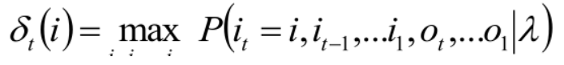
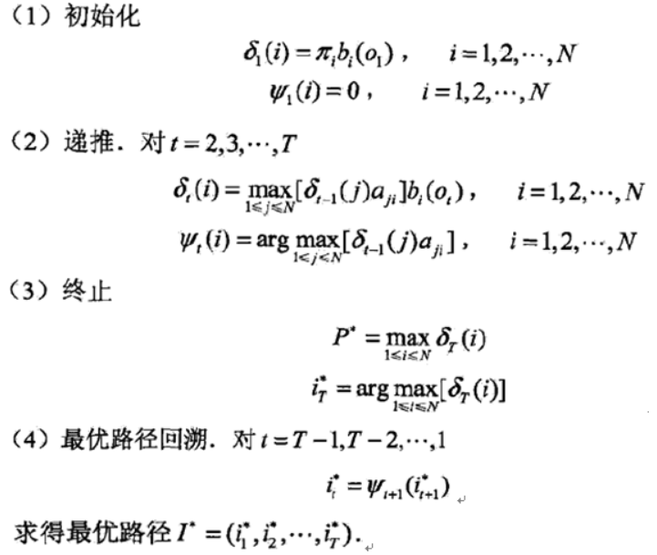
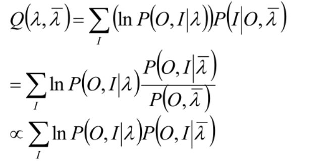
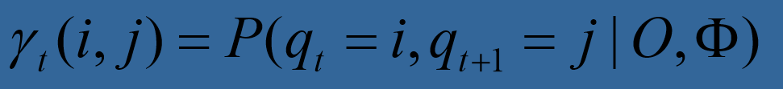
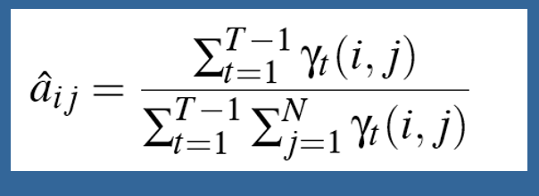

# 隐马尔可夫模型2

本篇，我们将介绍隐马尔可夫模型其余两种基本问题和算法，并介绍HMM在实际中的应用方法。

## 三个基本问题

### Decoding问题

问题2：给定一个观测值序列O，一个模型λ=(π, A, B)，如何选择一个最符合观测序列的状态序列？

解决这个问题的算法被称为Viterbi算法。和前向后向算法类似，该算法也使用到了动态规划的思想。

首先定义一个变量δ

这个变量的含义是，到时间t为止，沿着状态序列i产生出观测序列O的最大概率。

遵循这个变量，我们可以从t=0开始逐步迭代，直到得到产生完整观测序列的最优状态序列。如下图所示。

其中初始化阶段就是各个状态的初始概率乘上bi(o1)，然后在递归过程中，计算从t-1的各种概率转移到当前N种状态时生成i状态的各种可能性的最大值。

另外一个变量则是用于记录在这个过程中得到最大值的那个j值，便于最后路径回溯时进行遍历。

最后当t=T时，逐个检查路径种最大可能性的状态，即可得到一条完整的状态序列。

事实上Viterbi算法在各种最短路径问题中也有一定应用。

### learning

问题3：给定一个观测序列O，如何调整模型的参数(π, A, B)，使得P(O|λ)最大？

解决这个问题用到的算法是Baum-Welch算法，其实就是经典的EM算法（Expectation-Maximization algorithm）的一种变体。

EM算法适用于模型存在隐变量的场景。例如现有200个人的身高样本，需要我们估计一个模型p(z)的参数z，身高和人的性别之间的关系。如果我们知道200个人各自的性别，那么可以用最大似然估计的方法来进行参数估计。但如果性别是一个隐藏变量，我们就无法进行估计。

隐马尔可夫链的问题3也是一样。如果我们清楚的知道隐状态序列，那么我们可以很自然地使用参数估计来估算这里的参数π, A, B。

于是我们使用EM算法，先对模型的隐变量的期望做一个估计，再将这个估计当作隐变量的实际值进行最大似然估计。这两个步骤交替进行，最后得到比较符合需要的结果。其步骤如下：

1. 选择参数初值θ
2. E步：确定Q函数。Q=ΣlogP(Y,Z|θ)log(Z|Y,θi)，其中Y是观测值，Z是隐变量
3. M步：估计使得Q函数最大的θ值，作为θ(i+1)
4. 重复迭代直到参数θ收敛

将hmm场景中的参数代入Q函数式子，如下所示：

然后遵循步骤，在M步骤中对π, A, B分别进行拉格朗日乘子法估计即可。我们定义gamma为：

可解出A矩阵为：

此处的数学推导需要一定功底。我们在下次专门介绍EM等算法时做详细介绍。

## HMM的应用

HMM理论上可以用于一切有关时序的机器学习问题中，例如语音识别、NLP、推荐系统中。在这些问题中只需要找好对应的观测序列，隐藏状态即可。

例如推荐系统中，观测序列为用户对物品点击，隐藏状态为用户对物品的实际喜好。

