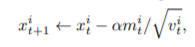
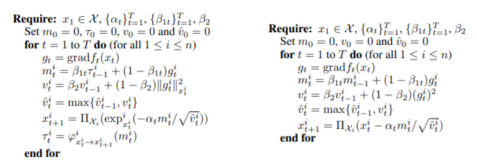

# 黎曼优化方法

在之前章节中，借助对pytorch中optim包的介绍，总结了很多种优化方法。例如最基本的SGD随机梯度下降以及带动量和适应机制的RMSPROP、Adam、AdaGrad等方法。

事实上这些优化方法在优化时都是默认将参数视作欧式空间中的点，这保证了参数具有欧式空间中的连续性，同时也满足欧式空间中距离、角度的性质。然而在数学领域，欧式空间是另一种更加一般性的空间，黎曼空间的特殊情况。因此不少研究开始尝试将欧式空间中的优化方法扩展到黎曼流形中，并由此产生了RSGD、RAdam等新的优化器。

Bonnabel在2013年提出RSGD，而ICLR2019论文Riemannian Adaptive Optimization Methods中将Riemannian manifold的设定扩展到了已有的其他适应性优化器中。

## 黎曼流形的简单介绍

由于非数学专业出身，笔者摘录ICLR2019论文中对相关知识的介绍。

黎曼流形（Riemmannian manifold）是一个（M, ρ）对。其中M表示一个流形，对于流形中的每一个点，都对应一个上切空间TxM, ρ表示一种黎曼度量(Riemannian metric)，这个度量被定义为流形上切空间的点积。

黎曼度量决定了流形M上会有特定的距离函数。对于x，y∈M，我们可以将d(x, y)设置为等同于M中x和y之间的平滑路径长度的最小值，其中路径c的长度可以通过在对应的切线空间中积分其速度向量得到。

指数映射和对数映射指的是在M上的点x从切线空间到流形的映射函数。直觉上讲，这个指数映射将切线空间折叠到了流形上。指数映射的一大作用是，对于切线空间上的点v,expx(vt)可以表示从M上的点x出发按照方向v采取的最短路径。在欧式空间中，expx(v) = x + v

在欧式空间中，从点x前往y的转移向量就是直线距离。而在黎曼流形中，转移向量取决于从x点采取哪一条路径进行转移。


## 基于黎曼流形的优化器

简单来说就是用黎曼流形上的指数映射函数替换欧式空间中的加法函数。例如用RSGD替换SGD只需要将 x - α*g 替换为expx(-α*g)即可。其中exp映射可能有闭式解，如果没有则要用近似函数替代。

而对于适应性的优化器，往往会引入一些随时间变化的额外参数。例如Adam的参数更新公式中：



其中x表示参数，α是学习率，m和v分别是两个随着更新变化的额外参数。

在黎曼流形优化器中我们不能简单地直接用欧式空间的更新方法更新那些额外参数，这是因为这些额外参数



右侧表示的是Adam的优化方法，左侧则是RAdam的优化方法。可以看出在计算m时，没有直接用m_{t-1}计算m_t而是引入了一个额外的变量表示对于m_t-1从TxM到TyM的任意一条等轴侧线。

再如对于参数v，在计算g^2时，不能直接用欧式空间的点乘，而是应该调用黎曼流形的距离函数d,此处简写为||g_t^i||^2

文章中还对这些算法的收敛性进行了证明和研究，有兴趣可以参考原文。


## 代码实现

比较幸运的是在开发过程中，有大佬实现了manifold相关优化器的pytorch实现，得以将数学比较差的程序员解放出来。链接为https://github.com/geoopt/geoopt，可以通过pip install geoopt直接安装。

其中的优化器类已经被封装为torch.optim.sgd和torch.optim.Adam的子类，可以直接使用。

例如：

```python
import geoopt.optim.RiemannianSGD
import geoopt.optim.RiemannianAdam

optimizer = RiemannianAdam(lr=0.01)
 
```

git中更加重要的是很多对于黎曼流形中映射、转移、点积等函数的实现，以及一些特殊的黎曼流形的实现，值得学习。笔者也是在学习过这些论文和代码后才意识到自己在数学领域的浅薄和不足。

