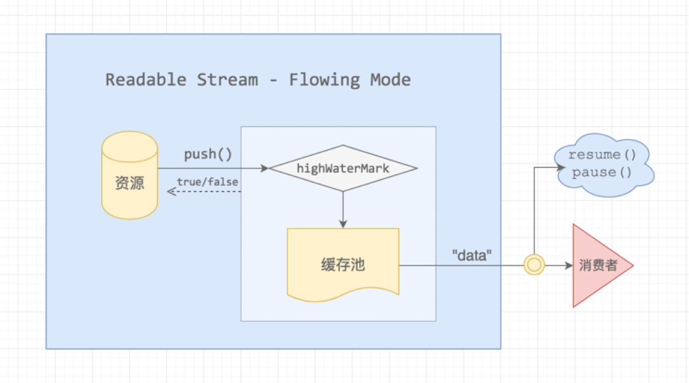
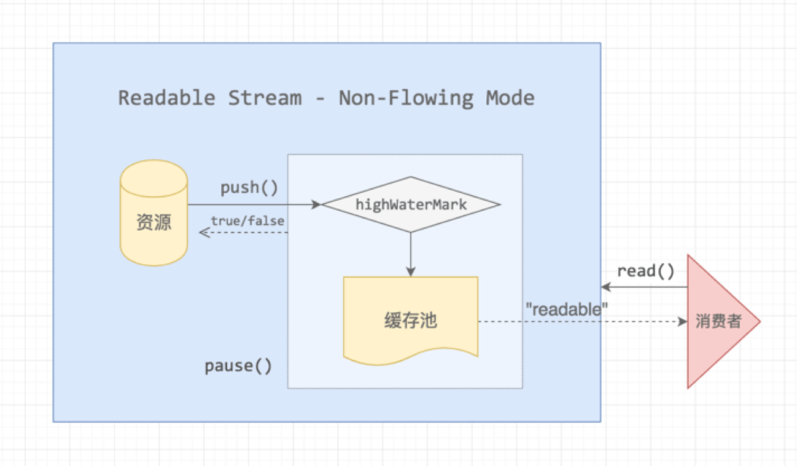
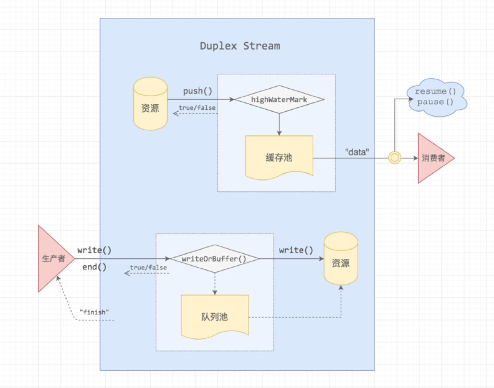

# Node Stream

## 概念

Stream 是 Node.js 中最重要的组件和模式之一，流是一组有序的，有起点和终点的字节数据传输手段，它是一个抽象的接口。 流是数据的集合，区别在于流中的数据可能不会立刻就全部可用，并且你无需一次性地把这些数据全部放入内存。这使得流在操作大量数据或是数据从外部来源逐段发送过来的时候变得非常有用。 每一个流对象都是 EventEmitter 类的一个实例，都有相应的 on 和 emit 方法

stream 是 node 的核心模块，引入方式如下：

```javascript
let Stream = require("stream");
```

## Stream 在 Node 中的具体应用

1. http 协议中的 请求 req 和响应 res
2. tcp 协议中的套接字对象 sockets
3. fs 文件模块中的可读流和可写流
4. process 进程模块中的 stdout stderr
5. zlib 中的 streams

## 类型

1. Readable
2. Writeable
3. Duplex
4. Transform

## Readable

Readable Stream 存在两种模式，一种是叫做 Flowing Mode，流动模式，在 Stream 上绑定 ondata 方法就会自动触发这个模式

### Flowing Mode

```javascript
const readable = getReadableStreamSomehow();
readable.on("data", chunk => {
  console.log(`Received ${chunk.length} bytes of data.`);
});
```



资源的数据流并不是直接流向消费者，而是先 push 到缓存池，缓存池有一个水位标记 highWatermark，超过这个标记阈值，push 的时候会返回 false，什么场景下会出现这种情况呢？

1. 消费者主动执行了 .pause\(\)
2. 消费速度比数据 push 到缓存池的生产速度慢

有个专有名词来形成这种情况，叫做「背压」，Writable Stream 也存在类似的情况。

流动模式，这个名词还是很形象的，缓存池就像一个水桶，消费者通过管口接水，同时，资源池就像一个水泵，不断地往水桶中泵水，而 highWaterMark 是水桶的浮标，达到阈值就停止蓄水。

### Non-Flowing Mode

暂停模式，这是 Stream 的预设模式，Stream 实例的 \_readableState.flow 有三个状态，分别是：

* \_readableState.flow = null，暂时没有消费者过来
* \_readableState.flow = false，主动触发了 .pause\(\)
* \_readableState.flow = true，流动模式

当我们监听了 onreadable 事件后，会进入这种模式，比如：

```javascript
const myReadable = new MyReadable(dataSource);
myReadable.setEncoding("utf8");
myReadable.on("readable", () => {});
```

监听 readable 的回调函数第一个参数不会传递内容，需要我们通过 myReadable.read\(\) 主动读取



资源池会不断地往缓存池输送数据，直到 highWaterMark 阈值，消费者监听了 readable 事件并不会消费数据，需要主动调用 .read\(\[size\]\) 函数才会从缓存池取出，并且可以带上 size 参数，用多少就取多少

只要数据达到缓存池都会触发一次 readable 事件，有可能出现「消费者正在消费数据的时候，又触发了一次 readable 事件，那么下次回调中 read 到的数据可能为空」的情况。我们可以通过 \_readableState.buffer 来查看缓存池到底缓存了多少资源

```javascript
let once = false;
myReadable.on("readable", chunk => {
  console.log(myReadable._readableState.buffer.length);
  if (once) return;
  once = true;
  console.log(myReadable.read());
});
```

上面的代码我们只消费一次缓存池的数据，那么在消费后，缓存池又收到了一次资源池的 push 操作，此时还会触发一次 readable 事件，我们可以看看这次存了多大的 buffer。

需要注意的是，buffer 大小也是有上限的，默认设置为 16kb，也就是 16384 个字节长度，它最大可设置为 8Mb，没记错的话，这个值好像是 Node 的 new space memory 的大小。

上面介绍了 Readable Stream 大概的机制，还有很多细节部分没有提到，比如 Flowing Mode 在不同 Node 版本中的 Stream 实现不太一样，实际上，它有三个版本，上面提到的是第 2 和 第 3 个版本的实现；再比如 Mixins Mode 模式，一般我们只推荐（允许）使用 ondata 和 onreadable 的一种来处理 Readable Stream，但是如果要求在 Non-Flowing Mode 的情况下使用 ondata 如何实现呢？那么就可以考虑 Mixins Mode 了。

## Writable

数据流过来的时候，会直接写入到资源池，当写入速度比较缓慢或者写入暂停时，数据流会进入队列池缓存起来


当生产者写入速度过快，把队列池装满了之后，就会出现「背压」，这个时候是需要告诉生产者暂停生产的，当队列释放之后，Writable Stream 会给生产者发送一个 drain 消息，让它恢复生产。

## pipe

用法

```javascript
readable.pipe(writable);
```

readable 通过 pipe（管道）传输给 writable

## Duplex

双工的意思，它的输入和输出可以没有任何关系



Duplex Stream 实现特别简单，它继承了 Readable Stream，并拥有 Writable Stream 的方法，它的 read 和 write 是两个管道，彼此互不干扰

## Transform

Transform Stream 集成了 Duplex Stream，它同样具备 Readable 和 Writable 的能力，只不过它的输入和输出是存在相互关联的，中间做了一次转换处理。常见的处理有 Gzip 压缩、解压等

Transform 的处理就是通过 \_transform 函数将 Duplex 的 Readable 连接到 Writable，由于 Readable 的生产效率与 Writable 的消费效率是一样的，所以这里 Transform 内部不存在「背压」问题，背压问题的源头是外部的生产者和消费者速度差造成的


