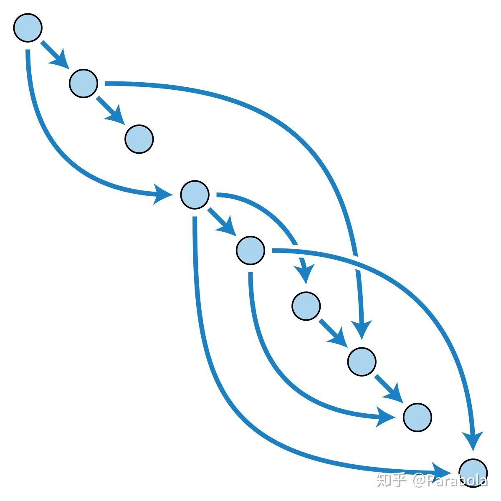

# SWR

[SWR](https://github.com/zeit/swr) 是一个取数的React Hooks包，它有着一些非常令人激动的功能，最主要的是实现了 RFC 5861 草案，即发起网络请求之前，利用本地缓存数据进行渲染，待请求的响应返回后再重新渲染并更新缓存，从而提高用户体验。

取数是前端业务的重要部分，也经历过几次演化：

1. fetch 的兼容性已经足够好，足以替换包括 get/post 在内的各种取数封装。
2. 原生用得久了，发现拓展性更好、支持 ssr 的同构取数方案也挺好，比如 axios。
3. 对于数据驱动场景还是不够，数据流逐渐将取数封装起来，同时针对数据驱动状态变化管理进行了 data/isLoading/error 封装。
4. Hooks 的出现让组件更 Reactive，我们发现取数还是优雅回到了组件里，封装 data/isLoading/error 也更加适合。

## Why Hooks

Hooks 可以触达 UI 生命周期，取数本质上是 UI 展示或交互的一个环节。 用 Hooks 取数的形式如下：

```jsx
import useSWR from "swr";

function Profile() {
  const { data, error } = useSWR("/api/user", fetcher);

  if (error) return <div>failed to load</div>;
  if (!data) return <div>loading...</div>;
  return <div>hello {data.name}!</div>;
}
```

使用这种方式有许多好处：
1. 可自动刷新。
2. 组件被销毁再渲染时优先启用本地缓存。
3. 在列表页中浏览器回退可以自动记忆滚动条位置。
4. tabs 切换时，被 focus 的 tab 会重新取数。

## useSWR 配置

可以配置的有：suspense 模式、focus 重新取数、重新取数间隔/是否开启、失败是否重新取数、timeout、取数成功/失败/重试时的回调函数等等。
第二个参数如果是 object 类型，则效果为配置项，第二个 fetcher 只是为了方便才提供的，在 object 配置项里也可以配置 fetcher。

[具体的配置](https://github.com/zeit/swr#options)

## 主要流程

参数处理阶段。useSWR 有多种 function overload，但无论如何都需要传入一个符合 keyInterface 的 key 才行。swr 会对开发者传入的参数进行处理，最终得到以下四个重要变量：

- key，这是请求的唯一标识符
- 有时候也包括请求函数的参数 fnArgs
- keyErr，对应请求标识符的错误标识符
- config，由默认配置，上下文配置和函数参数合并而成的配置对象
- fn，请求函数

然后，swr 会准备一些变量：

initialData 和 initialError，swr 会通过 cacheGet 方法从一个全局的 __cache map 中按照 key 存取缓存值，这其实就是 swr 请求缓存的实现原理。
data 和 dispatch，swr 是通过调用 useReducer 来生成的，它们记录了 key 所对应的请求的状态：请求的数据，请求的错误信息以及请求是否正在发送。
unmountedRefkeyRefdataReferrorRef等工具变量。
然后 swr 定义了一个非常重要的函数 revalidate ，这个函数内部定义了发起请求、处理响应和错误的主要过程。

注意生成这个函数的时候调用了 useCallback，依赖项为 key，即只有在 key 发生变化的时候才会重新生成 revalidate 函数。
我们先聚焦于主要流程，此时 shouldDeduping === false。

首先会在 CONCURRENT_PROMISES 这个全局变量上缓存 fn 调用后的返回值（一个 Promise），其实这里调用 fn 就已经发起了网络请求。CONCURRENT_PROMISES 这个变量是一个 Map，实际上建立了 key 和网络请求之间的映射，swr 利用这个 Map 来实现去重和超时报错等功能。

很明显能够看出 fn 必须返回一个 Promise，这个简单的约定也使得 swr 能够支持任意的网络请求库，不管是 REST 还是 GraphQL，只要返回 Promise 就行！
然后 revalidate 会等待网络请求完毕，获取到请求数据：

```jsx
newData = await CONCURRENT_PROMISES[key]
```

并触发 onSuccess 事件。

接着，更新缓存，并通过 dispatch 方法更新 state ，此时就会触发 React 的重新渲染，重新渲染时就能从 state 里拿到请求数据了。

以上就是 revalidate 函数的主要过程，那么这个函数是在什么时候被调用的呢？我们接着看 useIsomorphicLayoutEffect 的回调函数。

useIsomorphicLayoutEffect 函数在服务端就是 useEffect ，在浏览器端就是 useLayoutEffect 。
首先要判断本次调用时的 key 和上次调用的 key 是否相等。考虑下面这个组件：

```jsx
const Profile = (props) => {
  const { userData, userErr } = useSWR(() => `/${props.userId}`)
}
```

可以看到即使函数调用的位置相同（Hooks 的正确工作依赖各个 hook 的调用顺序），key 的值也可能不同，所以 swr 必须做这个检验。另外也要判断 data 是否相同，有可能别处更新了 key 所对应的缓存值。总之，当 swr 检查到 key 或者 data 不同，就会执行更新当前的 key 和 data，并调用 dispatch 进行重绘等操作。

然后，在 revalidate 的基础上定义了 softRevalidate 函数，在 revalidate 执行时执行去重逻辑。

const softRevalidate = () => revalidate({ dedupe: true })
然后 swr 就会调用 softRevalidate，如果当前有缓存值且浏览器支持 requestIdleCallback 的话，就作为 requestIdleCallback 的回调执行，避免打断 React 的渲染过程，否则就立即执行。

## 错误处理

如果数据请求的过程中发生了错误该怎么办呢？

注意到 revalidate 的函数，有很大一部分都在一个 try catch 块中，如果请求出错就会进入 catch 块。

主要做如下几件事情：

- 删除请求缓存
- 更新 state，更新错误内容
- 派发 onError 事件
- 如果配置了重试的话，就执行重试

默认的重试方法会在当前文档 visible 时执行重试，使用了一个指数退避策略，在一定的时间后重新调用 revalidate 

## 请求去重 (dedupe)

swr 提供了请求去重的功能，避免某个时间段内重复发起的请求过多。

实现的原理也非常简单。每次 revalidate 函数执行的时候，都会判断是否需要去重：

```jsx
let shouldDeduping =
  typeof CONCURRENT_PROMISES[key] !== 'undefined' && revalidateOpts.dedupe
```

即检验 CONCURRENT_PROMISES 里有没有 key 所对应的进行中的请求。

如果 shouldDeduping 为 true，直接等待请求完成，如果为 false，就按照上文所述进行处理。

而 revalidateOpts 的 dedupe 属性何时为 true 呢？可以看到声明 softRevalidate 的时候传入了参数：

const softRevalidate = () => revalidate({ dedupe: true })
而调用 useSWR 时返回的 revalidate 就是原本的 revalidate ，不带 dedupe 属性。

## 请求依赖

请求之间的依赖可以用一个有向无环图来表示，如：



大部分时候（请求并不复杂时），我们都用 Promise.all 来描述DAG，即先等前面所有请求结束后再来请求。

但是假设现在有这样一种情况：A,B,C,D四个请求，C依赖A，D依赖B和C，那么如果先请求A，返回后再请求B/C，返回后再请求D，那么实际上是浪费了一定的时间，因为请求B是不依赖A的，它可以先进行请求，那么用Promise最并行的写法应该是定义C ready和B ready的flag，并在两个Promise中都写一遍D的处理逻辑：

```jsx
let cReady = false;
let bReady = false;

fetch('a').then(A => {
  fetch('c?' + A.id).then(C => {
    cReady = true;
    setState({ C });
    if(bReady) {
      fetch('D?' + C.id + B.id).then(() => {
        // handle result
      })
    }
  })
});

fetch('b').then(() => {
  bReady = true;
  setState({ B });
  if(cReady) {
    fetch('D' + C.id + B.id).then(() => {
      // handle result
    })
  }
})
```

而在swr中，可以直接这么写：

```jsx
const { data: A } = useSWR('a');
const { data: B } = useSWR('b');
const { data: C } = useSWR('c' + A.id);
const { data: D } = useSWR('d' + C.id + B.id);
```

每次渲染的时候，SWR 会试着执行 key 函数（例如 ()=> 'c' + A.id)，如果这个函数抛出异常，那么就意味着它的依赖还没有就绪（A === undefined），SWR 将暂停这个数据的请求。在任一数据完成加载时，由于 setState 触发重渲染，上述 Hooks 会被重选执行一遍（再次检查数据依赖是否就绪），然后对就绪的数据发起新的一轮请求，这样就满足了最大的并行性。

## Suspense

想要支持 Suspense 很容易，仅需要把数据请求的 Promise 抛出就可以了：

```jsx
throw CONCURRENT_PROMISES[key]
```

但是和通常情况下不同：当抛出的 Promise 未 resolve 时，React 并不会渲染这部分组件，因此返回值里也无需判断 keyRef.current 是否和 key 相同。