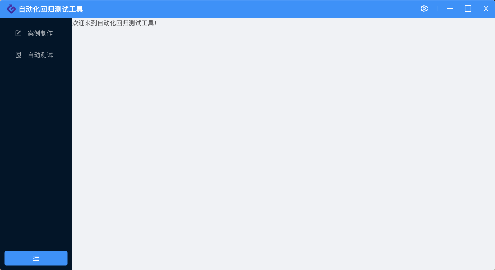
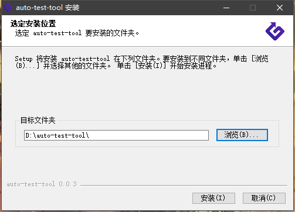
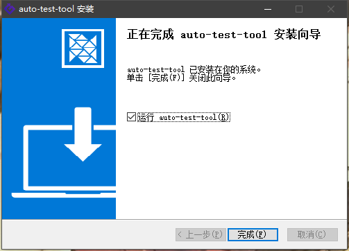
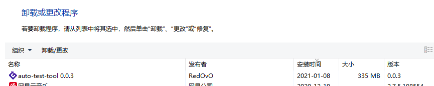

# Electron-Vue + Python 桌面应用实践

## 需求与设计背景

对接部门内的某个产品 A，为客户提供一个配套的桌面应用小工具 B。主要要求概括如下：

* 工具 B 主要用于作为测试工具，对产品内部的数据进行校验，减少因为版本迭代而产生的非易现 bug；

* 通过调用产品 A 提供的服务接口，获取工具 B 所需的数据；

* 工具 B 本身需要使用 python 的一些金融算法库，对通过产品 A 接口获取到的数据进行处理；

* 工具 B 需要提供一个可视化界面的版本与一个命令行执行版本；

* 客户本地无任何开发环境，也不可安装配置开发环境，如 python 开发环境；

* 最终输出为一个可安装的桌面可执行程序。

## 架构设想

对需求进行分析后，结合技术可行性与人员配置，时间安排等方面的问题，工具 B 整体架构设计如下。


* 工具 B 整体分为客户端与服务端两个部分，最终成型为一个可执行 exe 文件；

* 为了提高前端界面交互的美观度、自由度，同时也考虑到人员配置的可行性，客户端部分采用`electron`框架，前端通过`Vue`进行开发。并通过`Electron-builder`进行打包，输出可执行文件；

* 服务端部分通过`python`打包库`pyinstaller`打包形成可执行文件，服务端打包生成的 exe 文件本身可以单独运行，通过命令行进行交互。后端框架以及涉及到的其他 python 库需要后端开发进行后续敲定；

* 服务端可执行文件通过``Electron-builder``的``extraResources``配置成为一个静态文件打包入整个客户端可执行文件。所谓的静态文件，即在打包完成后，可以直接在工具B根目录下的``extraResources``中访问服务端可执行程序(可行性待验证)；

* 服务端与客户端整合生成的可执行文件运行后，``Electron``通过``nodejs``创建本地的``web server``，同时通过``nodejs``的``execFile()``启动打包至根目录下的服务端程序，与前端的本地server建立通信后，即可通过客户端界面进行交互。

## 工程实现

### 项目创建

* 首先通过 ``electron-vue`` 脚手架创建一个工程。注意创建工程的路径中不要带有中文。

  ```shell
  $ vue init simulatedgreg/electron-vue demo
  ```

* 根据需要选择配置，唯一需要注意的是打包所使用的依赖需要选择``electron-builder``，因为需要使用该依赖的``extraResources``来打包服务端的``pyinstaller``生成的静态exe文件。

* 创建完成后进入项目文件中，安装依赖。网络环境不稳定或存在问题时，安装依赖会碰到许多的坑与报错，建议替换使用淘宝源后再安装依赖。如果想要顺畅的完成安装还是建议科学上网。完成后运行项目即可。

  ```shell
  $ cd demo
  $ npm config set registry http://registry.npm.taobao.org/
  $ npm install
  $ npm run dev
  ```

* 运行完成后，如果本地node版本已经升至12那么会存在以下报错

  ```
  ReferenceError:process is not defined
  ```

* 可以将node版本回退至11，也可以直接在``webpack.web.config.js``和``webpack.renderer.config.js``两个文件中扩写``HtmlWebpackPlugin``，[参考资料](https://github.com/SimulatedGREG/electron-vue/issues/871)

  ```js
  new HtmlWebpackPlugin({
    filename: 'index.html',
    template: path.resolve(__dirname, '../src/index.ejs'),
    templateParameters(compilation, assets, options) {
      return {
        compilation: compilation,
        webpack: compilation.getStats().toJson(),
        webpackConfig: compilation.options,
        htmlWebpackPlugin: {
          files: assets,
          options: options
        },
        process,
      };
    },
    minify: {
      collapseWhitespace: true,
      removeAttributeQuotes: true,
      removeComments: true
    },
    nodeModules: false
  }),
  ```

* 修改完成后重新运行项目。至此，一个本地的``electron-vue``项目已经运行完毕

  

### 前后端本地运行

* 从一个后端朋友那拿到静态后端可执行程序后，将其文件夹放至工程的根目录下。接下来使用``extraResources``尝试项目打包，在``package.json``中增加配置，将需要静态打包的程序从根目录下的源位置打包至打包文件的目标位置。

  ```json
  "build": {
    ...
    "extraResources": [
      {
        "from": "./SocketHttpService",
        "to": "./SocketHttpService"
      }
    ],
    ...
  }
  ```

* 在第一次打包过程中，也会因为种种网络问题遇到许多的坑点。最新版的``electron-vue``在第一次打包时，会下载``electron-v2.0.18-win32-x64.zip``文件，该文件下载失败就会导致打包报错。建议直接从淘宝镜像上下载[对应版本](https://npm.taobao.org/mirrors/electron/)，并放至目录``User/.electron``(MacOS)、``User/AppData/Local/electron/Cache``(Windows)下。

* 打包完成后可以得到一个纯净的软件安装程序，安装完成后，我们可以在该软件的根目录下找到我们通过``extraResources``打包进去的静态服务端程序。那么现在只要能够想办法运行这个程序，就可以通过请求在本地实现前后端交互。

  

* Node中的``child_process``已经提供了运行可执行文件的方法，那么我们只要能够获取到运行程序与后端程序的相对路径，即可在本地实现前后端的同步运行与交互。在``electron-vue``中，``/src/main/index.js``中存在创建``electron-app``窗口的方法``createWindow``。那么只要在创建窗口时执行服务端即可。所以可以扩写该方法。

  ```js
  // src/main/index.js
  import path from 'path'
  import fs from 'fs'
  import { execFile } from 'child_process'
  let child = null
  // ...
  function createWindow() {
    // ...
    // 使用process.cwd获取当前运行程序的根目录
    let execFilePath = path.join(
      process.cwd(),
      "/SocketHttpService",
      "SocketHttpService.exe"
    ); // 开发环境运行路径
    if (process.env.NODE_ENV === "production") {
      execFilePath = path.join(
        process.cwd(),
        "/resources/SocketHttpService",
        "SocketHttpService.exe"
      ); // 生产环境运行路径
    }
    console.log(execFilePath);
    // fs.stat检测路径是否存在
    fs.stat(execFilePath, (err) => {
      if (err) {
        console.log("path error");
      } else {
        console.log("start running back-end");
        child = execFile(execFilePath, (err, stdout, stderr) => {
          console.log("Err:", err);
          console.log("StdOut:", stdout);
          console.log("StdErr:", stderr);
        });
      }
    });
  }
  ```

* 在本地进行运行，我们可以在任务管理器中看到服务端程序已经正确运行

  

* 由于`electron-app`与服务端程序本就属于两个进程，所以在停止运行前端窗口时，服务端进程不会被自动杀死，所以需要在窗口关闭时将服务端进程关闭，可以在窗口关闭的监听事件中补写进程杀死逻辑。关闭后，查看任务管理器，可以发现服务端程序已被关闭。

  ```js
  app.on("window-all-closed", () => {
    if (process.platform !== "darwin") {
      app.quit();
      child.kill();
    }
  });
  ```

* 那么本地运行都顺利之后，我们重新打包代码，重新安装并运行打包后程序，此时查看任务管理器，可以发现服务端程序依旧正确运行。至此，前后端本地运行部分已经都已实现并验证完成。

* 当前后端都能正确运行后，使用 HTTP 协议进行通信即可。对于前端部分来说，`Electron-vue`脚手架除开`electron`部分，本身就可以认为是一个`vue-cli`项目，在安装的时候也会提示增加`axios`依赖。增加依赖后，进行全局挂载便能调用服务程序提供的接口。

  ```js
  // Vue实例入口处进行挂载
  import axios from "axios";
  Vue.prototype.$http = axios;

  // 接口调用处进行使用
  this.$http.post(url, param).then((res) => {
    // ...
  });
  ```

### 自定义窗口

* ``Electron``应用，本质上还是C端外壳嵌入B端的内核，通过日益发展的前端技术来增强桌面应用的交互与体验。对于一个Web前端来说，``Electron``的友好之处在于不需要学习C#的内容，全权交给JavaScript，也就是Web前端的一套内容来实现桌面应用，即学习成本低。另外也能够做到多操作系统兼容，如Windows与OS X。

* 而C端的外壳与B端的内核放在操作系统中来说，``Electron``将其转化为了两个进程。一个主进程，控制程序外壳本身，使用操作系统原生的功能，包括提供窗口，窗口的拖动、放大缩小、开闭等。另一个为渲染进程，主要负责浏览器内核对于主页面部分的渲染。这在代码中正好对应了``main.js``与``render.js``两份代码。在W3C提供的[``Electron``中文文档](https://www.w3cschool.cn/electronmanual/)中，也可以找到主进程与渲染进程两个模块所拥有的API。

* 当打包完成的应用在Windows上运行时，能够看到包括最小化、关闭等Windows原生的窗口按钮，以及菜单栏等功能。而一些常见的``electron``应用，如网易云音乐、VSCode等，窗口菜单都与原生菜单大相径庭。在Windows中，通过对这些应用打开时会出现白屏的情况可以判断出，他们去除了原生的窗口与菜单栏，通过纯Web实现了一个菜单栏。

* 那么如何构建一个自定义的窗口。``electron``的``main``进程中就提供了去除原生窗口与菜单栏的功能。

  * 通过设置frame为false来创建一个frameless Window

    ```js
    // main.js
    mainWindow = new BrowserWindow({
      // ...
      frame: false
    })
    ```

  * 使用chrome内核下的拖拽样式实现原生的菜单栏拖拽功能。在使用该样式属性的同时，需要注意该属性会被子元素继承，导致子元素中的如点击事件失效，所以有自定义事件的自元素需要去除该属性。

    ```scss
    // header.scss
    .header {
      -webkit-app-region: drag;
      .icon-group {
        -webkit-app-region: no-drag; // 去除菜单栏功能按钮的拖拽属性
      }
    }
    ```
  
  * 补充完整header的样式后，即可实现一个自定义版的顶部窗口菜单栏。而此时最小化、最大化、关闭窗口等功能同样也需要自定义实现。

  * 对原生窗口的操作是建立在主(``main``)进程中的，而自定义化菜单的处理是在渲染(``render``)进程中进行的。此时就需要通过``electron``的ipcMain建立两个进程之间的通信，使主进程监听来自于渲染进程的事件通知，如关闭、最大最小化窗口等事件。

    ```js
    // main.js
    import { ipcMain } from 'electron';
    const ipc = ipcMain;
    const mainWindow = new BrowserWindow({
      // ...
    })
    /* 当ipcMain接收到以下三个类型为名称的事件时，就会对主进程窗口进行相应的操作 */
    // 窗口最小化
    ipc.on('min',() => {
      mainWindow.minimize();
    })
    // 窗口最大化
    ipc.on('max', () => {
      if(mainWindow.isMaximized()) {
        mainWindow.restore();  
      } else {
        mainWindow.maximize(); 
      }
    })
    // 关闭窗口
    ipc.on('close', () => {
      mainWindow.close();
    })
    ```

  * 在渲染进程增加关闭、最大最小化等按钮组的功能，并通过``ipcMain``模块发送事件通知给主进程。反之，渲染进程也可以通过``remote``模块监听来自于主进程的变化。

    ```html
    <!-- header.vue -->
    <div class="icon-group">
      <div class="icon-group-item" title="设置">
        <a-icon type="setting"></a-icon>
      </div>
      <a-divider type="vertical" />
      <div class="icon-group-item" @click="handleMinus('min')" title="最小化">
        <a-icon type="minus"></a-icon>
      </div>
      <div class="icon-group-item" @click="handleMax('max')" :title="isMax?'缩小':'全屏'">
        <a-icon :type="isMax?'switcher':'border'"></a-icon>
      </div>
      <div class="icon-group-item" @click="handleClose" title="退出">
        <a-icon type="close"></a-icon>
      </div>
    </div>
    ```

    ```js
    const {ipcRenderer: ipc} = require('electron');
    import { remote } from 'electron';
    export default {
      data() {
        return {
          isMax: false,
        }
      },
      methods: {
        // 关闭窗口
        handleClose() {
          ipc.send('close');
        },
        // 最小化窗口
        handleMinus() {
          ipc.send('min');
        },
        // 最大化窗口
        handleMax() {
          ipc.send('max');
        },
      },
      mounted() {
        // 监听窗口是否最大化
        window.addEventListener('resize', () => {
          // 通过remote判断主进程窗口是否最大化。
          this.isMax = remote.getCurrentWindow().isMaximized();
        })
      },
    }
    ```

  * 当去除原生Windows窗口后，可以发现在应用打开时，会出现一个短暂的白屏，这是页面在渲染中的一个正常表现，在``electron``的主进程初次渲染的生命周期中，会先加载一个浏览器窗口，而白屏就是这个浏览器窗口已经加载完成，但页面还在渲染中的一个阶段。想要减少白屏对于用户体验的影响，那么就要提高页面首次渲染的性能。性能优化是一个老生常谈的话题，这里不多做讨论。我们可以使用另一个方法来完全去除白屏。

  * 因为白屏阶段是浏览器加载完成后直接展示的情况，所以我们可以选择不展示加载完成的浏览器窗口，待页面渲染也完成后，浏览器窗口再与之一同展示。以此来完全“去除”白屏。

    ```js
    // 更换浏览器窗口展示的生命周期
    mainWindow.on('ready-to-show', () => {
      mainWindow.show()
    })
    ```
  
  * 不过这种去除的方法只是单纯的去掉了白屏，应用完全展示的时间还是没有任何减少的，应用本身打开性能的提升，还是要通过脚踏实地的性能优化来实现。

  * 至此，一个功能完善的自定义窗口就已经实现完成了。

    

* 当然，这里我们讨论的是Windows下的自定义菜单实现的方法。在``MacOS``下，我们需要使用``MacOS``本身原生红绿灯菜单按钮的功能，所以不能纯自定义实现一个菜单。所以在``MacOS``下，可以通过透明窗口的功能，自定义窗口的背景从而实现一个半自定义半原生的窗口。当然另一个比较土味的方法，也可以自己实现``MacOS``菜单按钮的样式与功能。

## 如何让桌面应用更标准化

* 在Windows中，我们经常能够看到一些通过非标准安装手段运行的exe文件，没有注册至操作系统中。这类应用的安装与卸载都会给人一种不够放心的感觉，比如在卸载的时候容易残留一些无用的缓存数据。

* 而对于``electron``应用而言，其本身就是一个能够正常安装卸载的应用，这在其支持的操作系统中均能够满足。不过在最初始的情况下，这个安装卸载就是一个纯粹的安装与卸载。简单的一个体现就是安装不需要选择路径，以及在Windows中仅仅安装至了单个用户。对于这些功能的实现，仅需在``package.json``中进行配置即可。

  ```json
  "nsis": {
    "oneClick": false,
    "allowToChangeInstallationDirectory": true, // 选择路径进行安装
    "perMachine": true // 全操作系统用户安装
  }
  ```

* 配置完成后，一个更加标准的桌面应用就完成了。以下为一些运行效果。

  

  

  

## 用户数据存储

> 对于一个桌面应用而言，自然会存在不记录用户行为的用户数据，比如之前保存的用户账号密码，用户对于页面或者数据的搜索记录，又或者是之前应用关闭时的窗口大小、全屏状态等。这些数据并没有必要储存至数据库，那么缓存的功能就落到了前端。

* 最浅显的前端缓存思路，由于``Electron``的渲染核心还是一个以``Chrome``作为内核的Web界面。而又在``Vue``框架下，所以很自然就能想到使用``VueX``与``localStorage``两种方法。

  * VueX：主要用于组件间传值，为需要暂存的页面参数提供存储功能，使用方法无特殊点，具体可见[VueX的使用](https://github.com/fff455/tech-share/blob/master/Vue/Vuex%E7%9A%84%E4%BD%BF%E7%94%A8.md)一文。``VueX``所存储的内容存在于内存中。

  * localStorage：由于``electron``内核使用的是``Chrome``，所以这里的``localStorage``与浏览器的本地缓存完全一致。``localStorage``所存储的内容存于硬盘中。

* 对比两种常用方法，``VueX``很明显无法满足我们的需求，对于网页而言，界面刷新后，存储内存的数据就会被清空，无法进行保存。

* 而``localStorage``从功能实现角度考虑，能够符合需求，储存的用户数据也会落于用户本地磁盘当中。界面的刷新与桌面应用的退出均不会对存储的内容产生影响。但仔细思考一下依旧存在问题：

  1. 仅支持字符串类型，对于多类型数据的处理并不是很方便。
  
  2. 存在安全性问题，尤其是用户密码，可能由于xss攻击而泄漏信息。

  3. localStorage的容错性不高，如果存在桌面应用程序崩溃或意外退出的清空，可能会存在数据丢失。

  3. 最关键的点，由于``localStorage``是浏览器的功能，而浏览器又仅存在于渲染进程中，所以``localStorage``仅能在渲染进程中起作用。

* 这个时候就需要换一种思路，使用一个专门用于``electron``存储数据的模块——``electron-store``。对比于``localStorage``，前者的劣势反之就是``electron-store``的优势：

  1. ``electron-store``的数据同样存储于本地磁盘，其本质在``Windows``中与标准桌面应用的用户数据同理，在``MacOS``中则与App文稿与数据同理。甚至在应用正常卸载后仍能存在。为此，若作为一个交互友好的桌面应用，还需要在``package.json``中添加以下配置以在卸载的时候删除这些用户数据。

    ```json
    "nsis": {
      "deleteAppDataOnUninstall": true,
    }
    ```
  
  2. 同样因为是桌面应用的本地用户数据，所以``electron-store``同样能够支持在主进程中进行使用。

  3. ``electron-store``通过原子写入至本地磁盘，若程序存在问题导致应用意外退出，对数据的存储不存在影响。

  4. 在使用上，``electron-store``的API更加完善，如能够配置一些默认值，这对于类似窗口大小数据的相关的写法来说是较为友好的。

* 添加``electron-store``依赖

  ```shell
  $ npm install electron-store
  ```

* 使用示例

  ```js
  const Store = require('electron-store');
 
  const schema = {
      foo: {
          type: 'number',
          maximum: 100,
          minimum: 1,
          default: 50
      },
      bar: {
          type: 'string',
          format: 'url'
      }
  };
  
  const store = new Store({schema});
  
  console.log(store.get('foo')); //=> 50
  
  store.set('foo', '1'); // [Error: Config schema violation: `foo` should be number]
  ```