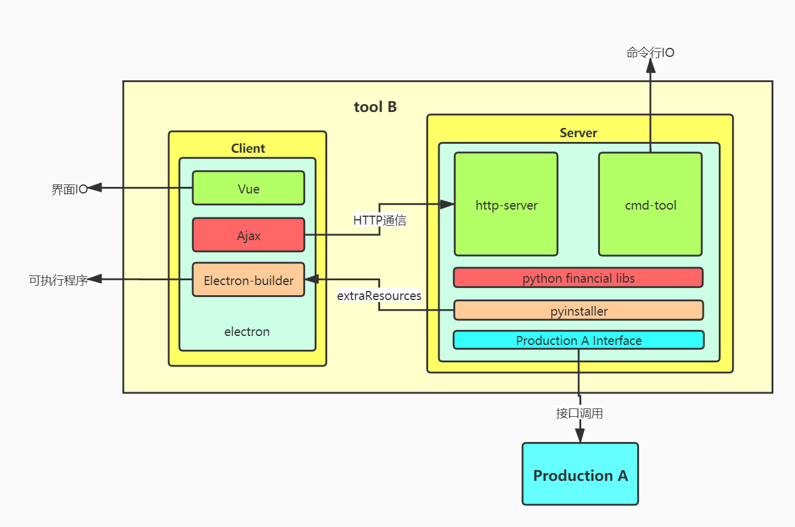
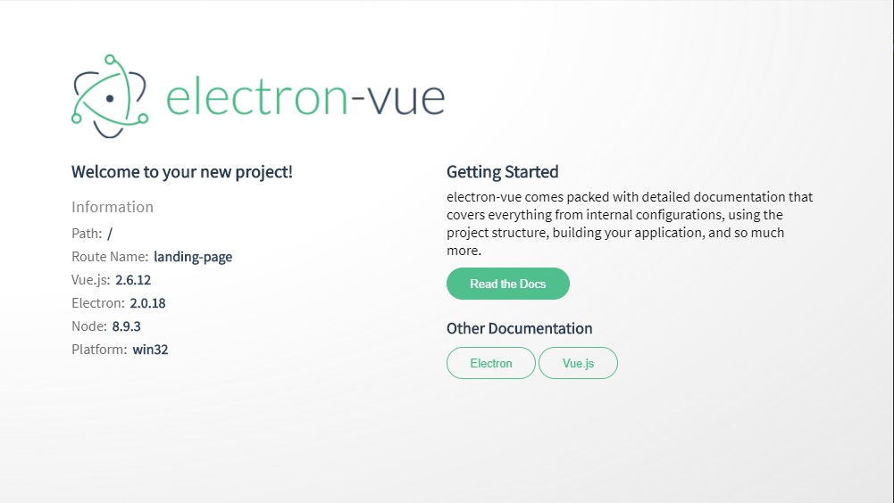
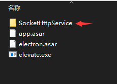
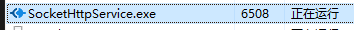

# Electron-Vue + Python 桌面应用实践

## 需求与设计背景

对接部门内的某个产品 A，为客户提供一个配套的桌面应用小工具 B。主要要求概括如下：

- 工具 B 主要用于作为测试工具，对产品内部的数据进行校验，减少因为版本迭代而产生的非易现 bug；

- 通过调用产品 A 提供的服务接口，获取工具 B 所需的数据；

- 工具 B 本身需要使用 python 的一些金融算法库，对通过产品 A 接口获取到的数据进行处理；

- 工具 B 需要提供一个可视化界面的版本与一个命令行执行版本；

- 客户本地无任何开发环境，也不可安装配置开发环境，如 python 开发环境；

- 最终输出为一个可安装的桌面可执行程序。

## 架构设想

对需求进行分析后，结合技术可行性与人员配置，时间安排等方面的问题，工具 B 整体架构设计如下。



- 工具 B 整体分为客户端与服务端两个部分，最终成型为一个可执行 exe 文件；

- 为了提高前端界面交互的美观度、自由度，同时也考虑到人员配置的可行性，客户端部分采用`electron`框架，前端通过`Vue`进行开发。并通过`Electron-builder`进行打包，输出可执行文件；

- 服务端部分通过`python`打包库`pyinstaller`打包形成可执行文件，服务端打包生成的 exe 文件本身可以单独运行，通过命令行进行交互。后端框架以及涉及到的其他 python 库需要后端开发进行后续敲定；

- 服务端可执行文件通过`Electron-builder`的`extraResources`配置成为一个静态文件打包入整个客户端可执行文件。所谓的静态文件，即在打包完成后，可以直接在工具 B 根目录下的`extraResources`中访问服务端可执行程序(可行性待验证)；

- 服务端与客户端整合生成的可执行文件运行后，`Electron`通过`nodejs`创建本地的`web server`，同时通过`nodejs`的`execFile()`启动打包至根目录下的服务端程序，与前端的本地 server 建立通信后，即可通过客户端界面进行交互。

## 工程实现

### 项目创建

- 首先通过 `electron-vue` 脚手架创建一个工程。注意创建工程的路径中不要带有中文。

  ```shell
  $ vue init simulatedgreg/electron-vue demo
  ```

- 根据需要选择配置，唯一需要注意的是打包所使用的依赖需要选择`electron-builder`，因为需要使用该依赖的`extraResources`来打包服务端的`pyinstaller`生成的静态 exe 文件。

- 创建完成后进入项目文件中，安装依赖。网络环境不稳定或存在问题时，安装依赖会碰到许多的坑与报错，建议替换使用淘宝源后再安装依赖。如果想要顺畅的完成安装还是建议科学上网。完成后运行项目即可。

  ```shell
  $ cd demo
  $ npm config set registry http://registry.npm.taobao.org/
  $ npm install
  $ npm run dev
  ```

- 运行完成后，如果本地 node 版本已经升至 12 那么会存在以下报错

  ```
  ReferenceError:process is not defined
  ```

- 可以将 node 版本回退至 11，也可以直接在`webpack.web.config.js`和`webpack.renderer.config.js`两个文件中扩写`HtmlWebpackPlugin`，[参考资料](https://github.com/SimulatedGREG/electron-vue/issues/871)

  ```js
  new HtmlWebpackPlugin({
    filename: 'index.html',
    template: path.resolve(__dirname, '../src/index.ejs'),
    templateParameters(compilation, assets, options) {
      return {
        compilation: compilation,
        webpack: compilation.getStats().toJson(),
        webpackConfig: compilation.options,
        htmlWebpackPlugin: {
          files: assets,
          options: options
        },
        process,
      };
    },
    minify: {
      collapseWhitespace: true,
      removeAttributeQuotes: true,
      removeComments: true
    },
    nodeModules: false
  }),
  ```

- 修改完成后重新运行项目。至此，一个本地的`electron-vue`项目已经运行完毕

  

### 前后端本地运行

- 从一个后端朋友那拿到静态后端可执行程序后，将其文件夹放至工程的根目录下。接下来使用`extraResources`尝试项目打包，在`package.json`中增加配置，将需要静态打包的程序从根目录下的源位置打包至打包文件的目标位置。

  ```json
  "build": {
    ...
    "extraResources": [
      {
        "from": "./SocketHttpService",
        "to": "./SocketHttpService"
      }
    ],
    ...
  }
  ```

- 在第一次打包过程中，也会因为种种网络问题遇到许多的坑点。最新版的`electron-vue`在第一次打包时，会下载`electron-v2.0.18-win32-x64.zip`文件，该文件下载失败就会导致打包报错。建议直接从淘宝镜像上下载[对应版本](https://npm.taobao.org/mirrors/electron/)，并放至目录`User/.electron`(MacOS)、`User/AppData/Local/electron/Cache`(Windows)下。

- 打包完成后可以得到一个纯净的软件安装程序，安装完成后，我们可以在该软件的根目录下找到我们通过`extraResources`打包进去的静态服务端程序。那么现在只要能够想办法运行这个程序，就可以通过请求在本地实现前后端交互。

  

- Node 中的`child_process`已经提供了运行可执行文件的方法，那么我们只要能够获取到运行程序与后端程序的相对路径，即可在本地实现前后端的同步运行与交互。在`electron-vue`中，`/src/main/index.js`中存在创建`electron-app`窗口的方法`createWindow`。那么只要在创建窗口时执行服务端即可。所以可以扩写该方法。

  ```js
  // src/main/index.js
  import path from "path";
  import fs from "fs";
  import { execFile } from "child_process";
  let child = null;
  // ...
  function createWindow() {
    // ...
    // 使用process.cwd获取当前运行程序的根目录
    let execFilePath = path.join(
      process.cwd(),
      "/SocketHttpService",
      "SocketHttpService.exe"
    ); // 开发环境运行路径
    if (process.env.NODE_ENV === "production") {
      execFilePath = path.join(
        process.cwd(),
        "/resources/SocketHttpService",
        "SocketHttpService.exe"
      ); // 生产环境运行路径
    }
    console.log(execFilePath);
    // fs.stat检测路径是否存在
    fs.stat(execFilePath, (err) => {
      if (err) {
        console.log("path error");
      } else {
        console.log("start running back-end");
        child = execFile(execFilePath, (err, stdout, stderr) => {
          console.log("Err:", err);
          console.log("StdOut:", stdout);
          console.log("StdErr:", stderr);
        });
      }
    });
  }
  ```

- 在本地进行运行，我们可以在任务管理器中看到服务端程序已经正确运行

  

- 由于`electron-app`与服务端程序本就属于两个进程，所以在停止运行前端窗口时，服务端进程不会被自动杀死，所以需要在窗口关闭时将服务端进程关闭，可以在窗口关闭的监听事件中补写进程杀死逻辑。关闭后，查看任务管理器，可以发现服务端程序已被关闭。

  ```js
  app.on("window-all-closed", () => {
    if (process.platform !== "darwin") {
      app.quit();
      child.kill();
    }
  });
  ```

- 那么本地运行都顺利之后，我们重新打包代码，重新安装并运行打包后程序，此时查看任务管理器，可以发现服务端程序依旧正确运行。至此，前后端本地运行部分已经都已实现并验证完成。

- 当前后端都能正确运行后，使用 HTTP 协议进行通信即可。对于前端部分来说，`Electron-vue`脚手架除开`electron`部分，本身就可以认为是一个`vue-cli`项目，在安装的时候也会提示增加`axios`依赖。增加依赖后，进行全局挂载便能调用服务程序提供的接口。

  ```js
  // Vue实例入口处进行挂载
  import axios from "axios";
  Vue.prototype.$http = axios;

  // 接口调用处进行使用
  this.$http.post(url, param).then((res) => {
    // ...
  });
  ```

### 自定义窗口

- `Electron`应用，本质上还是 C 端外壳嵌入 B 端的内核，通过日益发展的前端技术来增强桌面应用的交互与体验。对于一个 Web 前端来说，`Electron`的友好之处在于不需要学习 C#的内容，全权交给 JavaScript，也就是 Web 前端的一套内容来实现桌面应用，即学习成本低。另外也能够做到多操作系统兼容，如 Windows 与 OS X。

- 而 C 端的外壳与 B 端的内核放在操作系统中来说，`Electron`将其转化为了两个进程。一个主进程，控制程序外壳本身，使用操作系统原生的功能，包括提供窗口，窗口的拖动、放大缩小、开闭等。另一个为渲染进程，主要负责浏览器内核对于主页面部分的渲染。这在代码中正好对应了`main.js`与`render.js`两份代码。在 W3C 提供的[`Electron`中文文档](https://www.w3cschool.cn/electronmanual/)中，也可以找到主进程与渲染进程两个模块所拥有的 API。

- 当打包完成的应用在 Windows 上运行时，能够看到包括最小化、关闭等 Windows 原生的窗口按钮，以及菜单栏等功能。而一些常见的`electron`应用，如网易云音乐、VSCode 等，窗口菜单都与原生菜单大相径庭。通过使用其菜单的功能后能够发现，菜单的本质还是 Windows 原生的菜单的样式修改，那么通过使用主进程提供的 API，即可完成一个窗口的样式自定义。
