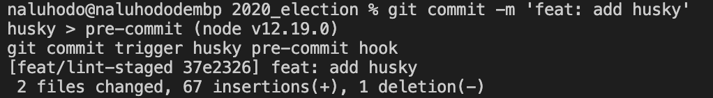
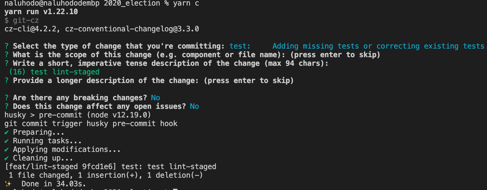

# Vue + TypeScript Web应用实践

> 项目各类代码规范作用详见小白[项目规范最佳实践](https://github.com/fff455/tech-share/blob/master/Engineering/%E9%A1%B9%E7%9B%AE%E8%A7%84%E8%8C%83%E6%9C%80%E4%BD%B3%E5%AE%9E%E8%B7%B5.md)一文

## 项目创建

使用``@vue/cli``脚手架的``vue-ui``创建项目。

* 创建过程中需要注意的点:

  * 开启TypeScript，关闭``class-style component syntax``，开启该功能会引入``vue-property-decorator``依赖，在``vue-ts``项目中，通过使用``@Component``等装饰器来简化书写。习惯于使用装饰器等语法可选择使用。

  * 使用``dart-sass``作为CSS与处理器

  * 不使用脚手架提供的自动配置``eslint``，后续手工添加配置

  * 开启``PWA Support``

## VSCode插件添加

- Prettier、ESLint、stylelint、Vetur

## Prettier配置

* 配置``.prettierrc``以规范代码风格，配置内容如下。配置完成后，vscode开启配置，通过``Prettier``插件在保存文件时，自动完成代码格式化。
  ```
  {
    "tabWidth": 2, // 缩进空格为2，
    "useTabs": false, // 不使用Tab作为缩进
    "printWidth": 100, // 单行代码最多字符数，将vscode单屏可视部分作为最大长度即可
    "semi": true, // 使用分号
    "singleQuote": true, // 字符串单引号
    "arrowParens": "avoid", // 单入参箭头函数可不带括号
    "trailingComma": "all", // 对象属性后添加逗号
    "bracketSpacing": true, // 括号前后增加括号
    "jsxSingleQuote": true,
    "jsxBracketSameLine": false,
    "insertPragma": false,
    "ignorePath": ".prettierignore" // ignore文件对应路径
  }
  ```

## ESLint配置

* Vue部分正常配置即可，重点关注TypeScript部分的配置

  * 增加以下两个依赖

  ```shell
  $ yarn add -D @typescript-eslint/parser
  $ yarn add -D @typescript-eslint/eslint-plugin
  ```
  
  * 在``.eslintrc.js``中增加以下配置

    ```js
    module.export = {
      // ...
      parserOptions: {
        parser: '@typescript-eslint/parser', // TypeScript parser
        ecmaVersion: 8, // ES版本
        project: ['./tsconfig.json'], // tsconfig路径
      },
      plugins: ['@typescript-eslint'], // 启用typescript-eslint插件
      extends: [
        // ...
        'plugin:@typescript-eslint/recommended',
        '@vue/typescript/recommended',
      ],
      rules: {
        // ...
        '@typescript-eslint/no-explicit-any': 'error', // 显式any类型定义报错
        '@typescript-eslint/no-unused-expressions': ['error'], // 未使用变量报错
      },
    }
    ```
  
  * 由于使用``@vue/cli``构建项目时，已开启TypeScript，直接使用脚手架创建的``tsconfig.json``即可，但由于项目中同样存在js文件，所以需要增加js配置，来保证``typescript-eslint``也能够对js文件生效。

    ```
    {
      ...
      "include": [
        "*.js", // 增加js配置
        ".eslintrc.js"
      ],
    }
    ```

  * vscode安装``ESLint``插件后，在右下角开启ESLint检测，运行项目后，若有ESLint运行报错，根据报错内容解决即可。若为代码格式报错，保存后即可实现代码自动规范。保存自动规范需要通过配置``vscode``设置文件``setting.json``开启。之后``ESLint``正常开启检测。

    ```json
    {
      "editor.formatOnPaste": true,
      "editor.formatOnType": true,
      "eslint.codeAction.showDocumentation": {
          "enable": true
      },
      "editor.codeActionsOnSave": {
          "source.fixAll": true
      },
      "[javascript]": {
          "editor.defaultFormatter": "esbenp.prettier-vscode"
      },
      "[vue]": {
          "editor.defaultFormatter": "esbenp.prettier-vscode"
      }
    }
    ```

## stylelint配置

> 配置``stylelint``实现样式代码的规范化。

* 安装依赖

  * stylelint

    ```shell
    $ yarn -D stylelint stylelint-config-stylelint
    ```

  * scss插件

    ```shell
    $ yarn -D stylelint-scss
    ```

  * 样式规则排序

    ```shell
    $ yarn -D stylelint-order
    ```

* 增加``stylelint``配置

  ```js
  // .stylelintrc.js
  module.exports = {
    extends: 'stylelint-config-standard',
    plugins: [
      'stylelint-order',
      'stylelint-scss',
    ],
    rules: {
      'color-no-invalid-hex': true, // 禁止无效十六进制颜色
      'property-no-unknown': true, // 禁止unknown属性
      'string-no-newline': true, // 禁止字符串类属性换行
      'unit-no-unknown': true, // 禁止unknown样式单位
      'order/order': [
        'declarations',
        'custom-properties',
        'dollar-variables',
        'rules',
        'at-rules'
      ],
      'order/properties-order': [
        // 自定义样式规则顺序
      ]
    }
  }
  ```

* 上述配置中，``order/order``中的顺序样例

  ```css
  a {
    /* declaration */
    --width: 10px;
    /* custom-properties */
    $height: 20px;
    /* dollar-variables */
    display: none;
    /* rules */
    span {}
    /* at-rules */
    @media (min-width: 100px) {}
  }
  ```

* stylelint至此已经能够正确生效。


## Lint-staged配置

> 通过``lint-staged``在代码commit前对代码规范进行检测，防止非规范代码递交。

* 安装``husky``

  ```shell
  $ yarn add -D husky
  ```

* ``pre-commit``配置与验证，``package.json``增加``pre-commit``的``git-hook``

  ```json
  "husky": {
    "hook": {
      "pre-commit": "echo \"git commit trigger husky pre-commit hook\" "
    }
  }
  ```

* ``commit``本地更新后，``pre-commit``成功触发

  

* 安装``lint-staged``

  ```shell
  yarn add -D lint-staged
  ```

* ``package.json``增加``lint-staged``的配置用于检测ts与vue文件，并在``pre-commit``中增加``lint-staged``执行命令

  ```json
  "husky": {
    "hook": {
      "pre-commit": "echo \"git commit trigger husky pre-commit hook\" & lint-staged "
    }
  },
  "lint-staged": {
    "src/**/*.{ts,vue}": [
      "prettier --write",
      "eslint --cache --fix"
      "stylelint src/**/*.{html,vue,css,sass,scss} --fix}" // stylelint检测
    ]
  },
  ```

* 对``lint-staged``功能进行验证。设置vscode，关闭on save时的代码自动格式化，编写一行不符合格式规范的代码，这里使用不带分号的代码进行验证。

  ```ts
  // main.ts
  import Vue from 'vue' // 无分号
  ```

* ``commit``代码触发``pre-commit``中的``lint-staged``命令，代码被``prettier``与``eslint``自动格式化，原无分号的代码已经自动增加分号

  

  ```ts
  // main.ts
  import Vue from 'vue';
  ```

## lint-staged tsc

> 在lint-staged中增加TypeScript的检测


