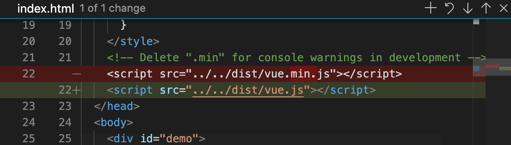
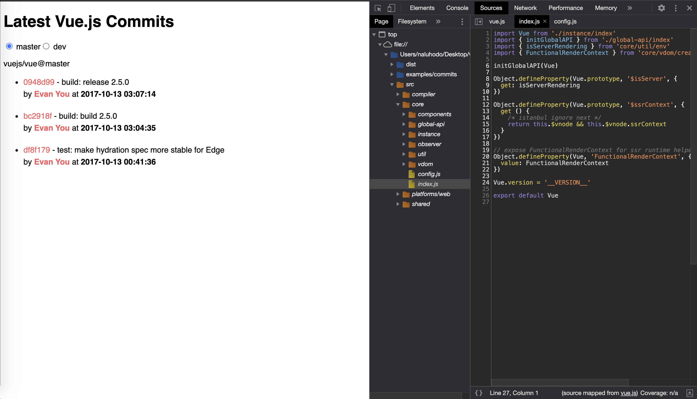

# Vue2.6.x源码阅读

## 编译

* 获取[Vue2.6.x源码](https://github.com/vuejs/vue)，dev分支即为最新源码，与去年最新发布的[Vue3.x](https://github.com/vuejs/vue-next)做好区分。获取后进行编译并运行。

  ```shell
  # 获取源码
  $ git clone git@github.com:vuejs/vue.git

  # 安装依赖
  $ yarn

  # 代码运行
  $ yarn dev
  ```

* 编译完成后，最新编译获得的``Vue``开发版本(development)的代码会自动生成于``~/dist/vue.js``。当前端项目引入这一份生成的代码并创建一个``Vue``实例后，那它就已经成为了一个``Vue``项目。

## 调试

* 在根目录下存在一个样例文件夹(``~/examples``)，供``Vue``的学习者阅读使用。当然也可作为源码阅读时的demo用于调试``Vue``源码。

* 当前``~/examples``目录下共有11份简单的样例工程，每个工程的入口文件``index.html``都引入了``vue.min.js``(生产环境版本)，我们可将其替换为开发版本的``vue.js``以对源码打断点或进行调试。

  

* 样例修改完引入的文件后，此时在开发工具中看到的依然为源码经过编译后的代码。可通过更改编译脚本配置，以及``sourcemap``模式重新运行代码。

  ```javascript
  // ~/scripts/config.js
  function genConfig (name) {
    const opts = builds[name]
    const config = {
      input: opts.entry,
      external: opts.external,
      // 增加sourceMap配置
      sourceMap: true, 
      // ...
    }
  }
  // ...
  ```

  ```shell
  # 启用sourcemap
  $ yarn dev --sourcemap
  ```

* 完成后便可以在``devtool``中看到源码内容。

  

## 目录结构

### 根目录

* **benchmarks**: 复杂情况下的Vue样例，如大量数据表格、服务端渲染(ssr)、渲染大量svg图片。

* **dist**: 构建后文件的输出目录，如``vue.js``、``vue.min.js``。

* **examples**: ``Vue``应用demo，统一引用了输出目录下的``vue.min.js``。

* **flow**: 类型声明，定义了源码中所使用的各种类型，包括``VNode``、``GlobalAPI``等，使用开源项目 [Flow](https://flowtype.org/)。

* **packages**: ``Vue``相关的一些依赖，如``Weex``，可直接引入使用。

* **scripts**: 用于存放一些``npm``脚本，配合``webpack``与``rollup``等工具对源码进行编译、测试、构建打包等。上文增加的sourcemap配置就位于``~/scripts/config.js``中。

* <strong style="color:red">src</strong>: Vue核心源码，学习的重点。

* **test**: 测试用例目录，包含了单元测试unit、e2e测试(用户真实场景)、服务端渲染(ssr)和weex的一些测试用例。通过``yarn test``执行。

* **types**： ``Vue2.6.x``已经能够支持开发者使用``typescript``，该目录定义了``typescript``类型声明文件。

* 其他文件：

  * 代码规范配置文件： ``.editorconfig``、``.eslintrc.js``、``eslintignore``

  * 类型检查配置文件: ``.flowonfig``

### 核心源码

* **compiler** - 编译器
  
  1. ``Vue``使用**字符串**使用的HTML模板(template)，编译器内做的主要工作就是解析该模版字符串。
  
  2. 解析模板字符串的算法就涉及到编译原理中的内容，包括词法解析、语法分析、抽象语法树(AST)生成、代码生成、代码优化等。将模板字符串转为对应的html与js代码，
  
  3. 解析过程中的代码优化部分有如生成静态dom子树(purely static sub-tree)，来提高``Vue``操作dom树时的性能。

* **core** - 核心代码

  * ``Vue``构造函数、生命周期方法、虚拟Dom(Virtual DOM)、``Vue``实例(instance)方法、Vue全局API等核心代码。

* **platform** - 平台

  * 根据运行环境(平台设备)的不同，即Web(浏览器)平台与Weex(移动端)平台，``Vue``会在运行时进行区别处理。由于涉及到平台不同而进行不同的运行处理，所以很容易就能想到，``Vue``代码运行的入口也在``platform``当中。

* **server** - 服务端

  * ``Vue``在服务端时的代码处理

* **sfc**：单文件组件(single file component)

  * ``Vue``框架最简便的使用方式，就是引用``vue.min.js``后创建实例，并在实例内进行编写。涉及的都是``.js``文件。而当我们使用一些官方脚手架时(vue/cli)，会发现可以直接使用``.vue``文件进行编写，在``.vue``文件中，根据标签的不同即可编写html、js、css等代码。而这个解析工作就属于``sfc``，它内部仅含一个``parser.js``文件，即用于解析``.vue``文件。这也是为什么它叫做单文件组件，一个``.vue``文件，就自成一个``Vue component``。

* **shared** - 工具类方法

  * ``src``源码中涉及的公共方法、公共常量(如生命周期常量)都来自于``shared``

## 源码阅读

> 基本熟悉了根目录与核心源码目录结构了之后，就可以逐步开始源码阅读了。

### shared

* 根据``src``的目录结构说明，我们自然能够想到通过入口文件进行入手，按其引入的文件以及代码逻辑进行分析。但简单阅读入口文件就能够发现，源码当中充满了各种各样的函数方法，这些方法都来自于``shared``目录中，需要对这些方法有一个前置的熟悉。

* 常量，常量文件比较短，所以直接把代码贴上来

  ```javascript
  // @/shared/constants.js
  /* 服务端渲染 */
  export const SSR_ATTR = 'data-server-rendered'

  /* 每个Vue组件都会挂载的成员 */
  export const ASSET_TYPES = [
    'component', // 组件
    'directive', // 指令
    'filter'     // 过滤器
  ]

  /* Vue的12个生命周期钩子函数 */
  export const LIFECYCLE_HOOKS = [
    'beforeCreate',
    'created',
    'beforeMount',
    'mounted',
    // ...
  ]
  ```

* 工具方法(``util``)，在代码中随处可用，内含

  * 类型判断方法，如``isUndef``、``isPromise``等。
  
  * 类型转换方法，如toString、toNumber等。在转换方法中我们可以发现定义了一些与基本数据类型原型方法同名的方法，但都进行了重写，以``toString``为例。

    ```js
    /**
     * Convert a value to a string that is actually rendered.
     * 除去Number类型，也对数组与空对象进行了处理
     * 数组与空对象类型使用类型判断方法进行判断
     * _toString为js原生toString方法
     */
    const _toString = Object.prototype.toString
    export function toString (val: any): string {
      return val == null
        ? ''
        : Array.isArray(val) || (isPlainObject(val) && val.toString === _toString)
          ? JSON.stringify(val, null, 2)
          : String(val)
    }
    ```

  * 其他重要方法

    1. **makeMap**: 用于生成一个带有缓存的函数，用于判断数据是否为缓存中的数据。

      ```js
      /**
       * Make a map and return a function for checking if a key is in that map.
       */
      export function makeMap (
        str: string,
        expectsLowerCase?: boolean
      ): (key: string) => true | void {
        const map = Object.create(null)
        const list: Array<string> = str.split(',')
        for (let i = 0; i < list.length; i++) {
          map[list[i]] = true
        }
        return expectsLowerCase
          ? val => map[val.toLowerCase()]
          : val => map[val]
      }

      /**
      * makeMap方法使用例子，两个类型判断的方法
      * isBuiltInTag 用于判断当前标签是否为Vue内置标签
      * isReservedAttribute 用于标签当前属性是否为Vue内置属性
      */
      export const isBuiltInTag = makeMap('slot,component', true)

      export const isReservedAttribute = makeMap('key,ref,slot,slot-scope,is')
      ```

    2. **remove**: 删除一个数组元素

    3. **cached**: 生成一个带有缓存的函数(闭包)

      ```js
      export function cached<F: Function> (fn: F): F {
        const cache = Object.create(null)
        return (function cachedFn (str: string) {
          // 判断传入的数据是否已缓存，如果已缓存，hit就有数据，反之为undefined
          const hit = cache[str]
          // 这里的return非常精简优雅，当hit为undefined时，同时进行了赋值与返回的操作
          return hit || (cache[str] = fn(str))
        }: any)
      }
      ```

    4. 字符串格式化转换方法**camelize**(下划线字符串驼峰化)、**capitalize**(字符串大写)、hyphenate(驼峰字符串下划线化)。字符串转换方法都使用了上述``cached``方法作为性能优化的技巧。
      ```js
      // 使用cached方法的camelize
      const camelizeRE = /-(\w)/g
      export const camelize = cached((str: string): string => {
        return str.replace(camelizeRE, (_, c) => c ? c.toUpperCase() : '')
      })
      ```


* 从``shared``中可以学习到一些标准化工程的构建思路，提前定义好工程中所需要的常量与工具类方法，一来能够有效的精简工程中的通用代码处理逻辑，二来也能够后续的代码维护。同时通过源码阅读，也能够看到一个好的工程离不开优美规范的代码。以及在代码编写过程中无时不想着的性能优化。