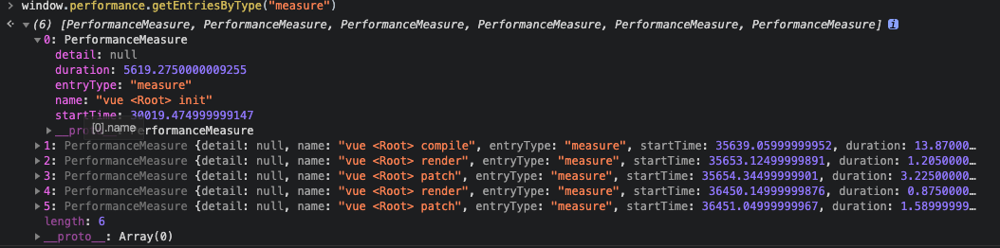

<!--
 * @Author: wangzn
 * @Date: 2021-03-14 19:05:29
 * @LastEditTime: 2021-05-09 19:43:02
 * @LastEditors: wangzn
 * @Description: 源码阅读-core-Vue构造函数
-->
# Vue2.6.x源码阅读 - 5.源码阅读-core-Vue构造函数

> 阅读学习``Vue``源码``/src``目录下的``core``文件夹内``Vue构造函数``相关的代码

## Vue构造函数

* ``core``目录下的``index.js``对``Vue``构造函数依旧进行了一定程度的封装，先除开封装的内容，直接进入到``Vue``真正的构造函数所在的位置``src/core/instance/index.js``。

  ```js
  /* Vue 构造函数 */
  function Vue (options) {
    // 入参 options 即为开发者new一个Vue实例时，Vue中传入的带有data、method、watch等属性的对象，在日常代码中，直接使用 this 指代。
    if (process.env.NODE_ENV !== 'production' &&
      !(this instanceof Vue) // 判断是否通过 new 调用 Vue 构造函数
    ) {
      warn('Vue is a constructor and should be called with the `new` keyword')
    }
    this._init(options) // 初始化 Vue 实例，方法定义于 Vue 的 prototype 中
  }

  initMixin(Vue) // 混入初始化方法，构造函数中的 Vue.prototype._init()方法来自于其中
  stateMixin(Vue) // 混入 状态处理 的方法
  eventsMixin(Vue) // 混入 事件 的方法
  lifecycleMixin(Vue) // 混入 生命周期 的方法
  renderMixin(Vue) // 混入 渲染相关 的方法

  export default Vue
  ```

* ⭐️ 构造函数所在的文件(``src/core/instance/index.js``)内容较少，但需要注意各个方法的执行顺序。构造函数在实际样例代码调用``new Vue(options)``才会执行，各类``Mixin``方法都先于构造函数执行，这些方法将包括prototype方法、状态处理、事件、生命周期、渲染相关的方法都预先写入至构造函数内，所以在实际调用构造方法时，``Vue``实例内容已经具有一定的复杂程度。

* 当然实例所挂载的内容也不仅限于``src/core/instance/index.js``文件，其外层的``src/core/index.js``以及再外层的``src/platforms/web/runtime/index.js``也同样进行了一定程度的挂载。从入口文件开始到构造函数，一个Vue实例经过了三层的封装。最外层的封装其实能够理解，是基于平台入口的不同而会存在挂载内容的区别。中层与内层的挂载内容区分依旧比较费解，初步认为是处于代码结构的考虑，需要更加深入的学习。

### initMixin

* 回到构造函数，进入到含有初始化方法的``initMixin()``，由于方法较长，所以按顺序分别进行分析。

  1. 初始化定义

    ```js
    // src/core/instance/init.js
    let uid = 0 // 每个类型的实例(组件)都含有的唯一标识，在vue-cli脚手架下，每个Vue文件就是一个单独的uid，可以通过this._uid获取。
    export function initMixin (Vue: Class<Component>) {
      /* 挂载初始化方法至prototype，用于构造函数调用 */
      Vue.prototype._init = function (options?: Object) {
        /* 定义Vue实例 */
        const vm: Component = this
        // a uid
        vm._uid = uid++

        // continued...
      }
    }
    ```

  2. 性能测试，``development``模式下，可开启``core/config.js``中的性能分析配置``performance: true``以测试各个Vue组件在初始化阶段的性能表现。
  
    * 在这里也可以看出``core/config.js``这份文件用于更改``Vue``内部的一些配置，这些配置不开放给实际开发者，但支持开发者更改在调试时使用。<!-- TODO: core/config.js 的作用需要继续探究 -->
    
    * 这段代码中有一处非代码逻辑的细节，可以看到有一些``istanbul``开头的注释，如``/* istanbul ignore if */``。``istanbul``为一个用于检查代码覆盖率的``JavaScript``库。在不开启性能分析配置的情况下，性能测试相关的两个``if-else``代码块无法被覆盖到，故加了这一段注释用于忽略覆盖率检测。扩展：如果需要忽略整个文件，可在文件开头增加``/* istanbul ignore next */``实现。

    ```js
    export function initMixin (Vue: Class<Component>) {
      Vue.prototype._init = function (options?: Object) {
        // ...

        // 性能测试时使用
        let startTag, endTag
        /* istanbul ignore if */
        if (process.env.NODE_ENV !== 'production' && config.performance && mark) {
          // 非生产模式、且开启性能分析配置config.performance后进入到此
          // 根据_uid定义开始与结束两个唯一标识
          startTag = `vue-perf-start:${vm._uid}`
          endTag = `vue-perf-end:${vm._uid}`
          mark(startTag) // 通过window.performance.mark()方法记录组件初始化的开始时点
        }

        // ...

        /* istanbul ignore if */
        if (process.env.NODE_ENV !== 'production' && config.performance && mark) {
          vm._name = formatComponentName(vm, false) // 格式化组件名称
          mark(endTag) // 记录组件初始化的结束时点
          measure(`vue ${vm._name} init`, startTag, endTag) // 计算组件初始化消耗的时间，并清空mark的时点
        }
        
        // continued...
      }
    }
    ```

    * 另一个关于代码顺序的细节，我们可以发现片段一的定义的代码内容是很少的，除了需要在性能分析中使用的变量，均未在片段一内进行处理。可以合理猜测这里的处理是为了让初始化阶段的性能更加精确。结合下面片段三的内容，也可以得出当前初始化方法内的性能，是用于测试实例创建，至生命周期``created``为止所消耗的时间。

    * 通过``performance API``可以获取到``Vue``源码所记录的性能记录。

      
    
  3. ``options``合并。``else``部分的合并逻辑中，可以发现``vm.constructor.options``内部是有内容的，甚至已经挂载了``KeepAlive``等组件，以及一些命令。构造函数自带的``options``就来自于上文所述的入口文件的多层封装。

    ```js
    export function initMixin (Vue: Class<Component>) {
      Vue.prototype._init = function (options?: Object) {
        // ...

        // a flag to avoid this being observed
        vm._isVue = true
        // merge options
        if (options && options._isComponent) {
          // 内部组件 internal component，由VNode构成的组件，使用于render方法内，用createElement或jsx语法构建
          // optimize internal component instantiation
          // since dynamic options merging is pretty slow, and none of the
          // internal component options needs special treatment.
          initInternalComponent(vm, options)
        } else {
          // 一般组件合并当前组件options与构造函数自带的options
          vm.$options = mergeOptions(
            resolveConstructorOptions(vm.constructor),
            options || {},
            vm
          )
        }
        // continued...
      }
    }
    ```
  
  4. 丰富Vue实例内容，赋值各类属性，以及生命周期方法``beforeCreate``、``created``的调用。[initProxy](https://www.imooc.com/article/29109)部分可参考学习。

    ```js
    export function initMixin (Vue: Class<Component>) {
      Vue.prototype._init = function (options?: Object) {
        // ...

        // 开发环境下赋值 _renderProxy属性
        // 在生产环境或不支持Proxy的环境下，直接将实例本身赋值给该属性
        // 在 $option.render._withStripped 属性为true时，将启用Proxy，使用其中的 getHandler(自定义对象get方法) 以及 hasHandler(自定义对象in方法)
        // Proxy在Vue3中才大范围开始使用，在这里主要用于开发环境下，起到警告提示作用
        /* istanbul ignore else */
        if (process.env.NODE_ENV !== 'production') {
          initProxy(vm)
        } else {
          vm._renderProxy = vm
        }
        // expose real self
        // 实例本身赋值至 _self
        vm._self = vm

        // 初始化一些重要属性，包括 $refs | $children | $parent | $root
        // 初始化生命周期的一些状态变量
        initLifecycle(vm)
        initEvents(vm) //初始化事件的容器 events ｜ listeners
        initRender(vm) //初始化渲染标记用到的变量
        callHook(vm, 'beforeCreate') // 调用beforeCreate生命周期函数
        initInjections(vm) // resolve injections before data/props 初始化注入器
        initState(vm) // ⭐️初始化状态数据，注册 data ｜ props
        initProvide(vm) // resolve provide after data/props
        callHook(vm, 'created') // 调用created生命周期函数

        // continued...
      }
    }
    ```

    * 通过观察初始化各类属性的方法以及``beforeCreate``、``created``两个生命周期方法的顺序，可以知道``data``、``props``、``injects``、``provides``等数据属性在``created``时候已经被创建，且存在内容。而此时与dom相关的属性依旧为空状态。

    * 关于实例的属性，带``$``符号以及下划线的属性一般都为实例的私有属性，而带``$``符号的属性一般认为为只读属性。
  
  5. ⭐️调用``mount``方法挂载组件。

    ```js
    export function initMixin (Vue: Class<Component>) {
      Vue.prototype._init = function (options?: Object) {
        // ...
        // vm.$options.el 存在的情况下调用 mount 方法
        if (vm.$options.el) {
          vm.$mount(vm.$options.el)
        }
        // 无el情况下可手动调用$mount方法
        // let vm = new Vue(...)
        // vm.$mount(...)
      }
    }
    ```

    * 可以发现构造函数所在的文件并没有该方法的定义，但``$mount``方法又充满了既视感。该方法会根据``platform``不同会有所区别，结合``web``模式下入口文件中的内容(可见上一篇[4.源码阅读-platform]())可知，该方法已经挂载在``Vue.prototype``上。而代码内容由运行模式决定。

    * 继续深入，``platform``的``mount``方法通过``document.querySelector``获取元素，并最终进入了同一个调用``mounted``生命周期的方法``mountComponent``(该方法于[6.源码阅读-core-组件挂载]()进行解析)。